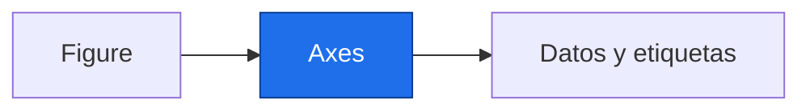

```mermaid
flowchart LR
    N0["Datos NASA en el reto real"]
    N1["Cargar P2.3 y P4.1"]
    N0 --> N1
    N2["Limpiar P4.1"]
    N1 --> N2
    N3["Anomalías P4.2"]
    N2 --> N3
    N4["Tendencia P5.1"]
    N3 --> N4
    N5["Mapa P5.2"]
    N4 --> N5
    N6["Compartir P5.3 y P.Z"]
    N5 --> N6
    classDef core fill:#1f6feb,stroke:#0b3d91,color:#ffffff
    class N3 core
```

```mermaid
flowchart LR
    N0["Nivel"]
    N1["Tendencia"]
    N0 --> N1
    N2["Estacionalidad"]
    N1 --> N2
    N3["Variabilidad lenta"]
    N2 --> N3
    N4["Ruido"]
    N3 --> N4
    N5["Serie simulada"]
    N4 --> N5
    classDef core fill:#1f6feb,stroke:#0b3d91,color:#ffffff
    class N3 core
```

```mermaid
flowchart LR
    N0["CSV simulado"]
    N1["Limpiar y contar"]
    N0 --> N1
    N2["Base mensual 2000–2009"]
    N1 --> N2
    N3["Anomalías anuales"]
    N2 --> N3
    N4["Tasas y figura"]
    N3 --> N4
    N5["Conclusión"]
    N4 --> N5
    classDef core fill:#1f6feb,stroke:#0b3d91,color:#ffffff
    class N3 core
```

```mermaid
flowchart LR
    N0["Etiqueta"]
    N1["Valor con tipo"]
    N0 --> N1
    N2["Conversión con unidad"]
    N1 --> N2
    classDef core fill:#1f6feb,stroke:#0b3d91,color:#ffffff
    class N1 core
```

```mermaid
flowchart LR
    N0["Dato"]
    N1["Condición positiva"]
    N0 --> N1
    N2["Actualizar conteo"]
    N1 --> N2
    classDef core fill:#1f6feb,stroke:#0b3d91,color:#ffffff
    class N1 core
```

```mermaid
flowchart LR
    N0["Serie y referencia"]
    N1["Función anomalia"]
    N0 --> N1
    N2["Lista de diferencias"]
    N1 --> N2
    classDef core fill:#1f6feb,stroke:#0b3d91,color:#ffffff
    class N1 core
```

```mermaid
flowchart LR
    N0["Datos"]
    N1["Colección"]
    N0 --> N1
    N2["Posición o clave"]
    N1 --> N2
    classDef core fill:#1f6feb,stroke:#0b3d91,color:#ffffff
    class N1 core
```

```mermaid
flowchart LR
    N0["Objeto"]
    N1["Método o atributo"]
    N0 --> N1
    N2["Resultado"]
    N1 --> N2
    classDef core fill:#1f6feb,stroke:#0b3d91,color:#ffffff
    class N1 core
```

```mermaid
flowchart LR
    N0["Leer campo"]
    N1["try convertir"]
    N0 --> N1
    N2["Dato o except registrado"]
    N1 --> N2
    classDef core fill:#1f6feb,stroke:#0b3d91,color:#ffffff
    class N1 core
```

```mermaid
flowchart LR
    N0["Lista"]
    N1["Arreglo con shape"]
    N0 --> N1
    N2["Selección"]
    N1 --> N2
    classDef core fill:#1f6feb,stroke:#0b3d91,color:#ffffff
    class N1 core
```

```mermaid
flowchart LR
    N0["Tiempo por región"]
    N1["Referencia por región"]
    N0 --> N1
    N2["Anomalías"]
    N1 --> N2
    classDef core fill:#1f6feb,stroke:#0b3d91,color:#ffffff
    class N1 core
```

```mermaid
flowchart LR
    N0["Figure"]
    N1["Axes"]
    N0 --> N1
    N2["Datos y etiquetas"]
    N1 --> N2
    classDef core fill:#1f6feb,stroke:#0b3d91,color:#ffffff
    class N1 core
```

```mermaid
flowchart LR
    N0["CSV"]
    N1["Índice y columnas"]
    N0 --> N1
    N2["Filas válidas"]
    N1 --> N2
    classDef core fill:#1f6feb,stroke:#0b3d91,color:#ffffff
    class N1 core
```

```mermaid
flowchart LR
    N0["Fechas"]
    N1["Base mensual"]
    N0 --> N1
    N2["Anomalías"]
    N1 --> N2
    N3["Año y cobertura"]
    N2 --> N3
    classDef core fill:#1f6feb,stroke:#0b3d91,color:#ffffff
    class N2 core
```

```mermaid
flowchart LR
    N0["Separar"]
    N1["Aplicar"]
    N0 --> N1
    N2["Combinar"]
    N1 --> N2
    classDef core fill:#1f6feb,stroke:#0b3d91,color:#ffffff
    class N1 core
```

```mermaid
flowchart LR
    N0["Pares válidos"]
    N1["Estimador"]
    N0 --> N1
    N2["Campos y unidades"]
    N1 --> N2
    classDef core fill:#1f6feb,stroke:#0b3d91,color:#ffffff
    class N1 core
```

```mermaid
flowchart LR
    N0["Dimensiones y coordenadas"]
    N1["Dataset"]
    N0 --> N1
    N2["Selección y reducción"]
    N1 --> N2
    classDef core fill:#1f6feb,stroke:#0b3d91,color:#ffffff
    class N1 core
```

```mermaid
flowchart LR
    N0["Archivos"]
    N1["git add prepara"]
    N0 --> N1
    N2["git commit registra localmente"]
    N1 --> N2
    classDef core fill:#1f6feb,stroke:#0b3d91,color:#ffffff
    class N1 core
```