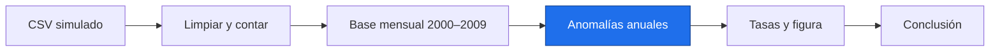

# Detective de tendencias en miniatura

> [!abstract] Entrega
> Una tabla de tasas, una figura y cinco líneas de conclusión reproducibles. Datos simulados en tres regiones.

Parte del Día 5: núcleo 95 min, ampliación 120 min. Las etapas comparten variables; ejecútalas en orden en el notebook. Los asserts comprueban cálculos, no validan por sí solos una inferencia científica.

Entrada: P.D. Salida: temperaturas y anomalías en °C; tasas en °C/década, con periodo y base explícitos. Doce meses válidos por año es una regla didáctica conservadora, no un estándar universal.



Enlaces: [[P.D Datos sintéticos de práctica|Datos]] · [[PZ_Proyecto_integrador.ipynb|Notebook autosuficiente]].

## ◆ Núcleo · 95 min

> [!question] PZ-01 · ◆ · ⭐⭐⭐ · Reto Tierra · 15 min · Generar, leer y limpiar
> Datos simulados. Genera las tres regiones de P.D con faltantes. Pasa por un CSV en memoria, convierte fechas, ordena y cuenta descartes. Comprueba unicidad fecha/región; duplicated marca filas repetidas según esas columnas. Conserva df y limpio.
> ```python
> # TU CÓDIGO AQUÍ
> ```
> > [!example]- Comprueba tu respuesta
> > ```python
> > assert (len(df)==864 and descartes==9 and len(limpio)==855), "Generar, leer y limpiar: revisa la etapa y sus entradas"
> > ```
> > [!tip]- Pista
> > No rellenes ausencias; los conteos anuales detectarán meses excluidos.
> > [!success]- Solución
> > ```python
> > import numpy as np
> > import pandas as pd
> > import matplotlib.pyplot as plt
> > from scipy.stats import linregress, theilslopes
> > from io import StringIO
> > df = pd.read_csv(StringIO(serie_mensual(faltantes=True).to_csv(index=False)))
> > df["fecha"] = pd.to_datetime(df["fecha"], errors="raise")
> > df = df.sort_values(["region", "fecha"])
> > assert not df.duplicated(["region", "fecha"]).any(), "Hay fechas duplicadas"
> > descartes = int(df["temp_C"].isna().sum())
> > limpio = df.dropna(subset=["temp_C"]).copy()
> > ```
> > **Por qué:** Conserva datos, unidades y cobertura para que otra persona reproduzca el resultado.

> [!question] PZ-02 · ◆ · ⭐⭐⭐ · Reto Tierra · 20 min · Climatología y cobertura anual
> Datos simulados. Por región calcula referencias mensuales exclusivamente en 2000–2009. Guarda series_anuales con anomalías anuales y cobertura con conteos de meses. Exige doce meses; usa índices de fechas reales.
> ```python
> # TU CÓDIGO AQUÍ
> ```
> > [!example]- Comprueba tu respuesta
> > ```python
> > assert (len(series_anuales)==3 and all([s.notna().sum()==21 for s in series_anuales.values()])), "Climatología y cobertura anual: revisa la etapa y sus entradas"
> > ```
> > [!tip]- Pista
> > Los años 2012, 2016 y 2021 están incompletos y deben quedar ausentes.
> > [!success]- Solución
> > ```python
> > series_anuales = {}
> > cobertura = {}
> > for region, grupo in limpio.groupby("region"):
> >     s = grupo.set_index("fecha")["temp_C"].sort_index()
> >     base = s.loc["2000":"2009"]
> >     clima = base.groupby(base.index.month).mean()
> >     assert len(clima)==12, "La base debe cubrir los doce meses"
> >     assert (base.groupby(base.index.month).count()==10).all(), "Base incompleta"
> >     anom = s - s.index.month.map(clima).to_numpy()
> >     n = anom.resample("YE").count()
> >     cobertura[region] = n
> >     series_anuales[region] = anom.resample("YE").mean().where(n==12)
> > ```
> > **Por qué:** Conserva datos, unidades y cobertura para que otra persona reproduzca el resultado.

> [!question] PZ-03 · ◆ · ⭐⭐⭐ · Reto Tierra · 20 min · Estimar y exportar tasas
> Datos simulados. Ajusta linregress por región con años reales, centrados en 2000. Guarda ajustes y tabla con tasa_decada,p_ols,n_anios. Incluye periodo,base,metodo,unidad,origen y exporta resultados_simulados.csv.
> ```python
> # TU CÓDIGO AQUÍ
> ```
> > [!example]- Comprueba tu respuesta
> > ```python
> > assert (tabla["region"].to_list()==["Sierra","Costa","Llanura"] and (tabla["n_anios"]==21).all() and np.allclose(tabla["tasa_decada"],[0.4,0.2,-0.1],atol=0.04)), "Estimar y exportar tasas: revisa la etapa y sus entradas"
> > ```
> > [!tip]- Pista
> > No confundas las 21 observaciones válidas con 21 años consecutivos.
> > [!success]- Solución
> > ```python
> > ajustes = {}
> > filas = []
> > for region, anual in series_anuales.items():
> >     s = anual.dropna()
> >     x = s.index.year.to_numpy() - 2000
> >     r = linregress(x, s.to_numpy())
> >     ajustes[region] = r
> >     filas.append({"region": region, "tasa_decada": 10*r.slope,
> >                   "p_ols": r.pvalue, "n_anios": len(s),
> >                   "periodo": "2000–2023", "base": "2000–2009",
> >                   "metodo": "OLS", "unidad": "°C/década", "origen": "simulado"})
> > tabla = pd.DataFrame(filas).sort_values("tasa_decada", ascending=False)
> > tabla.to_csv("resultados_simulados.csv", index=False)
> > ```
> > **Por qué:** Conserva datos, unidades y cobertura para que otra persona reproduzca el resultado.

> [!question] PZ-04 · ◆ · ⭐⭐⭐ · Reto Tierra · 25 min · Figura de evidencia
> Datos simulados. Dibuja series anuales con huecos visibles y sus rectas, más barras de tasas. Conserva fig,ejes. En el notebook basta ver la figura; el archivo incluido se regenera con assets/generar_figuras.py.
> ```python
> # TU CÓDIGO AQUÍ
> ```
> > [!example]- Comprueba tu respuesta
> > ```python
> > assert (len(ejes[0].lines)==6 and len(ejes[1].patches)==3), "Figura de evidencia: revisa la etapa y sus entradas"
> > ```
> > [!tip]- Pista
> > axhline traza una referencia horizontal y tight_layout ajusta márgenes. Se explican aquí antes de usarlos.
> > [!success]- Solución
> > ```python
> > fig, ejes = plt.subplots(1, 2, figsize=(9, 3.5))
> > colores = ["#0072B2", "#D55E00", "#009E73"]
> > for (region, anual), color in zip(series_anuales.items(), colores):
> >     x = anual.index.year.to_numpy()
> >     r = ajustes[region]
> >     ejes[0].plot(x, anual, "o-", color=color, label=region, markersize=3)
> >     ejes[0].plot(x, r.intercept+r.slope*(x-2000), "--", color=color)
> > ejes[0].set(xlabel="Año", ylabel="Anomalía [°C]",
> >             title="Simulado · base 2000–2009")
> > ejes[0].legend(fontsize=8)
> > ejes[1].bar(tabla["region"], tabla["tasa_decada"], color="#0072B2")
> > ejes[1].axhline(0, color="black", linewidth=0.7)
> > ejes[1].set(ylabel="Tasa OLS [°C/década]", title="Simulado · 2000–2023")
> > fig.tight_layout()
> > ```
> > **Por qué:** Conserva datos, unidades y cobertura para que otra persona reproduzca el resultado.

> [!question] PZ-05 · ◆ · ⭐⭐⭐ · Reto Tierra · 15 min · Conclusión de cinco líneas
> Datos simulados. Escribe conclusion con cinco líneas: pregunta, datos, método, resultado y límite. Incluye la tasa estimada de Sierra, unidad, 21 años válidos y advertencia de datos simulados. splitlines separa un texto en líneas.
> ```python
> # TU CÓDIGO AQUÍ
> ```
> > [!example]- Comprueba tu respuesta
> > ```python
> > assert (len(conclusion.splitlines())==5 and "simulad" in conclusion and "°C/década" in conclusion), "Conclusión de cinco líneas: revisa la etapa y sus entradas"
> > ```
> > [!tip]- Pista
> > La tasa y la cobertura pertenecen al resultado; la validez estadística necesita los bloques B y C.
> > [!success]- Solución
> > ```python
> > sierra = tabla.loc[tabla["region"]=="Sierra", "tasa_decada"].iloc[0]
> > conclusion = (
> >     "Pregunta: ¿qué región muestra mayor tasa de cambio?\n"
> >     "Datos: tres regiones simuladas, 2000–2023; 21 años completos por región.\n"
> >     "Método: base mensual 2000–2009, anomalías anuales y OLS sobre años reales.\n"
> >     f"Resultado: Sierra encabeza las tasas con {sierra:.3f} °C/década.\n"
> >     "Límite: son datos simulados; p_ols no demuestra causa y exige revisar autocorrelación."
> > )
> > print(conclusion)
> > ```
> > **Por qué:** Conserva datos, unidades y cobertura para que otra persona reproduzca el resultado.

![[fig_PZ_proyecto.png]]

Las tres regiones simuladas muestran tasas diferentes; los huecos corresponden a años sin doce meses válidos.

> [!tip]- Código de figura · ampliación o soporte
> Ejecuta desde assets; para P5 carga malla de P.D. tight_layout ajusta márgenes; savefig exporta; close libera memoria.
> ```python
> fig, ejes = plt.subplots(1, 2, figsize=(9, 3.5))
> colores = ["#0072B2", "#D55E00", "#009E73"]
> for (region, anual), color in zip(series_anuales.items(), colores):
>     x = anual.index.year.to_numpy()
>     r = ajustes[region]
>     ejes[0].plot(x, anual, "o-", color=color, label=region, markersize=3)
>     ejes[0].plot(x, r.intercept+r.slope*(x-2000), "--", color=color)
> ejes[0].set(xlabel="Año", ylabel="Anomalía [°C]",
>             title="Simulado · base 2000–2009")
> ejes[0].legend(fontsize=8)
> ejes[1].bar(tabla["region"], tabla["tasa_decada"], color="#0072B2")
> ejes[1].axhline(0, color="black", linewidth=0.7)
> ejes[1].set(ylabel="Tasa OLS [°C/década]", title="Simulado · 2000–2023")
> fig.tight_layout()
> fig.savefig("fig_PZ_proyecto.png", dpi=100, bbox_inches="tight")
> plt.close(fig)
> ```

## ➕ Ampliación · 120 min

> [!question] PZ-06 · ➕ · ⭐⭐⭐ · Reto Tierra · 20 min · Estimación robusta
> Datos simulados. Calcula theilslopes(y,x) para cada región con años reales. Guarda robustas con tasa_decada_theil, inferior y superior por década.
> ```python
> # TU CÓDIGO AQUÍ
> ```
> > [!example]- Comprueba tu respuesta
> > ```python
> > assert (len(robustas)==3 and (robustas["inferior"]<=robustas["tasa_decada_theil"]).all() and (robustas["superior"]>=robustas["tasa_decada_theil"]).all()), "Estimación robusta: revisa la etapa y sus entradas"
> > ```
> > [!tip]- Pista
> > Los límites son para la pendiente bajo los supuestos del estimador.
> > [!success]- Solución
> > ```python
> > filas_robustas = []
> > for region, anual in series_anuales.items():
> >     s = anual.dropna()
> >     r = theilslopes(s.to_numpy(), s.index.year.to_numpy())
> >     filas_robustas.append({"region": region, "tasa_decada_theil": 10*r.slope,
> >                           "inferior": 10*r.low_slope, "superior": 10*r.high_slope})
> > robustas = pd.DataFrame(filas_robustas)
> > ```
> > **Por qué:** Conserva datos, unidades y cobertura para que otra persona reproduzca el resultado.

> [!question] PZ-07 · ➕ · ⭐⭐⭐ · Reto Tierra · 20 min · Comparar métodos
> Datos simulados. Une tabla y robustas por región; calcula diferencia entre tasas. Identifica el mayor desacuerdo absoluto en max_diferencia.
> ```python
> # TU CÓDIGO AQUÍ
> ```
> > [!example]- Comprueba tu respuesta
> > ```python
> > assert (len(comparacion)==3 and max_diferencia<0.05), "Comparar métodos: revisa la etapa y sus entradas"
> > ```
> > [!tip]- Pista
> > one_to_one exige claves únicas en ambas tablas. Acuerdo entre métodos no prueba ausencia de sesgo.
> > [!success]- Solución
> > ```python
> > comparacion = tabla.merge(robustas, on="region", validate="one_to_one")
> > comparacion["diferencia"] = comparacion["tasa_decada"]-comparacion["tasa_decada_theil"]
> > max_diferencia = float(comparacion["diferencia"].abs().max())
> > comparacion.to_csv("comparacion_simulada.csv", index=False)
> > ```
> > **Por qué:** Conserva datos, unidades y cobertura para que otra persona reproduzca el resultado.

> [!question] PZ-08 · ➕ · ⭐⭐⭐ · Reto Tierra · 20 min · Tasa por celda
> Datos simulados. Genera la malla P.D. Reduce estacionalidad con promedios anuales antes de estimar pendiente por celda. Solo hay dos años: es una demostración de programación, sin prueba de significancia. Conserva tasa_mapa como DataArray.
> ```python
> # TU CÓDIGO AQUÍ
> ```
> > [!example]- Comprueba tu respuesta
> > ```python
> > assert (tasa_mapa.shape==(3,4) and bool((tasa_mapa.isel(lon=0)<0).all()) and bool((tasa_mapa.isel(lon=-1)>0).all())), "Tasa por celda: revisa la etapa y sus entradas"
> > ```
> > [!tip]- Pista
> > Cada celda recibe los mismos años; no interpretes pvalue con esta cobertura mínima.
> > [!success]- Solución
> > ```python
> > import xarray as xr
> > ds = malla()
> > anual_malla = ds["temp"].resample(time="YE").mean()
> > tasas = np.zeros((ds.sizes["lat"], ds.sizes["lon"]))
> > x = anual_malla["time"].dt.year.to_numpy()
> > for i in range(ds.sizes["lat"]):
> >     for j in range(ds.sizes["lon"]):
> >         y = anual_malla.isel(lat=i, lon=j).to_numpy()
> >         tasas[i, j] = 10*linregress(x, y).slope
> > tasa_mapa = xr.DataArray(tasas, dims=("lat", "lon"),
> >                         coords={"lat": ds.lat, "lon": ds.lon},
> >                         attrs={"units": "degC/decade", "origen": "simulado"})
> > ```
> > **Por qué:** Conserva datos, unidades y cobertura para que otra persona reproduzca el resultado.

> [!question] PZ-09 · ➕ · ⭐⭐⭐ · Reto Tierra · 20 min · Mapa y metadatos
> Datos simulados. Dibuja tasa_mapa con límites simétricos y guarda un Dataset NetCDF con el campo tasa. Conserva artista y archivo_mapa.
> ```python
> # TU CÓDIGO AQUÍ
> ```
> > [!example]- Comprueba tu respuesta
> > ```python
> > assert (artista.get_clim()==(-limite,limite) and archivo_mapa["tasa"].attrs["origen"]=="simulado"), "Mapa y metadatos: revisa la etapa y sus entradas"
> > ```
> > [!tip]- Pista
> > to_dataset asigna nombre a una variable para exportarla; cbar_kwargs configura la barra de color.
> > [!success]- Solución
> > ```python
> > fig_mapa, ax_mapa = plt.subplots(figsize=(5, 3))
> > limite = float(np.abs(tasa_mapa).max())
> > artista = tasa_mapa.plot(ax=ax_mapa, cmap="RdBu_r", vmin=-limite, vmax=limite,
> >                         cbar_kwargs={"label": "Tasa simulada [°C/década]"})
> > ax_mapa.set(title="Simulado · dos años · demostración")
> > archivo_mapa = tasa_mapa.to_dataset(name="tasa")
> > archivo_mapa.attrs["limite"] = "Dos años; no inferencia estadística"
> > archivo_mapa.to_netcdf("tasa_mapa_simulada.nc", engine="netcdf4")
> > ```
> > **Por qué:** Conserva datos, unidades y cobertura para que otra persona reproduzca el resultado.

> [!question] PZ-10 · ➕ · ⭐⭐⭐ · Reto Tierra · 20 min · README y repositorio local
> Datos simulados. Crea repo_simulado con README.md y .gitignore. Inicializa Git local con git init y consulta status mediante subprocess.run, que ejecuta una lista de argumentos externos; check=True detecta fallo. No ejecutes commit ni push. shutil.which detecta si Git está disponible; si falta, conserva los documentos.
> ```python
> # TU CÓDIGO AQUÍ
> ```
> > [!example]- Comprueba tu respuesta
> > ```python
> > assert ((repo/"README.md").exists() and (repo/".gitignore").exists() and (not git_disponible or (repo/".git").is_dir())), "README y repositorio local: revisa la etapa y sus entradas"
> > ```
> > [!tip]- Pista
> > Este repositorio de práctica no contiene commits. Si falta Git, la rúbrica deja la inicialización pendiente.
> > [!success]- Solución
> > ```python
> > from pathlib import Path
> > import subprocess
> > import shutil
> > repo = Path("repo_simulado")
> > repo.mkdir(exist_ok=True)
> > readme = (
> >     "# Detective simulado\n\n"
> >     "Datos simulados de P.D; periodo 2000–2023, base 2000–2009.\n"
> >     "Ejecutar las etapas PZ-01 a PZ-05 en orden en el notebook PZ.\n"
> >     "Dependencias: requirements.txt del bloque; semilla 2026.\n"
> >     "Regla: doce meses válidos por año; OLS usa años reales.\n"
> >     "Límites: simulación, autocorrelación, sin atribución causal.\n"
> > )
> > (repo/"README.md").write_text(readme, encoding="utf-8")
> > (repo/".gitignore").write_text(".venv/\n__pycache__/\n*.nc\n", encoding="utf-8")
> > git_disponible = shutil.which("git") is not None
> > if git_disponible:
> >     subprocess.run(["git", "init", "--quiet", str(repo)], check=True)
> >     estado_git = subprocess.run(["git", "-C", str(repo), "status", "--short"],
> >                                 check=True, capture_output=True, text=True).stdout
> > ```
> > **Por qué:** Conserva datos, unidades y cobertura para que otra persona reproduzca el resultado.

> [!question] PZ-11 · ➕ · ⭐⭐⭐ · Reto Tierra · 20 min · Entrega reproducible
> Datos simulados. Repite el generador con la misma semilla, verifica igualdad y agrega al README las versiones reales. importlib.metadata.version consulta la versión de una distribución instalada. Deja plan_git como texto con add y commit para lectura, sin ejecutarlo.
> ```python
> # TU CÓDIGO AQUÍ
> ```
> > [!example]- Comprueba tu respuesta
> > ```python
> > assert (replica.equals(original) and "Versiones verificadas" in (repo/"README.md").read_text(encoding="utf-8")), "Entrega reproducible: revisa la etapa y sus entradas"
> > ```
> > [!tip]- Pista
> > El plan de comandos se guarda como texto; esta etapa no crea commits ni publica nada.
> > [!success]- Solución
> > ```python
> > from importlib.metadata import version
> > replica = serie_mensual(faltantes=True)
> > original = serie_mensual(faltantes=True)
> > assert replica.equals(original), "Misma semilla y entorno deben reproducir datos"
> > versiones = {p: version(p) for p in ["numpy", "pandas", "scipy", "xarray"]}
> > with open(repo/"README.md", "a", encoding="utf-8") as f:
> >     f.write("\nVersiones verificadas: "+str(versiones)+"\n")
> > plan_git = "git add README.md .gitignore\n" + 'git commit -m "Documenta simulación"\n'
> > (repo/"plan_git_no_ejecutado.txt").write_text(plan_git, encoding="utf-8")
> > ```
> > **Por qué:** Conserva datos, unidades y cobertura para que otra persona reproduzca el resultado.

## Rúbrica

- [ ] Origen simulado; 864 filas y 9 faltantes detectados.
- [ ] Base 2000–2009 con diez valores de cada mes por región.
- [ ] Veintiún años completos por región; años reales con sus huecos.
- [ ] Tabla con unidad, periodo, base, método, cobertura y origen.
- [ ] Tres series, tres rectas y barras; huecos visibles.
- [ ] Cinco líneas: pregunta, datos, método, resultado y límite.
- [ ] Ampliación: método robusto y mapa marcado como demostración de dos años.
- [ ] Ampliación: README, .gitignore y repositorio local si Git está disponible; sin commit ni push.

Cada casilla vale un punto. Las seis primeras completan el núcleo; las otras dos no bloquean el cierre. Un pvalue no basta para afirmar significancia válida con dependencia temporal: revisar en bloques B y C.

## Qué viene después

| Bloque | Decisión siguiente |
|---|---|
| B Probabilidad y estadística (nota pendiente) | Incertidumbre, supuestos y pruebas |
| C Series de tiempo (nota pendiente) | Autocorrelación, estacionalidad y cobertura |
| D Matemáticas espaciales (nota pendiente) | Áreas, ponderación y proyecciones |
| F Comunicación y producto (nota pendiente) | Datos NASA, relato y entrega |

Fuentes: [[P.B Bibliografía y plan de lectura|Bibliografía y plan de lectura]].
