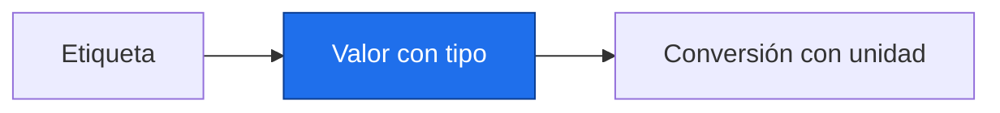

# Primeros pasos, variables y tipos

> [!abstract] Qué hace
> Convertir unidades antes de comparar tendencias.

> [!question] Tarea del Detective
> Una tasa simulada de 0.02 °C/año equivale a 0.20 °C/década. Sumar 273.15 cambia una temperatura absoluta; no cambia una diferencia ni una tasa.

## Modelo mental y sintaxis mínima



Un programa es una secuencia de instrucciones. Ejecuta una celda con Shift+Enter; un archivo con `python archivo.py`. `#` inicia un comentario. `print(...)` muestra un resultado; los paréntesis contienen sus argumentos.
Una variable es una etiqueta: `t = 14.0` asocia `t` con un valor; `=` asigna y `==` compara. Una expresión produce un valor. Las líneas se ejecutan de arriba abajo.
`int` guarda enteros, `float` decimales, `str` texto entre comillas, `bool` es `True` o `False`, y `None` indica ausencia. `type(x)` consulta el tipo; `float("14.0")` convierte texto.
`+ - * /` calculan; `//` divide hacia abajo, `%` obtiene el resto y `**` eleva a una potencia. `> >= < <= != ==` comparan. `abs(x)` quita el signo. Los decimales pueden redondearse: compara con tolerancia.
Una f-string, `f"{t:.2f}"`, inserta el valor con dos decimales. La sangría agrupa instrucciones: usa cuatro espacios cuando P1.2 abra un bloque con `:`.
`assert condicion, "mensaje"` comprueba una condición: si falla, muestra `AssertionError`. En este bloque sirve para revisar ejercicios; no sustituye controles de calidad de datos.

> [!info] Tiempo
> 15 min lectura/ejemplos + 10 min Prueba tú. Las ampliaciones se estudian dentro de su presupuesto opcional.

```python
# Temperatura y tasa simuladas; son magnitudes distintas.
t = float("14.0")
kelvin = t + 273.15
tasa = 0.02
por_decada = tasa * 10
print(f"{kelvin:.2f} K; {por_decada:.2f} °C/década")
assert abs(kelvin - 287.15) < 1e-10, "Revisa la conversión"
```
Salida esperada, capturada al ejecutar:

```text
287.15 K; 0.20 °C/década
```

| Paso o elemento | Línea u operación | Estado o interpretación |
|---|---|---|
| 1 | t = float(...) | t → 14.0 |
| 2 | kelvin = t + 273.15 | kelvin → 287.15 |
| 3 | tasa * 10 | por_decada → 0.2 |

> [!warning] Error intencional · ejecuta separado
> ❌ Se sumó texto y número. ✅ Convierte primero con `float`. `NameError` significa nombre no definido; `SyntaxError` indica sintaxis que Python no puede interpretar.
> ```python
> "14.0" + 273.15
> ```
> ```text
> Traceback (most recent call last):
>   File "error_intencional.py", line 1, in <module>
>     "14.0" + 273.15
>     ~~~~~~~^~~~~~~~
> TypeError: can only concatenate str (not "float") to str
> ```

> [!warning]- Otro error intencional
> ❌ SyntaxError: falta la expresión a la derecha de la asignación; escribe temperatura = 14.0. ✅ Repara la causa antes de seguir.
> ```python
> temperatura =
> ```
> ```text
> File "error_intencional.py", line 1
>     temperatura =
>                  ^
> SyntaxError: invalid syntax
> ```

> [!warning]- Otro error intencional
> ❌ NameError: ese nombre no fue definido; asigna su valor antes de usarlo. ✅ Repara la causa antes de seguir.
> ```python
> print(temperatura_no_definida)
> ```
> ```text
> Traceback (most recent call last):
>   File "error_intencional.py", line 1, in <module>
>     print(temperatura_no_definida)
>           ^^^^^^^^^^^^^^^^^^^^^^^
> NameError: name 'temperatura_no_definida' is not defined
> ```

## Prueba tú · 10 min
1. Predice `7 // 2` y `7 % 2`.
2. Corrige `t = "15"; k = t + 273.15`.
3. Completa la conversión de 0.03 °C/año a °C/década.

> [!success]- Solución comprobada
> ```python
> assert 7 // 2 == 3, "Cociente"
> assert 7 % 2 == 1, "Resto"
> t = "15"
> k = float(t) + 273.15
> decada = 0.03 * 10
> assert abs(k - 288.15) < 1e-10, "Kelvin"
> assert abs(decada - 0.3) < 1e-10, "Tasa"
> ```

## Mini aplicación al reto

Una tasa simulada de 0.02 °C/año equivale a 0.20 °C/década. Sumar 273.15 cambia una temperatura absoluta; no cambia una diferencia ni una tasa.

Enlaces: [[P.0 Empezar aquí|Antes]] → [[P1.2 Decisiones y repeticiones|Después]] · [[P1.E Ejercicios P1|Practicar]].

## Flashcards
¿Asignar o comparar?::= asigna; == compara
¿Qué significa None?::Ausencia explícita de valor
¿Cómo paso de °C/año a °C/década?::Multiplico por 10

- [ ] Reproduzco la salida y paso los asserts de Prueba tú sin copiar.
- [ ] Explico forma, unidad y origen simulado.

## Fuentes
Delgado Quintero, 2022, cap. 3, §§3.1–3.2, pp. 46–72; Garcimartín, 2022, Python básico, §§1–2, pp. 2–3.
[[P.B Bibliografía y plan de lectura|Páginas y documentación verificada]].
