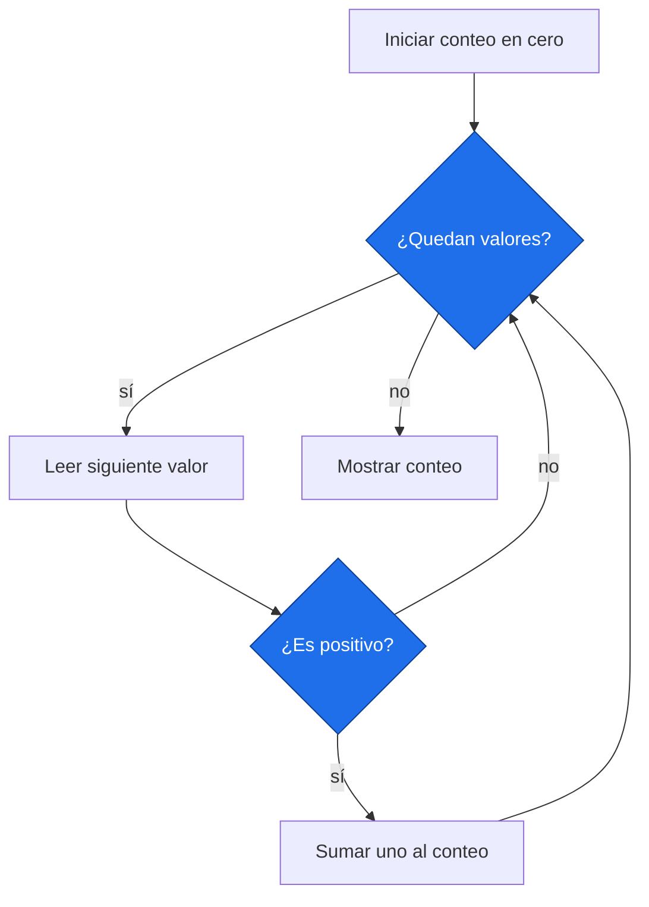

# Decisiones y repeticiones

> [!abstract] Qué hace
> Contar años con anomalía positiva y evitar bucles infinitos.

> [!question] Tarea del Detective
> El cero no cuenta como anomalía positiva. Para filtrar años válidos combina disponibilidad y condición antes de acumular.

## Modelo mental y sintaxis mínima



`if condicion:` ejecuta un bloque cuando la condición es verdadera; `elif` prueba otra; `else` cubre lo restante. `and` exige ambas, `or` alguna y `not` niega. `in` pregunta pertenencia.
Para recorrer datos usamos aquí una lista mínima: `[a, b, c]` conserva valores en orden. `for valor in lista:` visita cada uno. Sus demás operaciones llegan en P2.1.
`range(inicio, fin, paso)` recorre enteros sin incluir `fin`; `range(3)` produce 0, 1, 2. Un acumulador guarda el progreso; `suma += valor` significa `suma = suma + valor`.
`while condicion:` repite mientras siga siendo verdadera. Debe cambiar algo que termine la repetición. Cuenta, suma y máximo se inicializan antes del bucle; para el máximo usa el primer dato o `None`.
➕ `break` termina el bucle; `continue` salta a la siguiente vuelta. No se necesitan en el núcleo.

> [!info] Tiempo
> 15 min lectura/ejemplos + 10 min Prueba tú. Las ampliaciones se estudian dentro de su presupuesto opcional.

```python
# Anomalías simuladas en °C.
datos = [-0.2, 0.0, 0.3]
conteo = 0
suma = 0.0
mayor = None
for valor in datos:
    suma += valor
    if valor > 0:
        conteo += 1
    if mayor == None or valor > mayor:
        mayor = valor
i = 0
while i < 2:
    i += 1
if conteo == 0:
    etiqueta = "ninguno"
elif conteo == 1:
    etiqueta = "uno"
else:
    etiqueta = "varios"
print(conteo, etiqueta, i)
```
Salida esperada, capturada al ejecutar:

```text
1 uno 2
```

| Paso o elemento | Línea u operación | Estado o interpretación |
|---|---|---|
| 1 | valor = -0.2 | conteo=0; suma=-0.2; mayor=-0.2 |
| 2 | valor = 0.0 | conteo=0; suma=-0.2; mayor=0.0 |
| 3 | valor = 0.3 | conteo=1; suma≈0.1; mayor=0.3 |

> [!warning] Error intencional · ejecuta separado
> ❌ Falta sangría después de `:`. ✅ Indenta `print` cuatro espacios. Un bucle infinito puede no producir ningún error: detén la celda y revisa la condición.
> ```python
> if True:
> print("simulado")
> ```
> ```text
> File "error_intencional.py", line 2
>     print("simulado")
>     ^^^^^
> IndentationError: expected an indented block after 'if' statement on line 1
> ```

## Prueba tú · 10 min
1. Predice cuántas vueltas da `range(2, 5)`.
2. Corrige un contador iniciado dentro del `for`.
3. Completa un `while` que termine con `i == 3`.

> [!success]- Solución comprobada
> ```python
> contador = 0
> for i in range(2, 5):
>     contador += 1
> assert contador == 3, "El final no se incluye"
> i = 0
> while i < 3:
>     i += 1
> assert i == 3, "Actualiza i"
> ```

## Mini aplicación al reto

El cero no cuenta como anomalía positiva. Para filtrar años válidos combina disponibilidad y condición antes de acumular.

Enlaces: [[P1.1 Primeros pasos, variables y tipos|Antes]] → [[P1.3 Funciones|Después]] · [[P1.E Ejercicios P1|Practicar]].

## Flashcards
¿Incluye range su límite final?::No
¿Dónde inicializo un acumulador?::Antes del bucle
¿Qué evita un while infinito?::Una actualización que haga falsa la condición

- [ ] Reproduzco la salida y paso los asserts de Prueba tú sin copiar.
- [ ] Explico forma, unidad y origen simulado.

## Fuentes
Delgado Quintero, 2022, cap. 4, §§4.1–4.2, pp. 100–136; Garcimartín, 2022, Python básico, §§5–6, pp. 8–10.
[[P.B Bibliografía y plan de lectura|Páginas y documentación verificada]].
