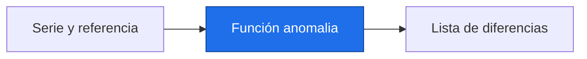

# Funciones

> [!abstract] Qué hace
> Reutilizar conversiones y cálculo de anomalías.

> [!question] Tarea del Detective
> Una función permite aplicar la misma definición de anomalía a varias regiones simuladas. Registra siempre la referencia; aquí es fija, la mensual llegará en P4.

## Modelo mental y sintaxis mínima



`def nombre(parametro):` define una función; llamarla ejecuta su cuerpo. `return` devuelve el resultado; `print` solo lo muestra. Sin `return`, una función devuelve `None`.
Los argumentos posicionales siguen el orden declarado; los nombrados usan `base=14`. Un valor por defecto se usa si omites ese argumento. La primera cadena del cuerpo es la docstring: explica contrato y unidades.
Un nombre creado dentro es local. Un nombre definido fuera es global: evita modificarlo desde la función. Pasa datos mediante parámetros.
Para construir la salida, `[]` crea una lista vacía y `.append(valor)` añade al final. Un método es una operación asociada a un objeto; P2 amplía esta idea.
`return a, b` devuelve una tupla, un grupo ordenado; `x, y = funcion()` desempaqueta sus dos valores. ➕ `lambda x: x * 10` expresa una función pequeña sin nombre.

> [!info] Tiempo
> 15 min lectura/ejemplos + 10 min Prueba tú. Las ampliaciones se estudian dentro de su presupuesto opcional.

```python
def c_a_k(t):
    """Convierte temperatura absoluta de °C a K."""
    return t + 273.15

def anomalia(serie, base=14.0):
    """Resta una referencia fija a valores simulados en °C."""
    salida = []
    for valor in serie:
        salida.append(valor - base)
    return salida

def unidades(t):
    return t, c_a_k(t)

grados, kelvin = unidades(14.0)
print(anomalia([14.0, 14.5], base=14.0))
print(f"{grados:.1f} °C = {kelvin:.2f} K")
```
Salida esperada, capturada al ejecutar:

```text
[0.0, 0.5]
14.0 °C = 287.15 K
```

| Paso o elemento | Línea u operación | Estado o interpretación |
|---|---|---|
| 1 | anomalia recibe serie y base | serie=[14.0,14.5]; base=14.0 |
| 2 | append(valor - base) | salida=[0.0] y luego [0.0,0.5] |
| 3 | return salida | la llamada produce una lista |

> [!warning] Error intencional · ejecuta separado
> ❌ `local` existe solo dentro de la función. ✅ Devuélvelo y asigna la llamada a otro nombre. No reemplaces `return` por `print`.
> ```python
> def convertir(t):
>     local = t + 273.15
> convertir(14.0)
> print(local)
> ```
> ```text
> Traceback (most recent call last):
>   File "error_intencional.py", line 4, in <module>
>     print(local)
>           ^^^^^
> NameError: name 'local' is not defined. Did you mean: 'locals'?
> ```

## Prueba tú · 10 min
1. Predice el resultado de `anomalia([14.5])`.
2. Corrige una función que imprime una conversión pero devuelve None.
3. Completa una función `decada(tasa)` con `return`.

> [!success]- Solución comprobada
> ```python
> def decada(tasa):
>     """Tasa anual a tasa por década."""
>     return tasa * 10
> def convertir(t):
>     return t + 273.15
> assert anomalia([14.5]) == [0.5], "Referencia por defecto"
> assert abs(convertir(0) - 273.15) < 1e-10, "Devuelve el valor"
> assert decada(2) == 20, "Multiplica por diez"
> ```

## Mini aplicación al reto

Una función permite aplicar la misma definición de anomalía a varias regiones simuladas. Registra siempre la referencia; aquí es fija, la mensual llegará en P4.

Enlaces: [[P1.2 Decisiones y repeticiones|Antes]] → [[P2.1 Listas, tuplas, diccionarios y conjuntos|Después]] · [[P1.E Ejercicios P1|Practicar]].

## Flashcards
¿print devuelve el dato mostrado?::No; devuelve None
¿Qué documenta una docstring?::Entradas, salida y unidades
¿Cómo saco un valor local?::Con return y una asignación al llamar

- [ ] Reproduzco la salida y paso los asserts de Prueba tú sin copiar.
- [ ] Explico forma, unidad y origen simulado.

## Fuentes
Delgado Quintero, 2022, cap. 6, §6.1, pp. 210–250; Garcimartín, 2022, Python básico, §9, pp. 12–13.
[[P.B Bibliografía y plan de lectura|Páginas y documentación verificada]].
