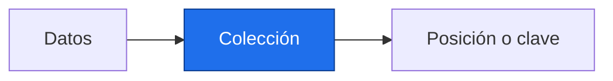

# Listas, tuplas, diccionarios y conjuntos

> [!abstract] Qué hace
> Guardar pares año y valor, y series por región.

> [!question] Tarea del Detective
> Los identificadores de región son claves. La posición de un valor en una lista no contiene por sí sola su año: guarda los años o define claramente el inicio.

## Modelo mental y sintaxis mínima


```text
posición:    0      1      2
valor:     14.0   14.2   14.4
negativo:   -3     -2     -1
```
Una lista se puede modificar; una tupla conserva sus elementos. Los índices empiezan en 0; -1 es el último. `a[inicio:fin:paso]` selecciona sin incluir fin; `len(a)` cuenta elementos.
`b = a` crea otro nombre para la misma lista. `b = a.copy()` copia el primer nivel; las listas anidadas internas seguirían compartidas. `.append`, `.extend`, `.pop`, `.sort` modifican la lista; `sort()` devuelve `None`.
Un diccionario relaciona claves únicas con valores: `d["Costa"]`; `.get(clave, defecto)` permite una clave ausente. `.items()` recorre pares clave y valor.
Un conjunto `set` reúne valores únicos sin orden posicional; `.add`, `.remove`, `|` unión y `&` intersección. Los conjuntos sí son mutables.
En texto, `.strip()` quita espacios exteriores, `.split(",")` separa campos y `",".join(partes)` los reúne. `
` dentro de una cadena representa un salto de línea.
La comparación x is None pregunta identidad con el objeto de ausencia; is not None la niega.

> [!info] Tiempo
> 15 min lectura/ejemplos + 10 min Prueba tú. Las ampliaciones se estudian dentro de su presupuesto opcional.

```python
# Series simuladas por región.
valores = [14.0, 14.2, 14.4]
copia = valores.copy()
copia[0] = 99.0
regiones = {"Costa": valores, "Sierra": [12.0, 12.3]}
anio, valor = (2000, valores[0])
campos = " Costa,14.0 ".strip().split(",")
unicos = {"Costa", "Costa", "Sierra"}
unicos.add("Llanura")
print(valores[-1], valores[:2], len(unicos))
print(",".join(campos))
```
Salida esperada, capturada al ejecutar:

```text
14.4 [14.0, 14.2] 3
Costa,14.0
```

| Paso o elemento | Línea u operación | Estado o interpretación |
|---|---|---|
| Lista | Orden y cambios | temperaturas |
| Tupla | Grupo fijo | año y valor |
| Diccionario | Consultar por clave | región → serie |
| Conjunto | Eliminar duplicados | regiones únicas |

> [!warning] Error intencional · ejecuta separado
> ❌ El índice 1 pide un segundo elemento inexistente. ✅ Usa 0 o comprueba `len`. Garcimartín, p. 4, llama inmutable a `set`; se corrige conforme a Python.
> ```python
> datos = [14.0]
> print(datos[1])
> ```
> ```text
> Traceback (most recent call last):
>   File "error_intencional.py", line 2, in <module>
>     print(datos[1])
>           ~~~~~^^^
> IndexError: list index out of range
> ```

## Prueba tú · 10 min
1. Predice `[10, 20, 30][-1]`.
2. Corrige el alias que cambia la serie original.
3. Completa un diccionario con la clave Costa y dos valores.

> [!success]- Solución comprobada
> ```python
> assert [10, 20, 30][-1] == 30, "Último elemento"
> a = [1, 2]
> b = a.copy()
> b[0] = 8
> assert a == [1, 2], "La copia protege el primer nivel"
> d = {"Costa": [14.0, 14.2]}
> assert len(d["Costa"]) == 2, "Dos años simulados"
> ```

## Mini aplicación al reto

Los identificadores de región son claves. La posición de un valor en una lista no contiene por sí sola su año: guarda los años o define claramente el inicio.

Enlaces: [[P1.3 Funciones|Antes]] → [[P2.2 Comprensiones, objetos y herramientas útiles|Después]] · [[P2.E Ejercicios P2|Practicar]].

## Flashcards
¿Qué devuelve sort?::None; modifica la lista
¿Qué significa -1?::Última posición
¿Un set es mutable?::Sí; sus elementos deben poder usarse como claves

- [ ] Reproduzco la salida y paso los asserts de Prueba tú sin copiar.
- [ ] Explico forma, unidad y origen simulado.

## Fuentes
Delgado Quintero, 2022, cap. 5, §§5.1–5.4, pp. 138–200; Garcimartín, 2022, Python básico, §§3–4 y 8, pp. 4–7 y 11–12.
[[P.B Bibliografía y plan de lectura|Páginas y documentación verificada]].
