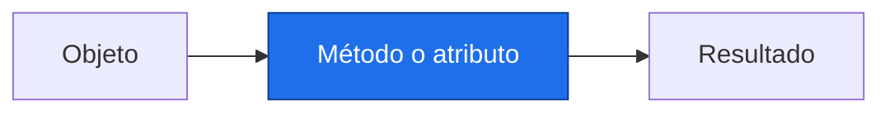

# Comprensiones, objetos y herramientas útiles

> [!abstract] Qué hace
> Transformar series y leer objetos de bibliotecas.

> [!question] Tarea del Detective
> Ordenar regiones por tasa necesita un criterio explícito. Las herramientas abreviadas conservan el significado de un bucle bien escrito.

## Modelo mental y sintaxis mínima



Una comprensión `[expresion for x in datos if condicion]` construye una lista; la condición es opcional. `{clave: valor for ...}` construye un diccionario. Primero entiende su bucle equivalente.
`zip(a, b)` empareja hasta la secuencia más corta; comprueba longitudes. `enumerate(a)` devuelve posición y valor. `sorted(a, key=funcion)` devuelve una lista ordenada sin modificar a; la función calcula el criterio.
`min`, `max`, `sum` resumen; `any` pregunta si alguna condición se cumple y `all` si todas. Evita aplicar min o max a una colección vacía.
Todo valor de Python es un objeto con tipo y operaciones. `objeto.atributo` consulta información; `objeto.metodo()` llama una operación. `dir(objeto)` lista nombres y `help(objeto.metodo)` describe su uso.
Leer `df.groupby(...).mean()` significa llamar groupby y luego mean sobre su resultado; todavía no lo ejecutamos. `resultado.slope` será un atributo numérico en P5.
➕ Una tupla con nombre permite posiciones y atributos; una `dataclass` agrupa campos con nombre. Aquí solo leerás `registro.region` y `registro.tasa` de objetos suministrados; no escribirás clases.
list(recorrido) recoge un recorrido en una lista; reverse=True invierte el orden en sorted.

> [!info] Tiempo
> 15 min lectura/ejemplos + 10 min Prueba tú. Las ampliaciones se estudian dentro de su presupuesto opcional.

```python
anios = [2000, 2001, 2002]
valores = [14.0, 14.5, 14.2]  # Simulados.
anomalias = [v - 14.0 for v in valores]
por_anio = {a: v for a, v in zip(anios, valores)}
def segundo(par):
    return par[1]
ordenados = sorted(por_anio.items(), key=segundo)
for i, valor in enumerate(anomalias):
    assert i < len(anomalias), "Posición válida"
print(anomalias)
print(ordenados[-1][0], any([v > 0 for v in anomalias]))
```
Salida esperada, capturada al ejecutar:

```text
[0.0, 0.5, 0.1999999999999993]
2001 True
```

| Paso o elemento | Línea u operación | Estado o interpretación |
|---|---|---|
| 1 | v - 14.0 | 14.0 → 0.0; 14.5 → 0.5 |
| 2 | zip(anios, valores) | 2000 ↔ 14.0 |
| 3 | sorted(..., key=segundo) | 2001 queda último |

> [!warning] Error intencional · ejecuta separado
> ❌ Una lista no tiene atributo shape. ✅ Usa `len(datos)`; shape se introduce para arreglos NumPy. Los paréntesis distinguen una llamada de la lectura de un atributo.
> ```python
> datos = [14.0]
> print(datos.shape)
> ```
> ```text
> Traceback (most recent call last):
>   File "error_intencional.py", line 2, in <module>
>     print(datos.shape)
>           ^^^^^^^^^^^
> AttributeError: 'list' object has no attribute 'shape'
> ```

## Prueba tú · 10 min
1. Predice `[v * 10 for v in [0.1, 0.2]]`.
2. Corrige zip si faltó un año: comprueba ambas longitudes antes.
3. Completa un diccionario año → anomalía con zip.

> [!success]- Solución comprobada
> ```python
> r = [v * 10 for v in [0.1, 0.2]]
> assert r == [1.0, 2.0], "Elemento a elemento"
> anios = [2000, 2001]
> valores = [0.1, 0.2]
> assert len(anios) == len(valores), "No pierdas años con zip"
> d = {a: v for a, v in zip(anios, valores)}
> assert d[2001] == 0.2, "Conserva el par"
> ```

## Mini aplicación al reto

Ordenar regiones por tasa necesita un criterio explícito. Las herramientas abreviadas conservan el significado de un bucle bien escrito.

Enlaces: [[P2.1 Listas, tuplas, diccionarios y conjuntos|Antes]] → [[P2.3 Archivos, errores y módulos|Después]] · [[P2.E Ejercicios P2|Practicar]].

## Flashcards
¿zip exige igual longitud?::No; hay que comprobarla
¿Atributo o método?::El método se llama con paréntesis
¿sorted modifica su entrada?::No; crea una lista

- [ ] Reproduzco la salida y paso los asserts de Prueba tú sin copiar.
- [ ] Explico forma, unidad y origen simulado.

## Fuentes
Delgado Quintero, 2022, cap. 5, §§5.1–5.3, pp. 138–191, y cap. 6, §6.2, p. 251; Garcimartín, 2022, Tópicos adicionales, §3, pp. 39–41.
[[P.B Bibliografía y plan de lectura|Páginas y documentación verificada]].
