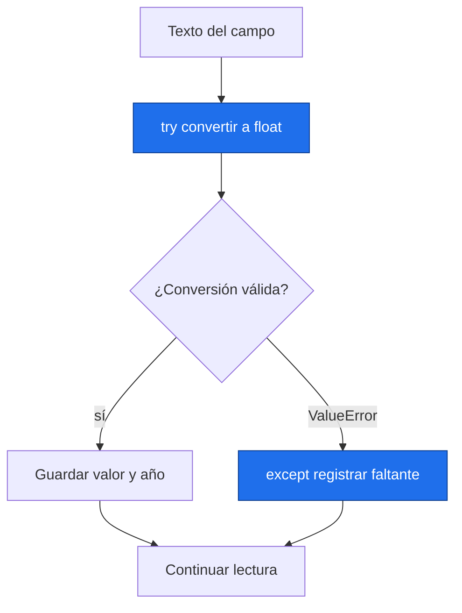

# Archivos, errores y módulos

> [!abstract] Qué hace
> Leer un CSV simulado con faltantes y errores visibles.

> [!question] Tarea del Detective
> Conserva el número de filas excluidas y la razón. En el proyecto exportarás resultados junto a periodo, referencia y unidades.

## Modelo mental y sintaxis mínima



Un módulo reúne herramientas; `import math` lo carga y `from pathlib import Path` trae un nombre. `as` crea un alias. `pip` instala paquetes desde la terminal: `python -m pip install -r requirements.txt` dentro del entorno.
`Path("datos.csv")` representa una ruta; `/` une partes de rutas. `.exists()` comprueba existencia. `with open(ruta, modo, encoding="utf-8") as f:` abre y cierra incluso si algo falla; `r` lee, `w` reemplaza y `x` crea sin sobrescribir. `.read()` lee; `.write(texto)` escribe.
`try` ejecuta algo que puede fallar; `except ValueError` trata una conversión inválida. `raise ValueError("mensaje")` detiene la función con una explicación. Atrapa errores concretos y cuenta los descartes.
`math` ofrece funciones matemáticas; `statistics.mean` promedia; `datetime.date` representa fechas. `random` existe para azar general, pero el bloque científico usará `np.random.default_rng(semilla)` desde P3.
CSV significa valores separados por comas. `split` basta para estos datos sencillos sin comas entrecomilladas; pandas leerá CSV generales en P4. ➕ Un módulo propio es un archivo `.py` cuyas funciones importas; evita llamarlo numpy.py.

> [!info] Tiempo
> 15 min lectura/ejemplos + 10 min Prueba tú. Las ampliaciones se estudian dentro de su presupuesto opcional.

```python
from pathlib import Path
import statistics
# Archivo simulado en el directorio de práctica.
ruta = Path("temperatura_P2.csv")
texto = "anio,temp_C\n2000,14.0\n2001,\n2002,14.4\n"
with open(ruta, "w", encoding="utf-8") as f:
    f.write(texto)
with open(ruta, "r", encoding="utf-8") as f:
    lineas = f.read().split("\n")
validos = []
faltantes = 0
for linea in lineas[1:]:
    if linea != "":
        anio, valor = linea.split(",")
        try:
            validos.append(float(valor))
        except ValueError:
            faltantes += 1
print(len(validos), faltantes, statistics.mean(validos))
```
Salida esperada, capturada al ejecutar:

```text
2 1 14.2
```

| Paso o elemento | Línea u operación | Estado o interpretación |
|---|---|---|
| 1 | float('14.0') | validos=[14.0] |
| 2 | float('') → except | faltantes=1 |
| 3 | float('14.4') | validos=[14.0,14.4] |

> [!warning] Error intencional · ejecuta separado
> ❌ Un campo vacío no es un número. ✅ Regístralo como faltante; no lo reemplaces silenciosamente por cero. `FileNotFoundError` apunta a una ruta ausente.
> ```python
> float("")
> ```
> ```text
> Traceback (most recent call last):
>   File "error_intencional.py", line 1, in <module>
>     float("")
>     ~~~~~^^^^
> ValueError: could not convert string to float: ''
> ```

## Prueba tú · 10 min
1. Predice cuántos valores conserva el ejemplo.
2. Corrige `except:` para capturar solo ValueError.
3. Completa una función que rechace una serie vacía con raise.

> [!success]- Solución comprobada
> ```python
> def media_segura(datos):
>     if len(datos) == 0:
>         raise ValueError("La serie está vacía")
>     return sum(datos) / len(datos)
> assert len(validos) == 2, "Se conservan dos valores"
> try:
>     float("")
> except ValueError:
>     estado = "faltante"
> assert estado == "faltante", "Trata el error concreto"
> assert media_segura([14, 16]) == 15, "Media válida"
> ```

## Mini aplicación al reto

Conserva el número de filas excluidas y la razón. En el proyecto exportarás resultados junto a periodo, referencia y unidades.

Enlaces: [[P2.2 Comprensiones, objetos y herramientas útiles|Antes]] → [[P3.1 Arreglos NumPy|Después]] · [[P2.E Ejercicios P2|Practicar]].

## Flashcards
¿Qué hace with?::Cierra el recurso al salir
¿Qué modo evita sobrescribir?::x
¿Por qué except ValueError?::No oculta errores ajenos a la conversión

- [ ] Reproduzco la salida y paso los asserts de Prueba tú sin copiar.
- [ ] Explico forma, unidad y origen simulado.

## Fuentes
Delgado Quintero, 2022, cap. 5, §5.5, pp. 201–208, y cap. 6, §§6.3–6.4, pp. 280–294; Garcimartín, 2022, Python básico, §§7 y 11, pp. 10–11 y 16–19.
[[P.B Bibliografía y plan de lectura|Páginas y documentación verificada]].
