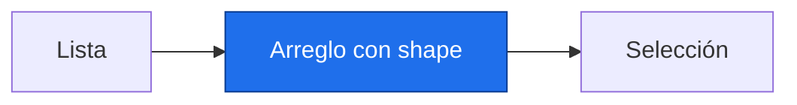

# Arreglos NumPy

> [!abstract] Qué hace
> Representar años y seleccionar celdas de una malla.

> [!question] Tarea del Detective
> Una matriz simulada necesita vectores lat y lon para saber dónde están sus celdas. P5 pondrá nombres y coordenadas con xarray.

## Modelo mental y sintaxis mínima


```text
shape = (2, 3)       columnas: 0 1 2
fila 0                        0 1 2
fila 1                        3 4 5
```
`import numpy as np` abrevia el módulo. Un arreglo `np.array` guarda valores de un tipo común y permite cálculo por elemento; multiplicar una lista la repite.
`np.arange(inicio, fin, paso)` excluye el fin; `np.linspace(inicio, fin, n)` incluye ambos extremos por defecto. `np.zeros((filas, columnas))` inicia con ceros. `dtype=float` admite decimales y faltantes.
`shape` describe tamaños por eje; `ndim` cuenta ejes; `size` cuenta elementos. `reshape` cambia la forma conservando el número total de elementos.
`a[fila, columna]` selecciona una celda; `a[:, 1:]` toma todas las filas desde la columna 1. Una máscara como `a > 0` produce booleanos; `a[mascara]` selecciona verdaderos.
Una rebanada básica suele ser una vista que comparte memoria; `.copy()` la independiza. `np.array_equal(a,b)` compara arreglos exactamente; `np.allclose(a,b)` compara números con tolerancia.

> [!info] Tiempo
> 15 min lectura/ejemplos + 10 min Prueba tú. Las ampliaciones se estudian dentro de su presupuesto opcional.

```python
import numpy as np
a = np.arange(6, dtype=float).reshape(2, 3)  # Malla simulada.
region = a[:, 1:].copy()
region[0, 0] = 99.0
lat = np.linspace(-30, 30, 2)
ceros = np.zeros((2, 3))
positivos = a[a > 0]
print(a.shape, a.ndim, a.size)
print(a[0, 1], positivos.size)
```
Salida esperada, capturada al ejecutar:

```text
(2, 3) 2 6
1.0 5
```

| Paso o elemento | Línea u operación | Estado o interpretación |
|---|---|---|
| 1 | arange(6) | shape=(6,) |
| 2 | reshape(2,3) | shape=(2,3) |
| 3 | a[:,1:].copy() | shape=(2,2); memoria separada |

> [!warning] Error intencional · ejecuta separado
> ❌ Cinco valores no caben en seis celdas. ✅ El producto de shape debe ser size. En una matriz, el eje 0 recorre filas y el eje 1 columnas; no son coordenadas geográficas por sí mismos.
> ```python
> import numpy as np
> np.arange(5).reshape(2, 3)
> ```
> ```text
> Traceback (most recent call last):
>   File "error_intencional.py", line 2, in <module>
>     np.arange(5).reshape(2, 3)
>     ~~~~~~~~~~~~~~~~~~~~^^^^^^
> ValueError: cannot reshape array of size 5 into shape (2,3)
> ```

## Prueba tú · 10 min
1. Predice shape de zeros((3,4)).
2. Corrige reshape(2,3) si hay solo cinco valores.
3. Completa una selección independiente de la primera fila.

> [!success]- Solución comprobada
> ```python
> assert np.zeros((3, 4)).shape == (3, 4), "Tres por cuatro"
> b = np.arange(6).reshape(2, 3)
> fila = b[0, :].copy()
> fila[0] = 99
> assert b[0, 0] == 0, "Copia independiente"
> ```

## Mini aplicación al reto

Una matriz simulada necesita vectores lat y lon para saber dónde están sus celdas. P5 pondrá nombres y coordenadas con xarray.

Enlaces: [[P2.3 Archivos, errores y módulos|Antes]] → [[P3.2 Vectorización, broadcasting y NaN|Después]] · [[P3.E Ejercicios P3|Practicar]].

## Flashcards
¿Qué cuenta ndim?::Ejes
¿Qué conserva reshape?::El número total de elementos
¿Una rebanada siempre copia?::No; usa copy si modificarás datos independientes

- [ ] Reproduzco la salida y paso los asserts de Prueba tú sin copiar.
- [ ] Explico forma, unidad y origen simulado.

## Fuentes
Delgado Quintero, 2022, cap. 8, §8.2, pp. 326–368; Garcimartín, 2022, NumPy, §§1–2, pp. 22–24.
[[P.B Bibliografía y plan de lectura|Páginas y documentación verificada]].
