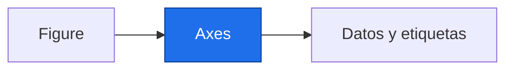

# Gráficas con matplotlib

> [!abstract] Qué hace
> Mostrar una serie simulada con unidades y una tasa espacial.

> [!question] Tarea del Detective
> La figura permite revisar si la señal simulada y las unidades son coherentes antes de interpretar resultados. Un mapa sin proyección ni costas es una vista de la malla, no cartografía completa.

## Modelo mental y sintaxis mínima



`Figure` es el lienzo y `Axes` una zona de dibujo. `fig, ax = plt.subplots()` crea ambos. `ax.plot(x,y)` une puntos; `scatter` dibuja puntos; `bar` compara categorías; `hist(..., bins=...)` cuenta intervalos.
`ax.set(title=..., xlabel=..., ylabel=...)` rotula; `label` nombra una serie y `ax.legend()` muestra la leyenda. Usa azul `#0072B2` y naranja `#D55E00`, además de marcadores o guiones para distinguir.
Una paleta divergente `RdBu_r` representa signos opuestos. Fija `vmin=-limite, vmax=limite` para que cero quede en el centro; indica siempre unidad y periodo.
La recta aquí es la tendencia conocida del simulador, no una regresión calculada. P5 enseñará a estimarla.
➕ `imshow(matriz, origin="lower", extent=[oeste,este,sur,norte])` dibuja celdas; `pcolormesh(lon,lat,matriz,shading="auto")` acepta coordenadas. `fig.colorbar(im, ax=ax)` añade escala. `fig.savefig(ruta,dpi=100)` guarda; `plt.close(fig)` libera memoria.

> [!info] Tiempo
> 15 min lectura/ejemplos + 10 min Prueba tú. Las ampliaciones se estudian dentro de su presupuesto opcional.

```python
import numpy as np
import matplotlib.pyplot as plt
rng = np.random.default_rng(2026)
t = np.arange(24)
y = 14 + 0.02 * t + rng.normal(0, 0.05, 24)  # Simulado.
fig, ax = plt.subplots(figsize=(6, 3))
ax.plot(2000 + t, y, "o-", color="#0072B2", label="Serie simulada")
ax.plot(2000 + t, 14 + 0.02 * t, "--", color="#D55E00", label="Tasa impuesta")
ax.set(xlabel="Año", ylabel="Temperatura [°C]", title="Simulado · 2000–2023")
ax.legend()
print(len(ax.lines))
```
Salida esperada, capturada al ejecutar:

```text
2
```

| Paso o elemento | Línea u operación | Estado o interpretación |
|---|---|---|
| Línea | Orden temporal | plot |
| Dispersión | Relación de pares | scatter |
| Barras | Regiones | bar |
| Histograma | Distribución | hist |

> [!warning] Error intencional · ejecuta separado
> ❌ Cada x necesita un y. ✅ Revisa las longitudes antes de dibujar. Una pendiente visual depende también de los límites de los ejes.
> ```python
> import matplotlib.pyplot as plt
> fig, ax = plt.subplots()
> ax.plot([2000, 2001], [14.0])
> ```
> ```text
> Traceback (most recent call last):
>   File "error_intencional.py", line 3, in <module>
>     ax.plot([2000, 2001], [14.0])
>     ~~~~~~~^^^^^^^^^^^^^^^^^^^^^^
>   File "C:\Users\crist\Documents\Projects\Obsidian-Maths-NASASpace\P Python desde cero\.venv-temporal\Lib\site-packages\matplotlib\axes\_axes.py", line 1792, in plot
>     lines = [*self._get_lines(self, *args, data=data, **kwargs)]
>             ^^^^^^^^^^^^^^^^^^^^^^^^^^^^^^^^^^^^^^^^^^^^^^^^^^^^
>   File "C:\Users\crist\Documents\Projects\Obsidian-Maths-NASASpace\P Python desde cero\.venv-temporal\Lib\site-packages\matplotlib\axes\_base.py", line 331, in __call__
>     yield from self._plot_args(
>                ~~~~~~~~~~~~~~~^
>         axes, this, kwargs, ambiguous_fmt_datakey=ambiguous_fmt_datakey,
>         ^^^^^^^^^^^^^^^^^^^^^^^^^^^^^^^^^^^^^^^^^^^^^^^^^^^^^^^^^^^^^^^^
>         return_kwargs=return_kwargs
>         ^^^^^^^^^^^^^^^^^^^^^^^^^^^
>     )
>     ^
>   File "C:\Users\crist\Documents\Projects\Obsidian-Maths-NASASpace\P Python desde cero\.venv-temporal\Lib\site-packages\matplotlib\axes\_base.py", line 509, in _plot_args
>     raise ValueError(f"x and y must have same first dimension, but "
>                      f"have shapes {x.shape} and {y.shape}")
> ValueError: x and y must have same first dimension, but have shapes (2,) and (1,)
> ```

## Prueba tú · 10 min
1. Predice cuántas líneas añade el ejemplo.
2. Corrige una gráfica sin unidades en y.
3. Completa la leyenda de una serie llamada Simulado.

> [!success]- Solución comprobada
> ```python
> assert len(ax.lines) == 2, "Serie y tendencia impuesta"
> ax.set_ylabel("Temperatura [°C]")
> assert ax.get_ylabel() == "Temperatura [°C]", "Unidad visible"
> ax.legend()
> assert ax.get_legend() is not None, "Leyenda creada"
> ```

## Mini aplicación al reto

La figura permite revisar si la señal simulada y las unidades son coherentes antes de interpretar resultados. Un mapa sin proyección ni costas es una vista de la malla, no cartografía completa.

![[fig_P3_3_serie.png]]

Puntos azules: serie simulada; línea naranja: tasa impuesta, no estimada.

> [!tip]- Código de figura · ampliación o soporte
> Ejecuta desde assets; para P5 carga malla de P.D. tight_layout ajusta márgenes; savefig exporta; close libera memoria.
> ```python
> import numpy as np
> import matplotlib.pyplot as plt
> rng = np.random.default_rng(2026)
> t = np.arange(24)
> y = 14 + 0.02*t + rng.normal(0, 0.05, 24)
> fig, ax = plt.subplots(figsize=(6, 3))
> ax.plot(2000+t, y, "o-", color="#0072B2", label="Serie simulada")
> ax.plot(2000+t, 14+0.02*t, "--", color="#D55E00", label="Tasa impuesta")
> ax.set(xlabel="Año", ylabel="Temperatura [°C]", title="Simulado · 2000–2023")
> ax.legend()
> fig.tight_layout()
> fig.savefig("fig_P3_3_serie.png", dpi=100, bbox_inches="tight")
> plt.close(fig)
> ```

![[fig_P3_3_mapa.png]]

Ampliación: las celdas azules tienen tasa negativa, las rojas positiva, con escala simétrica.

> [!tip]- Código de figura · ampliación o soporte
> Ejecuta desde assets; para P5 carga malla de P.D. tight_layout ajusta márgenes; savefig exporta; close libera memoria.
> ```python
> import numpy as np
> import matplotlib.pyplot as plt
> tasas = np.array([[-0.4, -0.2, 0.1, 0.3], [-0.3, -0.1, 0.2, 0.4]])
> fig, ax = plt.subplots(figsize=(5, 3))
> im = ax.imshow(tasas, origin="lower", cmap="RdBu_r", vmin=-0.4, vmax=0.4)
> fig.colorbar(im, ax=ax, label="Tasa simulada [°C/década]")
> ax.set(xlabel="Columna", ylabel="Fila", title="Malla simulada · tasas impuestas")
> fig.tight_layout()
> fig.savefig("fig_P3_3_mapa.png", dpi=100, bbox_inches="tight")
> plt.close(fig)
> ```

Enlaces: [[P3.2 Vectorización, broadcasting y NaN|Antes]] → [[P4.1 Series y DataFrames|Después]] · [[P3.E Ejercicios P3|Practicar]].

## Flashcards
¿Figure o Axes?::Lienzo o zona de dibujo
¿Cómo centro la paleta en cero?::Límites simétricos
¿Qué debe aparecer en el título?::Origen simulado y periodo; unidades en ejes

- [ ] Reproduzco la salida y paso los asserts de Prueba tú sin copiar.
- [ ] Explico forma, unidad y origen simulado.

## Fuentes
Delgado Quintero, 2022, cap. 8, §8.4, pp. 433–474; Garcimartín, 2022, matplotlib, §§1–2, pp. 26–30.
[[P.B Bibliografía y plan de lectura|Páginas y documentación verificada]].
