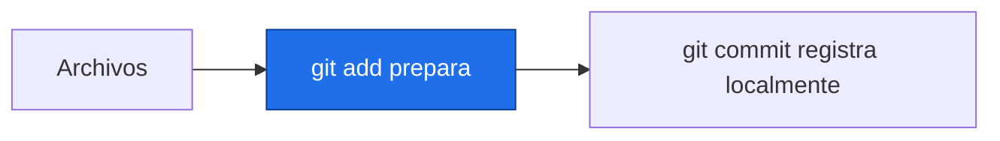
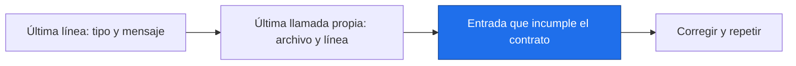

# Depuración, Git y código reproducible

> [!abstract] Qué hace
> Localizar errores y entregar código reproducible al equipo.

> [!question] Tarea del Detective
> Compartir una conclusión exige poder reconstruirla. El proyecto deja código, metadatos, figuras y límites; publicar o versionar queda bajo control del equipo.

## Modelo mental y sintaxis mínima



Un traceback enumera llamadas y termina con tipo de error y mensaje. Lee esa última línea y busca la última línea de tu código. `print(tipo, forma)` ayuda a acotar; `assert` comprueba una expectativa concreta.
Prefiere funciones pequeñas con docstring y entradas explícitas. Fija semilla, periodo, referencia y versiones. Un `venv` aísla bibliotecas; `requirements.txt` declara dependencias; un README explica ejecución y límites.
Git registra versiones. El área de trabajo contiene cambios; `add` prepara una selección; `commit` crea una versión local. Una rama es una línea de trabajo. `.gitignore` evita incluir entornos, cachés y archivos grandes.
Los comandos de la tabla son material de estudio. En esta entrega no se ejecuta ningún commit ni push. Para el proyecto escribirás README y un plan de comandos que otra persona pueda revisar.
➕ pytest descubre funciones `test_...` en archivos `test_...py`; usa asserts como los del bloque. Ejecuta `python -m pytest archivo.py` en un entorno de práctica. `time.perf_counter` mide duración; compara respuestas antes de optimizar.

> [!info] Tiempo
> 15 min lectura/ejemplos + 10 min Prueba tú. Las ampliaciones se estudian dentro de su presupuesto opcional.

```python
import numpy as np
def media_valida(valores):
    """Media en °C de una serie simulada finita, sin modificarla."""
    a = np.array(valores, dtype=float)
    assert a.size > 0, "Falta al menos un valor"
    assert np.isfinite(a).all(), "Hay valores no finitos"
    return float(a.mean())
rng = np.random.default_rng(2026)
datos = rng.normal(14, 0.1, 6)
resultado = media_valida(datos)
print(f"Media simulada: {resultado:.4f} °C")
```
Salida esperada, capturada al ejecutar:

```text
Media simulada: 13.9882 °C
```

| Paso o elemento | Línea u operación | Estado o interpretación |
|---|---|---|
| git init | Inicia un repositorio de práctica | No ejecutar en esta bóveda |
| git status | Muestra cambios | Lectura |
| git switch -c practica | Crea una rama | Plan didáctico |
| git add README.md | Prepara ese archivo | Plan didáctico |
| git commit -m "Documenta datos simulados" | Guarda una versión local | Solo explicado; no ejecutado |

> [!warning] Error intencional · ejecuta separado
> ❌ Falló una condición documentada. ✅ Revisa el dato de entrada; no borres el assert para ocultarlo. Los asserts pueden desactivarse con Python optimizado: para entrada externa usa raise.
> ```python
> def revisar(x):
>     assert x > 0, "Se necesitan datos"
> revisar(0)
> ```
> ```text
> Traceback (most recent call last):
>   File "error_intencional.py", line 3, in <module>
>     revisar(0)
>     ~~~~~~~^^^
>   File "error_intencional.py", line 2, in revisar
>     assert x > 0, "Se necesitan datos"
>            ^^^^^
> AssertionError: Se necesitan datos
> ```



## Prueba tú · 10 min
1. Predice qué ocurre con media_valida([14,16]).
2. Corrige una función que depende de una variable global.
3. Completa un assert que verifique una media esperada.

> [!success]- Solución comprobada
> ```python
> def media_explicita(datos):
>     """Media con entrada explícita."""
>     return sum(datos) / len(datos)
> assert media_valida([14, 16]) == 15, "Media conocida"
> assert media_explicita([2, 4]) == 3, "Sin globales"
> ```

## Mini aplicación al reto

Compartir una conclusión exige poder reconstruirla. El proyecto deja código, metadatos, figuras y límites; publicar o versionar queda bajo control del equipo.

Enlaces: [[P5.2 xarray y NetCDF|Antes]] → [[P.Z Proyecto integrador|Después]] · [[P5.E Ejercicios P5|Practicar]].

## Flashcards
¿Por dónde leo un traceback?::Tipo y mensaje final, luego mi línea más cercana
¿Qué fija una semilla?::La secuencia pseudoaleatoria bajo el mismo entorno
¿Git add crea una versión?::No; prepara cambios para un commit posterior

- [ ] Reproduzco la salida y paso los asserts de Prueba tú sin copiar.
- [ ] Explico forma, unidad y origen simulado.

## Fuentes
Delgado Quintero, 2022, cap. 6, §§6.3–6.4, pp. 280–294; Garcimartín, 2022, Python básico, §9, pp. 12–13, para funciones. Git y pytest: documentación oficial.
[[P.B Bibliografía y plan de lectura|Páginas y documentación verificada]].
