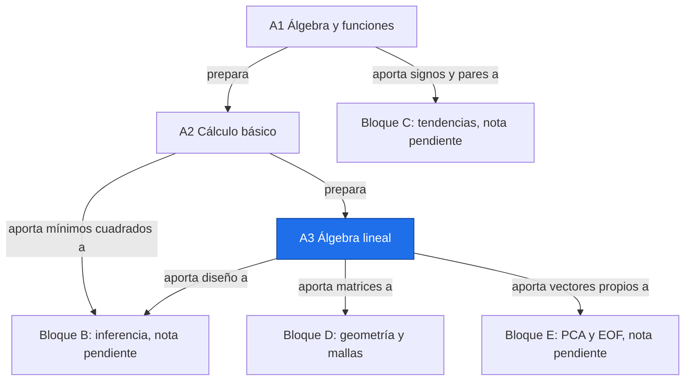

# Índice del bloque A

**Antes:** Inicio del recorrido · **Después:** [[A1.0 Índice A1|Índice A1]]

## Objetivo del bloque

Construir las bases para tomar una serie NASA por punto o malla, calcular cambios con unidades y preparar una evaluación estadística y espacial defendible.

La decisión de significancia requiere inferencia y métodos temporales de los bloques B y C (notas pendientes). D presenta geometría y multiplicidad como introducción.

Estudia A1 → A2 → A3. Todos los datos terrestres numéricos de los ejemplos son ilustrativos o simulados.

## Orden de estudio

| Nota | Tema | Prioridad | Dificultad | Enlace |
| --- | --- | --- | --- | --- |
| A1.0 | Índice A1 | E | 1 | [[A1.0 Índice A1\|Índice A1]] |
| A1.1 | Notación de sumatoria y productos | E | 1 | [[A1.1 Notación de sumatoria y productos\|Notación de sumatoria y productos]] |
| A1.2 | Función lineal, pendiente e intercepto | E | 1 | [[A1.2 Función lineal, pendiente e intercepto\|Función lineal, pendiente e intercepto]] |
| A1.3 | Logaritmos y exponenciales | E | 2 | [[A1.3 Logaritmos y exponenciales\|Logaritmos y exponenciales]] |
| A1.4 | Función signo | E | 1 | [[A1.4 Función signo\|Función signo]] |
| A1.5 | Mediana, cuantiles y rangos | E | 1 | [[A1.5 Mediana, cuantiles y rangos\|Mediana, cuantiles y rangos]] |
| A1.6 | Traducir fórmulas con sumatoria a código | E | 2 | [[A1.6 Traducir fórmulas con sumatoria a código\|Traducir fórmulas con sumatoria a código]] |
| A1.P | Práctica A1 | E | 2 | [[A1.P Práctica A1\|Práctica A1]] |
| A2.0 | Índice A2 | R | 1 | [[A2.0 Índice A2\|Índice A2]] |
| A2.1 | Derivada como tasa de cambio | R | 2 | [[A2.1 Derivada como tasa de cambio\|Derivada como tasa de cambio]] |
| A2.2 | Integral como acumulado | R | 2 | [[A2.2 Integral como acumulado\|Integral como acumulado]] |
| A2.3 | Mínimos de una función y mínimos cuadrados | R | 3 | [[A2.3 Mínimos de una función y mínimos cuadrados\|Mínimos de una función y mínimos cuadrados]] |
| A2.4 | Tasa de cambio del nivel del mar | R | 2 | [[A2.4 Tasa de cambio del nivel del mar\|Tasa de cambio del nivel del mar]] |
| A2.P | Práctica A2 | R | 2 | [[A2.P Práctica A2\|Práctica A2]] |
| A3.0 | Índice A3 | R | 1 | [[A3.0 Índice A3\|Índice A3]] |
| A3.1 | Vectores y matrices | R | 1 | [[A3.1 Vectores y matrices\|Vectores y matrices]] |
| A3.2 | Producto matricial y transpuesta | R | 2 | [[A3.2 Producto matricial y transpuesta\|Producto matricial y transpuesta]] |
| A3.3 | Mínimos cuadrados en forma matricial | R | 3 | [[A3.3 Mínimos cuadrados en forma matricial\|Mínimos cuadrados en forma matricial]] |
| A3.4 | Proyección y residuos | R | 3 | [[A3.4 Proyección y residuos\|Proyección y residuos]] |
| A3.5 | Valores y vectores propios | R | 3 | [[A3.5 Valores y vectores propios\|Valores y vectores propios]] |
| A3.6 | Regresión lineal con NumPy | R | 2 | [[A3.6 Regresión lineal con NumPy\|Regresión lineal con NumPy]] |
| A3.P | Práctica A3 | R | 2 | [[A3.P Práctica A3\|Práctica A3]] |

Después: [[D.0 Introducción al bloque D|Introducción al bloque D]] — prioridad E, dificultad 1.

## Dependencias



Enlaces: [[A1.0 Índice A1|Índice A1]] → [[A2.0 Índice A2|Índice A2]] → [[A3.0 Índice A3|Índice A3]] → [[D.0 Introducción al bloque D|Introducción al bloque D]]

## Debes saber hacer

- [ ] Leer una fórmula con Σ y traducirla a código.
- [ ] Interpretar una pendiente con sus unidades (p. ej. °C/década).
- [ ] Explicar qué significa "+3 mm/año" como derivada del nivel del mar respecto al tiempo.
- [ ] Armar la matriz de diseño X = [1, tiempo] y obtener la recta de regresión con NumPy.

**Práctica del temario:** dada una serie de 10 valores, calcular a mano la pendiente entre cada par de puntos. Tabla completa de 45 pendientes en [[A1.P Práctica A1|Práctica A1]].

## Seguimiento con Dataview

```dataview
TABLE estado, dificultad, prioridad
FROM "A Matemáticas base"
WHERE bloque = "A" AND tipo != "indice"
SORT subtema ASC, orden ASC
```

## Cobertura del temario

| Contenido | Dónde estudiarlo |
| --- | --- |
| Σ, Π, valor absoluto e índices | [[A1.1 Notación de sumatoria y productos\|Notación de sumatoria y productos]] |
| Recta, pendiente, intercepto y unidades | [[A1.2 Función lineal, pendiente e intercepto\|Función lineal, pendiente e intercepto]] |
| Logaritmos, exponenciales y semilog | [[A1.3 Logaritmos y exponenciales\|Logaritmos y exponenciales]] |
| Signos, pares, empates y S | [[A1.4 Función signo\|Función signo]] |
| Mediana, cuantiles, IQR y rangos | [[A1.5 Mediana, cuantiles y rangos\|Mediana, cuantiles y rangos]] |
| Bucles, axis, NaN y vectorización | [[A1.6 Traducir fórmulas con sumatoria a código\|Traducir fórmulas con sumatoria a código]] |
| Derivadas y diferencias numéricas | [[A2.1 Derivada como tasa de cambio\|Derivada como tasa de cambio]] |
| Integrales y trapecios | [[A2.2 Integral como acumulado\|Integral como acumulado]] |
| Mínimos y deducción OLS | [[A2.3 Mínimos de una función y mínimos cuadrados\|Mínimos de una función y mínimos cuadrados]] |
| Nivel del mar, altimetría y ENSO | [[A2.4 Tasa de cambio del nivel del mar\|Tasa de cambio del nivel del mar]] |
| Vectores, matrices, producto punto y norma | [[A3.1 Vectores y matrices\|Vectores y matrices]] |
| Producto matricial y transpuesta | [[A3.2 Producto matricial y transpuesta\|Producto matricial y transpuesta]] |
| Diseño, ecuaciones normales y rango | [[A3.3 Mínimos cuadrados en forma matricial\|Mínimos cuadrados en forma matricial]] |
| Proyección, H y residuos | [[A3.4 Proyección y residuos\|Proyección y residuos]] |
| Autovalores y puente PCA/EOF | [[A3.5 Valores y vectores propios\|Valores y vectores propios]] |
| Regresión con NumPy y SciPy | [[A3.6 Regresión lineal con NumPy\|Regresión lineal con NumPy]] |
| 45 pendientes entre diez datos | [[A1.P Práctica A1\|Práctica A1]] |
| Práctica de cálculo y álgebra lineal | [[A2.P Práctica A2\|Práctica A2]]; [[A3.P Práctica A3\|Práctica A3]] |
| Esfera, pesos, mallas, trigonometría, dependencia espacial y FDR como adelantos | [[D.0 Introducción al bloque D\|Introducción al bloque D]] |

## Flashcards

¿Cuál es el orden de estudio?::A1, A2 y A3; después la introducción de D.
¿Una pendiente distinta de cero demuestra significancia?::No; se necesita una prueba adecuada y sus supuestos.
¿Qué acompaña siempre a una tasa?::Unidad, periodo, método y procedencia de datos.

## Autoevaluación

- [ ] Resuelvo las tres prácticas.
- [ ] Convierto una tasa anual a una por década.
- [ ] Distingo cálculo verificado e inferencia válida.
- [ ] Identifico los temas que siguen pendientes.

## Verificación del material

Revisión del 2026-10-02 sobre las 24 notas de este encargo. Las salidas impresas se obtuvieron ejecutando los bloques; los ejemplos manuales se contrastaron con aritmética exacta o verificación numérica independiente.

| Comprobación | Resultado |
| --- | --- |
| Marcadores y variables de plantilla | Ninguno pendiente |
| Frontmatter | YAML válido, campos de plantilla conservados, fecha y prioridades verificadas |
| Tablas | Filas consecutivas y número de columnas consistente; alias de wikilinks escapados dentro de tablas |
| Vallas de código | Balanceadas |
| Wikilinks | Todos apuntan a notas creadas en este encargo; ninguno dentro de Mermaid |
| Python | 34 bloques ejecutados en espacios de nombres independientes, con backend Agg; salidas impresas coincidentes |
| Matemática | 249 comprobaciones con SymPy, fracciones exactas y comparaciones numéricas; incluye las 45 pendientes |
| Mermaid | 52 diagramas aceptados por mermaid.parse con jsdom, sin generar imágenes |
| Formato | UTF-8 sin BOM, saltos LF, sin espacios finales ni líneas vacías duplicadas |
| Cobertura | Mapa completo en la sección anterior; B, C y E y las futuras notas D1–D5 se señalan como pendientes |

Versiones de ejecución: NumPy 2.3.4, SciPy 1.18.0, SymPy 1.14.0 y Matplotlib 3.10.7. Los ejemplos usan únicamente las bibliotecas autorizadas y, donde se pide, itertools de la biblioteca estándar.

La validación de Mermaid comprueba sintaxis; no sustituye la revisión visual en Obsidian. No se abrió la vista de lectura de Obsidian ni se comprobó la ejecución del plugin Dataview. Conviene revisar visualmente las fórmulas extensas de A2.3, las matrices de A3.3–A3.5, la tabla plegable de A1.P y los diagramas de D.0.

**Supuestos de estudio:** tiempos anuales expresados en años, datos terrestres ilustrativos o simulados y esfera idealizada de radio elegido 6371 km en D.0. Para aplicar el material al reto, reemplaza las series por observaciones con producto, versión, fechas, unidades y calidad documentados. Las tasas, áreas del modelo y resultados simulados no son mediciones actuales de NASA.

## Fuentes

- Temario y habilidad para Detective.pdf.
- Khan Academy, álgebra, cálculo y estadística.
- 3Blue1Brown, Esencia del álgebra lineal y Esencia del cálculo.
- Jake VanderPlas, Python Data Science Handbook.
