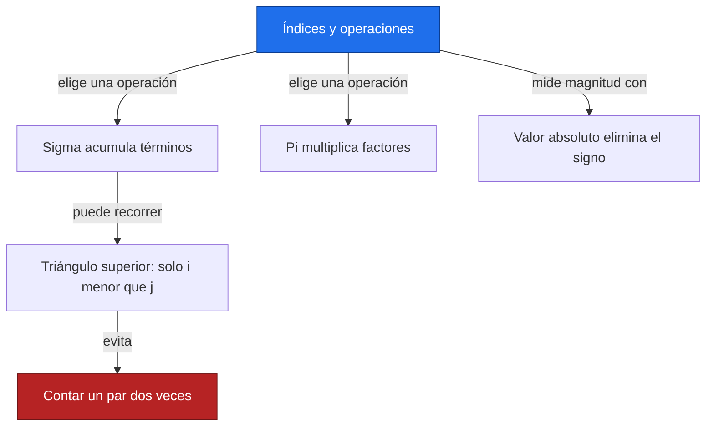
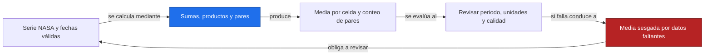
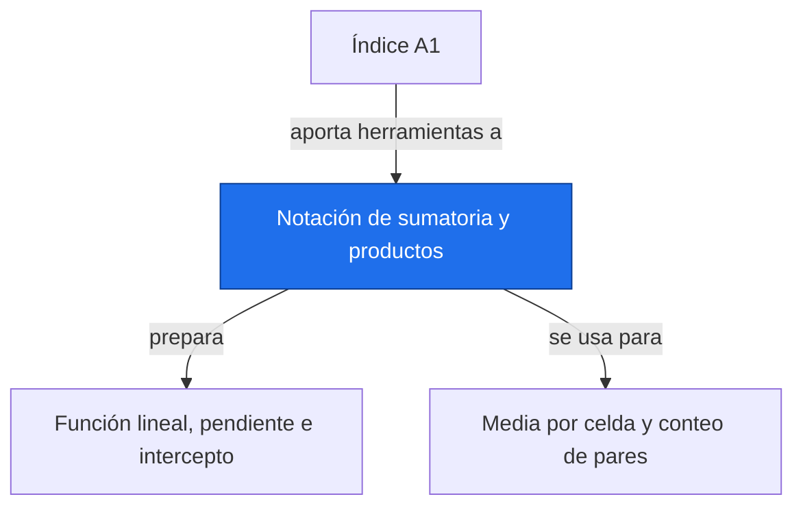

# Notación de sumatoria y productos

**Antes:** [[A1.0 Índice A1|Índice A1]] · **Después:** [[A1.2 Función lineal, pendiente e intercepto|Función lineal, pendiente e intercepto]]

> [!abstract] Idea clave
> Una sumatoria reúne aportes; un producto reúne factores; el valor absoluto mide tamaño sin dirección.

> [!question] ¿Qué pregunta responde?
> ¿Cómo leer una fórmula compacta y comprobar que cuenta cada dato o cada par una sola vez?

> [!quote]- En 30 segundos (versión hablada)
> La sigma es una instrucción de repetir y sumar. Primero decides qué índices entran, luego calculas cada término y por último acumulas. Cambiar los límites cambia el conjunto de datos que estás resumiendo.

## Intuición visual

Imagina ocho cajas con valores de una serie. Para la media, todas aportan una vez. Para comparar fechas, cada pareja debe aparecer una sola vez; el triángulo superior de una tabla de pares lo muestra.



**Conclusión intuitiva:** Una sumatoria reúne aportes; un producto reúne factores; el valor absoluto mide tamaño sin dirección.

## Definición y notación

> [!note] Definición
> Sea una lista ordenada de n números. El índice es una etiqueta que recorre posiciones, no el valor del dato.
>
> $$
> \sum_{i=1}^{n}x_i=x_1+\cdots+x_n,\qquad \prod_{i=1}^{n}x_i=x_1\cdots x_n,\qquad \lvert x\rvert=\begin{cases}x&x\geq0\\-x&x<0.\end{cases}
> $$
>
> > [!info] En palabras
> > Sigma suma, pi multiplica y el valor absoluto devuelve la distancia a cero. Los límites indican la primera y la última posición, ambas incluidas.

| Símbolo | Significa |
| --- | --- |
| n | Cantidad de observaciones |
| i, j | Posiciones de la lista |
| xᵢ | Valor de la observación i |
| Σ, Π | Suma y producto, respectivamente |

## Resultado principal

> [!important] Propiedad principal
> $$
> \sum_{i=1}^{n}(a x_i+b y_i)=a\sum_{i=1}^{n}x_i+b\sum_{i=1}^{n}y_i
> $$
>
> > [!info] En palabras
> > Si a y b no dependen del índice, pueden salir de la suma. Esta linealidad permite reorganizar medias y pendientes.

> [!tip]- Demostración (intenta hacerla antes de abrir)
> Expande los primeros términos, distribuye cada multiplicación y agrupa todos los términos de x y todos los de y. El mismo factor se repite en cada posición; por eso puede extraerse. Un factor que cambia con i debe permanecer dentro.

## Propiedades

$$
\sum_{i=1}^{n-1}\sum_{j=i+1}^{n}g_{ij}=\sum_{i<j}g_{ij},\qquad N_{\rm pares}=\frac{n(n-1)}{2}
$$

> [!info] En palabras
> El índice exterior elige el primer punto y el interior recorre solo los posteriores. Así se excluyen la diagonal y los pares invertidos.

No necesitas fechas igualmente espaciadas para contar pares. Sí necesitas sus tiempos reales cuando calcules pendientes entre ellos.

$$
\sum_{i=1}^{n}x_i^2\ne\left(\sum_{i=1}^{n}x_i\right)^2\quad\text{en general}
$$

> [!info] En palabras
> Elevar cada término al cuadrado y después sumar no equivale a elevar el total; en el segundo caso aparecen productos cruzados.

## Ejemplo resuelto

**Problema:** hallar la media de ocho anomalías ilustrativas en °C, con igual peso temporal.

| i | 1 | 2 | 3 | 4 | 5 | 6 | 7 | 8 |
| --- | --- | --- | --- | --- | --- | --- | --- | --- |
| xᵢ en °C | 1 | 2 | 2 | 3 | 4 | 4 | 5 | 3 |

$$
\bar{x}=\frac{1}{8}\sum_{i=1}^{8}x_i=\frac{1+2+2+3+4+4+5+3}{8}=\frac{24}{8}=3\ {\rm ^\circ C}
$$

> [!info] En palabras
> Suma los ocho valores y divide entre ocho; la media conserva la unidad del dato.

$$
\sum x_i^2=84,\qquad \left(\sum x_i\right)^2=576,\qquad \prod_{i=1}^{3}x_i=4
$$

> [!info] En palabras
> La suma de cuadrados, el cuadrado de la suma y el producto son tres operaciones diferentes sobre la misma lista.

> [!success] Comprobación
> La media 3 °C está entre 1 y 5 °C. El producto de los tres primeros valores sería 4 °C³ si conservamos unidades físicas; no es otra forma de media.

## Contraejemplo o caso límite

La suma de una lista vacía se define como cero y su producto como uno, pero su media no está definida. Si las fechas representan intervalos de distinta duración, la media temporal puede requerir pesos.

## Verificación con Python

```python
import numpy as np
x = np.array([1, 2, 2, 3, 4, 4, 5, 3], dtype=float)  # Ilustrativos, °C
print(f"suma = {x.sum():.0f}; media = {x.mean():.2f} °C")
print(f"suma de cuadrados = {np.sum(x**2):.0f}")
print(f"cuadrado de la suma = {np.sum(x)**2:.0f}")
print(f"producto inicial = {np.prod(x[:3]):.0f}")
i, j = np.triu_indices(x.size, k=1)
print(f"pares = {len(i)}; magnitud de -3 = {np.abs(-3)}")
```

Salida esperada:

```text
suma = 24; media = 3.00 °C
suma de cuadrados = 84
cuadrado de la suma = 576
producto inicial = 4
pares = 28; magnitud de -3 = 3
```

## Errores comunes

> [!warning] Error común
> ❌ Usar x[1] como primer dato en Python → ✅ x[0] es el primero. El último índice es n−1 y range(n) excluye n.
>
> ❌ Sumar faltantes como si fueran cero → ✅ declarar una política de datos faltantes y ajustar el denominador de la media.

## Aplicación en Space Apps

**Reto:** Earth System Trend Detective · **Pregunta:** ¿Cómo leer una fórmula compacta y comprobar que cuenta cada dato o cada par una sola vez?

Una media de anomalías resume una serie por celda. Una suma sobre pares prepara el conteo de subidas de Mann-Kendall (bloque C, nota pendiente). Ninguna de estas operaciones, por sí sola, establece significancia.



## Dependencias



Enlaces: [[A1.0 Índice A1|Índice A1]] → **Notación de sumatoria y productos** → [[A1.2 Función lineal, pendiente e intercepto|Función lineal, pendiente e intercepto]]

## Ejercicios

> [!question] Ejercicio 1
> Calcula la suma y el producto de 2, 3 y 4; calcula la magnitud de −4.
>
> > [!success]- Solución
> > Suma: 9. Producto: 24. Valor absoluto: 4. Son cantidades adimensionales en este ejercicio.

> [!question] Ejercicio 2
> ¿Cuántos pares distintos tienen cuatro datos? Enuméralos sin invertir su orden.
>
> > [!success]- Solución
> > Son 6: 1–2, 1–3, 1–4, 2–3, 2–4 y 3–4. La diagonal no participa.

## Flashcards

¿Qué indica el índice de una sumatoria?::La posición que recorre los términos, dentro de los límites indicados.
¿Qué cambia entre suma de cuadrados y cuadrado de la suma?::El segundo incluye productos cruzados.
¿Por qué usar solo i menor que j?::Para contar cada pareja una vez y excluir la diagonal.

## Autoevaluación

- [ ] Expando una suma de cuatro términos sin perder los límites.
- [ ] Obtengo 3 °C con los ocho datos y explico el denominador.
- [ ] Enumero los seis pares de cuatro puntos.
- [ ] Traduzco el primer índice matemático a x[0].

## Fuentes

- Khan Academy, cursos de álgebra y estadística: https://www.khanacademy.org
- Jake VanderPlas, Python Data Science Handbook, capítulo sobre NumPy.
