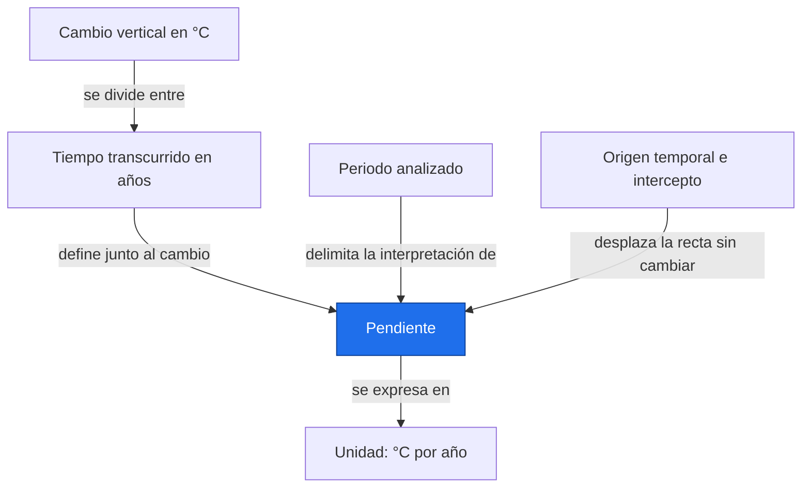
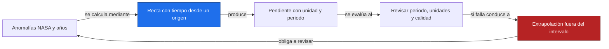
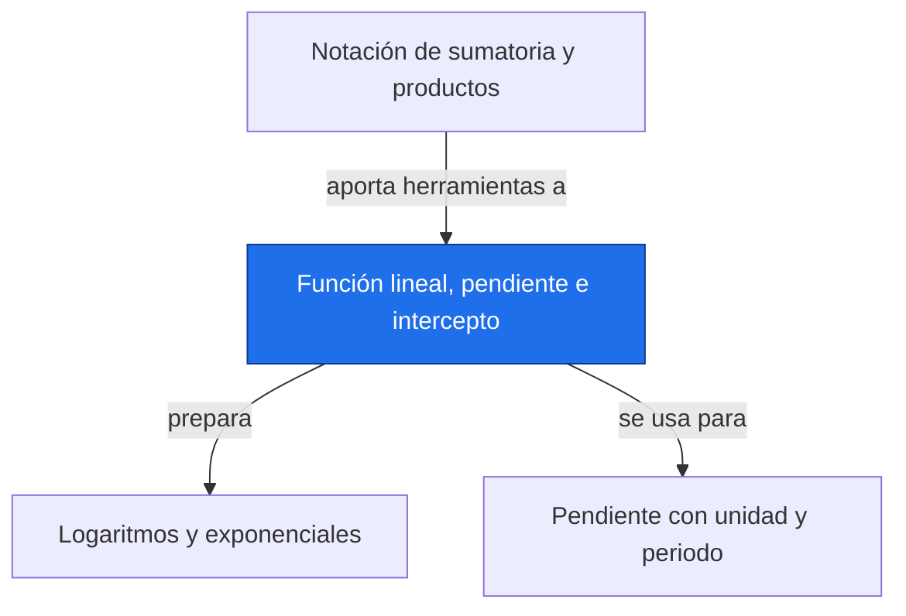

# Función lineal, pendiente e intercepto

**Antes:** [[A1.1 Notación de sumatoria y productos|Notación de sumatoria y productos]] · **Después:** [[A1.3 Logaritmos y exponenciales|Logaritmos y exponenciales]]

> [!abstract] Idea clave
> La pendiente mide cuánto cambia una variable por unidad de tiempo; el intercepto fija su valor en el origen elegido.

> [!question] ¿Qué pregunta responde?
> ¿Cuántos °C por década cambia una anomalía ilustrativa y qué periodo representa esa tasa?

> [!quote]- En 30 segundos (versión hablada)
> Una recta tiene un nivel inicial y un ritmo constante. Cambiar el año que llamamos cero cambia el nivel inicial, pero no el ritmo. Para comparar regiones hay que expresar las pendientes con las mismas unidades y fechas.

## Intuición visual

Coloca el tiempo horizontalmente y la anomalía verticalmente. La pendiente compara desplazamiento vertical con horizontal. Una recta más inclinada en la pantalla puede deberse a que cambiaste la escala de los ejes.



**Conclusión intuitiva:** La pendiente mide cuánto cambia una variable por unidad de tiempo; el intercepto fija su valor en el origen elegido.

## Definición y notación

> [!note] Definición
> $$
> y=a+bx,\qquad b=\frac{y_2-y_1}{x_2-x_1},\quad x_2\ne x_1
> $$
>
> > [!info] En palabras
> > El intercepto a es y cuando x vale cero; b es el cambio de y por cada unidad de x. En lenguaje estricto es una función afín si a no es cero, aunque se llama lineal en regresión.

| Símbolo | Significa |
| --- | --- |
| x | Años desde el origen |
| y | Anomalía en °C |
| a | Intercepto, en °C |
| b | Pendiente, en °C/año |

## Resultado principal

> [!important] Propiedad principal
> $$
> b_{\rm década}=10b_{\rm año},\qquad x^{\prime}=x-c,\qquad y=(a+bc)+bx^{\prime}
> $$
>
> > [!info] En palabras
> > Al cambiar de años a décadas, la cifra de la tasa se multiplica por diez. Al trasladar el origen c años, el nuevo intercepto es el valor de la recta en ese año y la pendiente se conserva.

> [!tip]- Demostración (intenta hacerla antes de abrir)
> Sustituye x por x′+c en la recta y distribuye b. El término constante pasa a ser a+bc. Para la unidad por década, acumula diez cambios anuales iguales.

## Propiedades

La pendiente puede ser positiva, cero o negativa. Dos puntos con tiempos distintos determinan una recta; con más puntos generalmente se obtiene un ajuste aproximado.

El intercepto es interpretable cerca del periodo observado. Usar el año civil directamente puede dar un intercepto muy grande y sin utilidad física.

## Ejemplo resuelto

**Problema:** anomalías ilustrativas con referencia fija, de 2020 a 2024.

| Año | x en años desde 2020 | y en °C |
| --- | --- | --- |
| 2020 | 0 | 0.10 |
| 2021 | 1 | 0.12 |
| 2022 | 2 | 0.14 |
| 2023 | 3 | 0.16 |
| 2024 | 4 | 0.18 |

$$
b=\frac{0.18-0.10}{4-0}=0.02\ {\rm ^\circ C/año},\qquad a=0.10\ {\rm ^\circ C},\qquad 10b=0.20\ {\rm ^\circ C/década}
$$

> [!info] En palabras
> Los cinco puntos siguen exactamente la misma recta ilustrativa: aumenta 0.02 °C por año.

$$
y=0.10+0.02x
$$

> [!info] En palabras
> Esta recta usa años desde 2020; el intercepto indica la anomalía en ese año.

Si el nuevo origen es 2022, el nuevo tiempo x′ vale cero allí y el intercepto es 0.14 °C. La pendiente sigue siendo 0.02 °C/año.

> [!success] Comprobación
> El aumento total en cuatro años es 0.08 °C. La cifra por década expresa la unidad de la tasa; no convierte el registro de cinco años en diez años de observaciones.

## Contraejemplo o caso límite

Extrapolar esta recta fuera de 2020–2024 supone que el ritmo persiste. El ejemplo no respalda esa hipótesis. Si dos puntos tienen la misma fecha, la pendiente entre ellos no está definida.

## Verificación con Python

```python
import numpy as np
anios = np.arange(2020, 2025)
t = anios - 2020
y = np.array([0.10, 0.12, 0.14, 0.16, 0.18])  # Ilustrativos, °C
b, a = np.polyfit(t, y, 1)
b2, a2 = np.polyfit(anios - 2022, y, 1)
print(f"a = {a:.2f} °C; b = {b:.2f} °C/año")
print(f"b = {10*b:.2f} °C/década")
print(f"origen 2022: a = {a2:.2f} °C; b = {b2:.2f} °C/año")
```

Salida esperada:

```text
a = 0.10 °C; b = 0.02 °C/año
b = 0.20 °C/década
origen 2022: a = 0.14 °C; b = 0.02 °C/año
```

## Errores comunes

> [!warning] Error común
> ❌ Intercambiar pendiente e intercepto al leer polyfit → ✅ devuelve primero la pendiente y luego el intercepto para grado uno.
>
> ❌ Interpretar 0.20 °C/década como aumento total observado → ✅ el aumento observado es 0.08 °C durante cuatro años.

## Aplicación en Space Apps

**Reto:** Earth System Trend Detective · **Pregunta:** ¿Cuántos °C por década cambia una anomalía ilustrativa y qué periodo representa esa tasa?

Un mapa de tendencias debe indicar °C/década, el intervalo de fechas y el método. Dos mapas con distintas ventanas pueden diferir sin que el cálculo esté mal. La incertidumbre y las pruebas se estudian en regresión (bloque B, nota pendiente).



## Dependencias



Enlaces: [[A1.1 Notación de sumatoria y productos|Notación de sumatoria y productos]] → **Función lineal, pendiente e intercepto** → [[A1.3 Logaritmos y exponenciales|Logaritmos y exponenciales]]

## Ejercicios

> [!question] Ejercicio 1
> Una serie ilustrativa sube de 5 a 11 mm entre t=1 y t=3 años. Halla pendiente e intercepto.
>
> > [!success]- Solución
> > La pendiente es 3 mm/año y el intercepto es 2 mm. Sustituir t=1 devuelve 5 mm.

> [!question] Ejercicio 2
> Convierte −0.03 °C/año a °C/década e interpreta un periodo de cuatro años.
>
> > [!success]- Solución
> > La tasa es −0.30 °C/década. Si fuera constante, el cambio en cuatro años sería −0.12 °C.

## Flashcards

¿Qué unidad tiene la pendiente?::Unidad de la respuesta dividida entre unidad del predictor.
¿Qué ocurre al trasladar el origen temporal?::Cambia el intercepto, pero no la pendiente.
¿Cómo convierto una pendiente anual a una por década?::Multiplico su valor por diez.

## Autoevaluación

- [ ] Obtengo 0.02 °C/año a partir de dos filas de la tabla.
- [ ] Recalculo el intercepto con origen en 2022.
- [ ] Distingo una tasa de un cambio acumulado.
- [ ] Explico por qué cinco años no justifican extrapolar varias décadas.

## Fuentes

- Khan Academy, cursos de álgebra y estadística: https://www.khanacademy.org
- Jake VanderPlas, Python Data Science Handbook, capítulo sobre NumPy.
- NumPy, documentación de numpy.polyfit: https://numpy.org/doc/stable/reference/generated/numpy.polyfit.html
