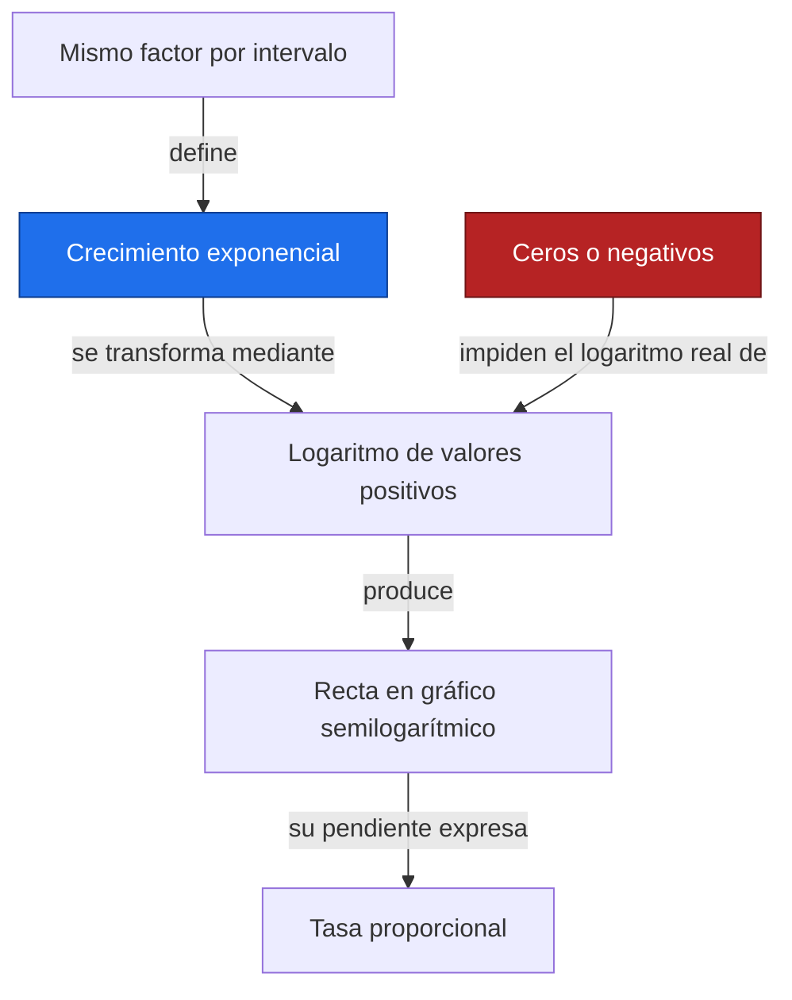
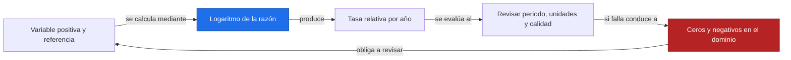
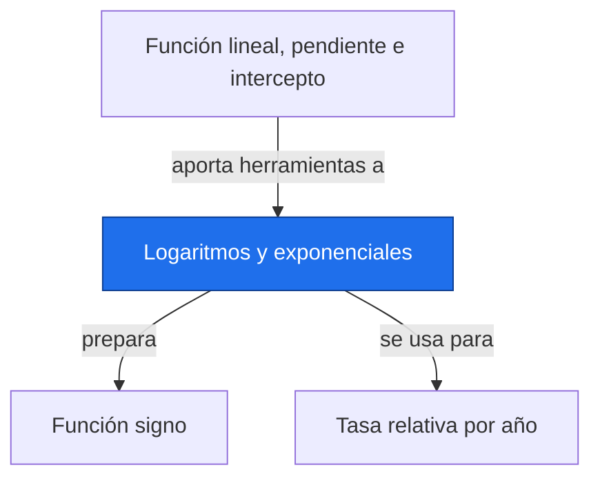

# Logaritmos y exponenciales

**Antes:** [[A1.2 Función lineal, pendiente e intercepto|Función lineal, pendiente e intercepto]] · **Después:** [[A1.4 Función signo|Función signo]]

> [!abstract] Idea clave
> Una exponencial mantiene un cambio proporcional constante; un logaritmo permite estudiar ese cambio en una escala aditiva.

> [!question] ¿Qué pregunta responde?
> ¿Cuándo una tendencia representa crecimiento proporcional y cómo leerla sin confundirla con una pendiente en unidades originales?

> [!quote]- En 30 segundos (versión hablada)
> Sumar siempre la misma cantidad produce una recta. Multiplicar siempre por el mismo factor produce una exponencial. El logaritmo convierte esos factores en incrementos, por eso una exponencial aparece recta en un gráfico semilogarítmico.

## Intuición visual

Compara un depósito que gana una cantidad fija cada año con uno que se multiplica por el mismo factor. En el segundo, el aumento absoluto crece con el nivel. La escala logarítmica muestra razones iguales como distancias iguales.



**Conclusión intuitiva:** Una exponencial mantiene un cambio proporcional constante; un logaritmo permite estudiar ese cambio en una escala aditiva.

## Definición y notación

> [!note] Definición
> $$
> z(t)=z_0e^{kt},\qquad \ln\!\left(\frac{z(t)}{z_0}\right)=kt,\qquad z_0>0
> $$
>
> > [!info] En palabras
> > El cociente respecto al nivel inicial es adimensional y positivo. k es una tasa continua por unidad de tiempo. ln usa base e y log10 usa base diez.

| Símbolo | Significa |
| --- | --- |
| z₀ | Cantidad inicial positiva |
| t | Tiempo en años |
| k | Tasa continua en año⁻¹ |
| ln, log10 | Logaritmos natural y decimal |

## Resultado principal

> [!important] Propiedad principal
> $$
> T_2=\frac{\ln 2}{k}\quad(k>0)
> $$
>
> > [!info] En palabras
> > El tiempo de duplicación es el tiempo necesario para que la cantidad se multiplique por dos; solo hay duplicación futura si la tasa es positiva.

> [!tip]- Demostración (intenta hacerla antes de abrir)
> $$
> 2z_0=z_0e^{kT_2}\ \Longrightarrow\ 2=e^{kT_2}\ \Longrightarrow\ \ln 2=kT_2
> $$
>
> > [!info] En palabras
> > Divide entre el nivel inicial y aplica el logaritmo natural. El nivel inicial se cancela, por eso no afecta al tiempo de duplicación.

## Propiedades

$$
\ln(ab)=\ln a+\ln b,\qquad \ln(a/b)=\ln a-\ln b,\qquad \ln(a^r)=r\ln a,\qquad \log_{10}a=\frac{\ln a}{\ln 10}
$$

> [!info] En palabras
> Estas identidades requieren a y b positivos en los números reales. No existe una identidad que convierta el logaritmo de una suma en suma de logaritmos.

En una gráfica semilogarítmica solo el eje vertical es logarítmico; el horizontal sigue siendo tiempo lineal. La tasa k no es exactamente el porcentaje discreto anual: este se obtiene del factor exp(k).

## Ejemplo resuelto

**Problema:** índice ilustrativo positivo que se duplica cada dos años, sin unidad física. Nivel inicial: 10; tasa continua: ln(2)/2 año⁻¹.

| t en años | 0 | 1 | 2 | 3 | 4 |
| --- | --- | --- | --- | --- | --- |
| Índice | 10 | 14.142136 | 20 | 28.284271 | 40 |

$$
k=\frac{\ln 2}{2}\approx0.346574\ {\rm año}^{-1},\quad z(4)=10e^{4\ln 2/2}=40,\quad T_2=2\ {\rm años}
$$

> [!info] En palabras
> En cuatro años ocurren dos duplicaciones. Los valores intermedios de la tabla están redondeados a seis decimales.

$$
100(e^k-1)\approx41.421356\%
$$

> [!info] En palabras
> El porcentaje discreto de aumento de un año al siguiente es aproximadamente 41.42 %, aunque la tasa continua vale aproximadamente 0.346574 por año.

> [!success] Comprobación
> Los cocientes de dos años consecutivos son iguales. La diferencia absoluta entre puntos sucesivos aumenta; una pendiente constante en escala original no representa este ejemplo.

## Contraejemplo o caso límite

Una precipitación positiva muy asimétrica puede beneficiarse de una transformación logarítmica para estudiar razones. La lluvia cero y las anomalías negativas no admiten logaritmo real directo. Agregar una constante cambia la interpretación; log1p también necesita una escala y no resuelve automáticamente los supuestos estadísticos.

## Verificación con Python

```python
import numpy as np
import matplotlib.pyplot as plt
t = np.arange(5, dtype=float)
k = np.log(2) / 2
z = 10 * np.exp(k*t)  # Índice ilustrativo
print("z =", np.round(z, 6).tolist())
print(f"k = {k:.6f}; duplicación = {np.log(2)/k:.2f} años")
print(f"aumento anual = {100*np.expm1(k):.6f}%")
plt.semilogy(t, z, "o-")
plt.xlabel("Tiempo (años)")
plt.ylabel("Índice ilustrativo, escala logarítmica")
plt.title("Crecimiento ilustrativo")
plt.grid(True)
plt.show()
```

Salida esperada:

```text
z = [10.0, 14.142136, 20.0, 28.284271, 40.0]
k = 0.346574; duplicación = 2.00 años
aumento anual = 41.421356%
```

## Errores comunes

> [!warning] Error común
> ❌ Tomar ln de anomalías negativas → ✅ revisar el dominio antes de transformar.
>
> ❌ Leer la pendiente de ln(z/z₀) como °C/año → ✅ es una tasa relativa por año. Al volver a la escala original, las medias y los intervalos no se transforman de manera trivial.

## Aplicación en Space Apps

**Reto:** Earth System Trend Detective · **Pregunta:** ¿Cuándo una tendencia representa crecimiento proporcional y cómo leerla sin confundirla con una pendiente en unidades originales?

Para una variable NASA positiva, compara la historia que cuenta una tasa absoluta con la que cuenta una tasa relativa. Documenta la transformación, el tratamiento de ceros y la unidad de referencia; no la elijas solo porque mejora la apariencia de una recta.



## Dependencias



Enlaces: [[A1.2 Función lineal, pendiente e intercepto|Función lineal, pendiente e intercepto]] → **Logaritmos y exponenciales** → [[A1.4 Función signo|Función signo]]

## Ejercicios

> [!question] Ejercicio 1
> Calcula log10 de 1000 y ln de exp(2).
>
> > [!success]- Solución
> > Los resultados son 3 y 2, respectivamente: cada logaritmo deshace la exponencial de su misma base.

> [!question] Ejercicio 2
> Un índice ilustrativo positivo sigue una exponencial con k=ln(2)/5 por año. ¿Cuándo se duplica? ¿Cuánto vale a los diez años si inicia en 3?
>
> > [!success]- Solución
> > Se duplica en cinco años. A los diez años vale 12, porque se ha duplicado dos veces.

## Flashcards

¿Qué transforma ln de un producto?::Lo convierte en la suma de los logaritmos de factores positivos.
¿Cuándo existe un tiempo de duplicación futuro?::Cuando el nivel inicial es positivo y la tasa exponencial es positiva.
¿Qué datos impiden el logaritmo real directo?::Cero y valores negativos.

## Autoevaluación

- [ ] Reconstruyo los valores 20 y 40 del ejemplo sin usar la tabla.
- [ ] Distingo tasa continua de porcentaje anual discreto.
- [ ] Reconozco una exponencial en ejes semilogarítmicos.
- [ ] Justifico el dominio antes de transformar lluvia o anomalías.

## Fuentes

- Khan Academy, cursos de álgebra y estadística: https://www.khanacademy.org
- Jake VanderPlas, Python Data Science Handbook, capítulo sobre NumPy.
