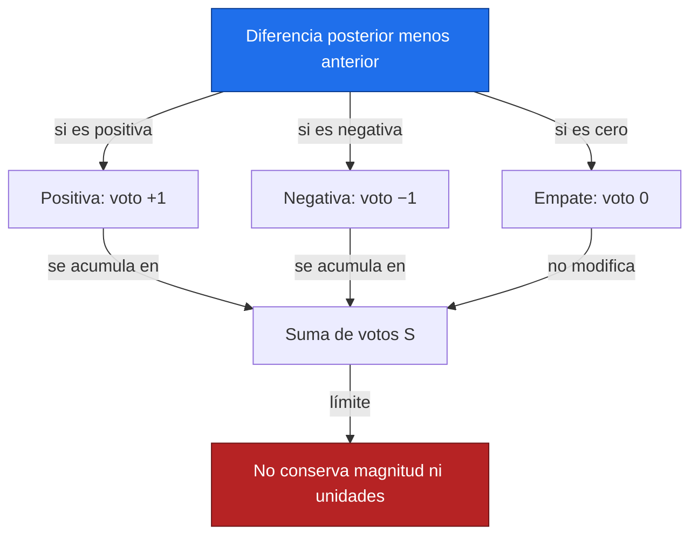
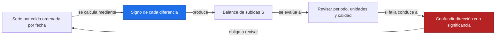
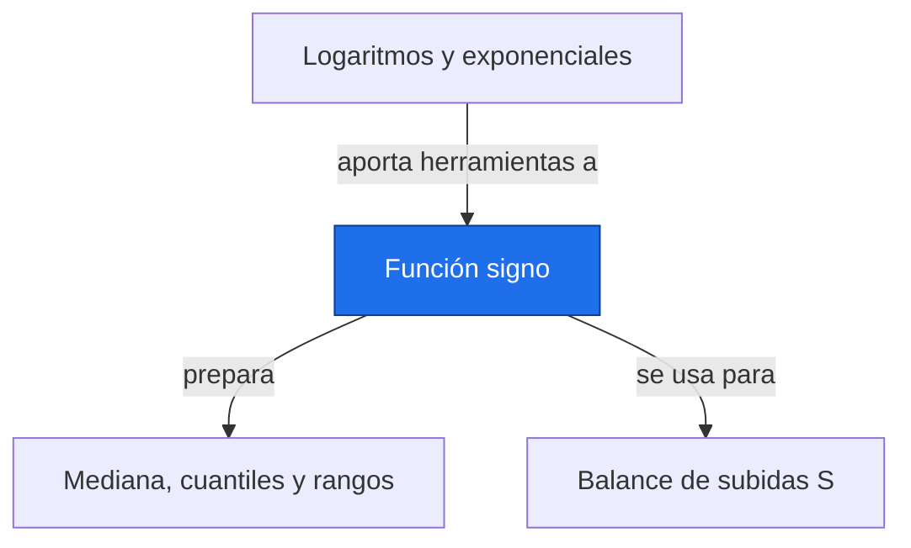

# Función signo

**Antes:** [[A1.3 Logaritmos y exponenciales|Logaritmos y exponenciales]] · **Después:** [[A1.5 Mediana, cuantiles y rangos|Mediana, cuantiles y rangos]]

> [!abstract] Idea clave
> La función signo guarda la dirección de una diferencia y descarta su tamaño.

> [!question] ¿Qué pregunta responde?
> ¿Predominan las subidas o las bajadas al comparar todas las fechas de una serie?

> [!quote]- En 30 segundos (versión hablada)
> Cada par de fechas emite un voto: más uno si el valor posterior es mayor, menos uno si es menor y cero si empatan. La suma resume la dirección dominante, pero no dice cuántos milímetros cambia la variable ni si la evidencia es significativa.

## Intuición visual

Lee una tabla triangular de comparaciones. Cada celda representa un par cronológico; las subidas y bajadas se cancelan, y los empates no añaden votos.



**Conclusión intuitiva:** La función signo guarda la dirección de una diferencia y descarta su tamaño.

## Definición y notación

> [!note] Definición
> $$
> \operatorname{sign}(d)=\begin{cases}+1&d>0\\0&d=0\\-1&d<0,\end{cases}\qquad S=\sum_{i=1}^{n-1}\sum_{j=i+1}^{n}\operatorname{sign}(x_j-x_i)
> $$
>
> > [!info] En palabras
> > Calcula primero la diferencia en orden temporal; aplica el signo a cada diferencia y después suma. El resultado S es adimensional.

| Símbolo | Significa |
| --- | --- |
| d | Diferencia posterior menos anterior |
| i < j | Orden cronológico de los puntos |
| S | Balance de subidas y bajadas |
| n | Número de datos válidos |

## Resultado principal

> [!important] Propiedad principal
> $$
> S=N_+-N_-,\qquad \lvert S\rvert\leq\frac{n(n-1)}{2}
> $$
>
> > [!info] En palabras
> > Cada par aporta a lo sumo una unidad en magnitud; los empates aportan cero. El máximo se alcanza en una serie estrictamente creciente.

> [!tip]- Demostración (intenta hacerla antes de abrir)
> Separa la suma en tres grupos: positivos, negativos y empates. Los primeros aportan una unidad por par, los segundos restan una y el último grupo suma cero. Hay como máximo tantos votos como pares.

## Propiedades

Una transformación estrictamente creciente conserva todos los signos y empates. Multiplicar los valores por un factor positivo conserva S; invertir la dirección temporal invierte su signo.

S igual a cero no demuestra constancia: una serie puede subir y luego bajar con votos que se compensan. El valor de S también depende del número de observaciones.

## Ejemplo resuelto

**Problema:** valores ilustrativos de un índice en seis fechas crecientes: 3, 1, 4, 4, 2, 5. Las fechas están igualmente espaciadas, aunque el conteo solo necesita su orden.

| i | j | xⱼ − xᵢ | Signo |
| --- | --- | --- | --- |
| 1 | 2 | -2 | -1 |
| 1 | 3 | 1 | 1 |
| 1 | 4 | 1 | 1 |
| 1 | 5 | -1 | -1 |
| 1 | 6 | 2 | 1 |
| 2 | 3 | 3 | 1 |
| 2 | 4 | 3 | 1 |
| 2 | 5 | 1 | 1 |
| 2 | 6 | 4 | 1 |
| 3 | 4 | 0 | 0 |
| 3 | 5 | -2 | -1 |
| 3 | 6 | 1 | 1 |
| 4 | 5 | -2 | -1 |
| 4 | 6 | 1 | 1 |
| 5 | 6 | 3 | 1 |

$$
N_{\rm pares}=15,\qquad N_+=10,\quad N_-=4,\quad N_0=1,\qquad S=10-4=6
$$

> [!info] En palabras
> De los quince pares, diez suben, cuatro bajan y uno empata. El par 3–4 es el empate.

> [!success] Comprobación
> Los grupos contienen 10+4+1=15 pares. El balance positivo concuerda con el predominio de subidas, aunque la serie no sea estrictamente creciente.

## Contraejemplo o caso límite

Un cambio minúsculo y uno enorme reciben el mismo voto. Un valor faltante no es un empate: hay que excluirlo según una política explícita. Con datos de sensores, la precisión y el redondeo determinan qué valores son realmente iguales.

## Verificación con Python

```python
import numpy as np
x = np.array([3, 1, 4, 4, 2, 5])  # Índice ilustrativo
i, j = np.triu_indices(x.size, k=1)
signos = np.sign(x[j] - x[i])
print(f"pares = {signos.size}")
print(f"subidas = {np.sum(signos > 0)}")
print(f"bajadas = {np.sum(signos < 0)}")
print(f"empates = {np.sum(signos == 0)}")
print(f"S = {np.sum(signos)}")
```

Salida esperada:

```text
pares = 15
subidas = 10
bajadas = 4
empates = 1
S = 6
```

## Errores comunes

> [!warning] Error común
> ❌ Calcular signo de la suma de diferencias → ✅ sumar los signos de cada diferencia.
>
> ❌ Tratar S positivo como prueba estadística completa → ✅ faltan distribución nula, tratamiento de empates y supuestos temporales.

## Aplicación en Space Apps

**Reto:** Earth System Trend Detective · **Pregunta:** ¿Predominan las subidas o las bajadas al comparar todas las fechas de una serie?

Este conteo es el punto de partida de Mann-Kendall (bloque C, nota pendiente). En una malla, cada celda produce su propio S, pero aquí no calculamos p-valores ni declaramos tendencias significativas.



## Dependencias



Enlaces: [[A1.3 Logaritmos y exponenciales|Logaritmos y exponenciales]] → **Función signo** → [[A1.5 Mediana, cuantiles y rangos|Mediana, cuantiles y rangos]]

## Ejercicios

> [!question] Ejercicio 1
> Para la serie ilustrativa 2, 2, 1, enumera los signos y calcula S.
>
> > [!success]- Solución
> > Los pares 1–2, 1–3 y 2–3 aportan 0, −1 y −1. S vale −2.

> [!question] Ejercicio 2
> Para 1, 3, 2, 4, calcula S y explica qué cambia al multiplicar todos los valores por diez.
>
> > [!success]- Solución
> > Cinco pares suben y uno baja: S vale 4. Multiplicar por diez conserva S; solo cambian las magnitudes de las diferencias.

## Flashcards

¿Cuánto aporta un empate a S?::Cero.
¿Qué conserva y qué pierde la función signo?::Conserva la dirección y pierde la magnitud de la diferencia.
¿S positivo equivale a significancia?::No; solo resume el balance de pares y requiere una prueba posterior.

## Autoevaluación

- [ ] Enumero los quince pares sin duplicar ninguno.
- [ ] Obtengo S=6 tanto a mano como con NumPy.
- [ ] Identifico el par empatado.
- [ ] Explico por qué S no se expresa en mm/año.

## Fuentes

- Khan Academy, cursos de álgebra y estadística: https://www.khanacademy.org
- Jake VanderPlas, Python Data Science Handbook, capítulo sobre NumPy.
