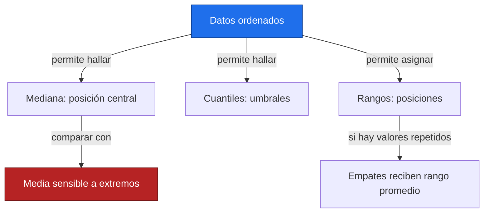
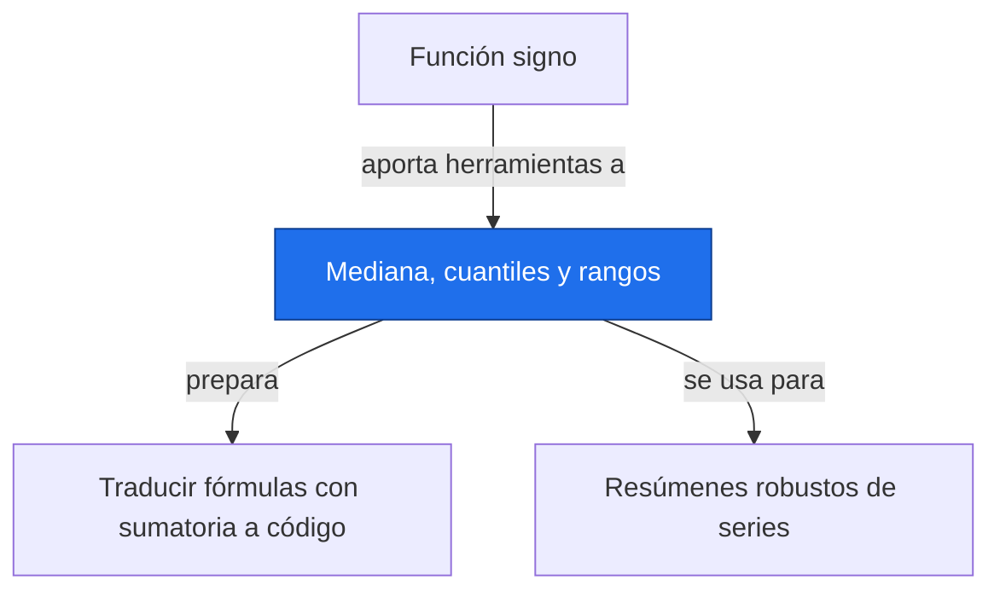

# Mediana, cuantiles y rangos

**Antes:** [[A1.4 Función signo|Función signo]] · **Después:** [[A1.6 Traducir fórmulas con sumatoria a código|Traducir fórmulas con sumatoria a código]]

> [!abstract] Idea clave
> La mediana y los cuantiles describen posiciones en datos ordenados; los rangos conservan el orden y reducen la influencia de las magnitudes extremas.

> [!question] ¿Qué pregunta responde?
> ¿Dónde está el centro de una serie asimétrica y qué valores delimitan sus extremos habituales?

> [!quote]- En 30 segundos (versión hablada para el pitch)
> Si un valor es enorme, puede arrastrar la media. La mediana mira el centro de la lista ordenada. Los cuantiles separan porciones de esa lista y los rangos asignan posiciones, tratando los empates de forma explícita.

## Intuición

Imagina ordenar días de lluvia de menor a mayor cantidad. El día central describe una posición típica sin depender del tamaño del aguacero máximo. Un umbral alto como P90 localiza la cola superior, pero su valor depende del periodo de referencia.



**Conclusión intuitiva:** ordenar permite describir centro y colas sin confundirlos con cambio temporal.

## Fórmula

$$
Q(q)=(1-g)x_{(j+1)}+g x_{(j+2)},\quad h=(n-1)q,\quad j=\lfloor h\rfloor,\quad g=h-j
$$

> [!info] En palabras
> Esta convención de interpolación lineal usa datos ordenados y posiciones matemáticas desde uno. Para q=1 se devuelve directamente el último dato. Si h es entero, se toma esa posición sin interpolar.

$$
\operatorname{mediana}(x)=Q(0.5),\qquad IQR=Q(0.75)-Q(0.25),\qquad P_p=Q(p/100)
$$

> [!info] En palabras
> La mediana es el cuantil central; el rango intercuartílico mide la separación entre el cuartil superior y el inferior. Un percentil expresa la probabilidad en escala de cero a cien.

| Símbolo | Significa |
| --- | --- |
| x₍ᵢ₎ | Dato ordenado en posición i |
| q | Fracción entre cero y uno |
| IQR | Amplitud intercuartílica, con unidad del dato |
| rango | Posición ordinal, sin unidad física |

La amplitud total es máximo menos mínimo; no es el mismo concepto que rango ordinal. Aquí se especifica siempre cuál se usa.

## Supuestos

| Supuesto | Por qué importa | Cómo lo compruebo |
| --- | --- | --- |
| Datos numéricos comparables | Unidades y referencia deben coincidir | Leer metadatos y escala |
| Orden definido y faltantes tratados | NaN no tiene posición válida | Contar faltantes y decidir exclusión |
| Convención de cuantiles explícita | Distintos métodos dan cifras distintas en muestras pequeñas | Usar method="linear" en ambos cálculos |
| Independencia no necesaria para describir esta lista | Sí puede importar para incertidumbre y pruebas posteriores | Distinguir resumen descriptivo de inferencia |
| Normalidad no exigida | Los cuantiles se definen también en datos asimétricos | No descartar el método por asimetría |

Un cuantil muestral es una estimación de un umbral poblacional. Con pocos años o con fuerte estacionalidad, su interpretación como umbral estable requiere cuidado.

## Ejemplo a mano

Datos ilustrativos de lluvia diaria en mm; lista ya ordenada. No son mediciones NASA.

| Posición | Valor en mm | Rango promedio |
| --- | --- | --- |
| 1 | 1 | 1 |
| 2 | 2 | 2.5 |
| 3 | 2 | 2.5 |
| 4 | 3 | 4 |
| 5 | 4 | 5 |
| 6 | 5 | 6 |
| 7 | 6 | 7 |
| 8 | 40 | 8 |

$$
\bar x=\frac{63}{8}=7.875\ {\rm mm},\qquad Q(0.5)=\frac{3+4}{2}=3.5\ {\rm mm}
$$

> [!info] En palabras
> La media supera siete de los ocho datos por el valor extremo de 40 mm. La mediana queda entre las dos posiciones centrales.

$$
Q(0.25)=2,\quad Q(0.75)=5.25,\quad IQR=3.25,\quad P_{10}=1.7,\quad P_{90}=16.2\quad{\rm mm}
$$

> [!info] En palabras
> Las posiciones fraccionarias h son 1.75, 5.25, 0.7 y 6.3 respectivamente. Interpolamos entre vecinos; por ejemplo P90 es 6+0.3·(40−6).

Si se reemplaza el 40 ilustrativo por 7, la media baja a 3.75 mm y la mediana permanece en 3.5 mm. La amplitud original es 39 mm y la de la lista modificada 6 mm.

## Código

```python
import numpy as np
import matplotlib.pyplot as plt
from scipy.stats import rankdata
x = np.array([1., 2., 2., 3., 4., 5., 6., 40.])  # Ilustrativos, mm
q = np.quantile(x, [0.1, 0.25, 0.5, 0.75, 0.9], method="linear")
print(f"media = {x.mean():.3f}; mediana = {np.median(x):.2f}")
print("P10, Q1, mediana, Q3, P90 =", np.round(q, 6).tolist())
print(f"IQR = {q[3]-q[1]:.2f}; amplitud = {np.ptp(x):.0f}")
print("rangos =", rankdata(x, method="average").tolist())
z = x.copy()
z[-1] = 7
print(f"media sin extremo = {z.mean():.2f}; mediana = {np.median(z):.2f}")
plt.plot(np.arange(1, 9), x, "o")
plt.axhline(np.median(x), label="Mediana", color="orange")
plt.xlabel("Posición ordenada")
plt.ylabel("Lluvia ilustrativa (mm)")
plt.title("Distribución ilustrativa con un valor extremo")
plt.legend()
plt.show()
```

Salida esperada:

```text
media = 7.875; mediana = 3.50
P10, Q1, mediana, Q3, P90 = [1.7, 2.0, 3.5, 5.25, 16.2]
IQR = 3.25; amplitud = 39
rangos = [1.0, 2.5, 2.5, 4.0, 5.0, 6.0, 7.0, 8.0]
media sin extremo = 3.75; mediana = 3.50
```

rankdata usa el promedio de las posiciones ocupadas por empates: los dos valores 2 ocupan lugares 2 y 3, por eso reciben 2.5. No se reordena la cronología original para calcular tendencias.

## Interpretación

> [!success] Qué significa el resultado
> La lluvia central ilustrativa es 3.5 mm. El 50 % central queda delimitado por Q1=2 y Q3=5.25 mm. P90=16.2 mm es un umbral interpolado, aunque ningún día de la lista tenga exactamente ese valor.

## Trampas y límites

> [!warning] Error común
> ❌ Confundir rango ordinal con amplitud → ✅ el rango expresa orden y la amplitud una diferencia de valores.
>
> ❌ Creer que un método basado en rangos carece de supuestos → ✅ métodos no paramétricos (bloque B, nota pendiente) también pueden requerir independencia y un tratamiento de empates.

No permite afirmar que haya una tendencia temporal: al ordenar se pierde la secuencia de fechas. Una transformación estrictamente creciente conserva los rangos, pero pierde información de cuánto difieren las magnitudes.

Revisa en datos de la Tierra:

- [ ] Comparo meses equivalentes antes de interpretar extremos.
- [ ] Cuento faltantes antes de estimar cuantiles.
- [ ] Distingo dependencia temporal de resumen descriptivo.
- [ ] Uso unidades, resolución y referencia homogéneas.

## Aplicación en Space Apps

**Reto:** Earth System Trend Detective · **Pregunta:** ¿cambian los umbrales de una variable por celda entre periodos comparables?

| Producto | Variable | Unidades | Cobertura | Resolución | Enlace |
| --- | --- | --- | --- | --- | --- |
| Altimetría multimisiones, serie global | Anomalía del nivel del mar | Según descarga; convertir a mm | Promedio oceánico global del producto | Conservar las fechas del archivo elegido | [NASA, nivel medio global](https://sealevel.nasa.gov/vital-signs/global-mean-sea-level/) |

La tabla señala una fuente candidata; aquí no se descargó ni analizó ese producto. Los datos de lluvia anteriores son exclusivamente ilustrativos.


## Conexiones



Enlaces: [[A1.4 Función signo|Función signo]] → **Mediana, cuantiles y rangos** → [[A1.6 Traducir fórmulas con sumatoria a código|Traducir fórmulas con sumatoria a código]]

## Flashcards

¿Qué hace la mediana ante un extremo aislado?::Su posición central puede permanecer igual aunque cambie mucho la media.
¿Cómo se asigna el rango promedio a empates?::Promediando las posiciones que ocuparían los valores empatados.
¿Por qué declarar el método de cuantiles?::Porque la interpolación muestral no tiene una única convención.

## Autoevaluación

- [ ] Obtengo media 7.875 mm y mediana 3.5 mm a mano.
- [ ] Reconstruyo P90=16.2 mm con interpolación.
- [ ] Asigno rango 2.5 a cada valor empatado.
- [ ] Explico qué información se pierde al ordenar por valor.

## Fuentes

- Khan Academy, estadística descriptiva.
- [NumPy, numpy.quantile](https://numpy.org/doc/stable/reference/generated/numpy.quantile.html).
- [SciPy, scipy.stats.rankdata](https://docs.scipy.org/doc/scipy/reference/generated/scipy.stats.rankdata.html).
