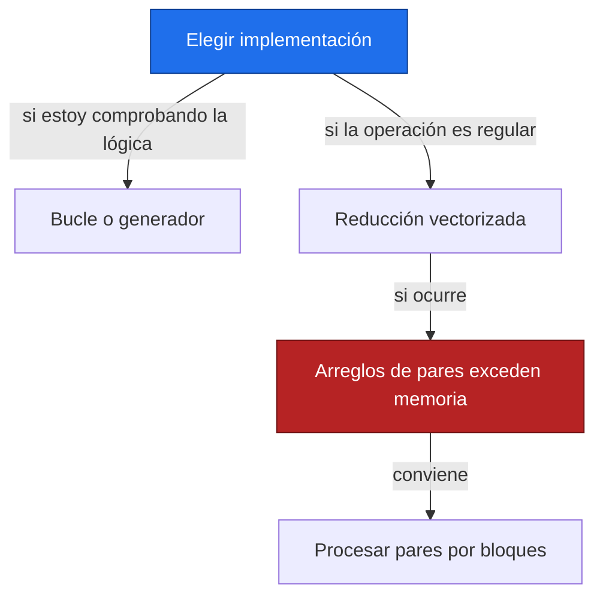
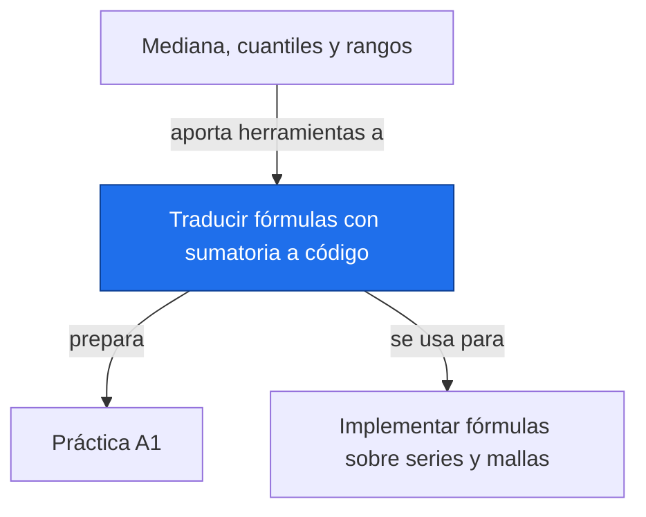

# Traducir fórmulas con sumatoria a código

**Antes:** [[A1.5 Mediana, cuantiles y rangos|Mediana, cuantiles y rangos]] · **Después:** [[A1.P Práctica A1|Práctica A1]]

> [!abstract] Qué hace
> Traduce índices, sumas simples y sumas sobre pares a código legible, comprobable y consciente de sus dimensiones.

> [!question] ¿Cuándo lo necesito?
> Al implementar una media, una varianza o el conteo S de una serie antes de aplicarlo a muchas celdas.

## Modelo mental


Separar selección, transformación y reducción ayuda a detectar errores. Primero define qué datos entran; después calcula los términos y finalmente suma. Un bucle explícito permite revisar la lógica antes de vectorizar.

## Instalación e importación

Los ejemplos requieren NumPy; la biblioteca estándar incluye itertools sin instalación adicional. Si falta NumPy, instálalo únicamente en un entorno virtual temporal activado con python -m pip install numpy. No hace falta instalar nada para leer la nota.

```python
import numpy as np
from itertools import combinations
```

Este bloque no imprime salida; deja disponibles las importaciones o el resultado indicado.

## Sintaxis mínima

$$
\sum_{i=1}^{n}g(x_i)\quad\longleftrightarrow\quad\text{suma de g aplicada a cada elemento}
$$

> [!info] En palabras
> En Python, el primer elemento tiene índice cero. range(n) recorre cero hasta n−1; el extremo final queda excluido.

```python
import numpy as np
x = np.array([1., 2., 3.])  # Ejemplo ilustrativo
total = 0.0
for valor in x:
    total += valor**2
print(f"bucle = {total:.0f}")
print(f"sum = {sum(valor**2 for valor in x):.0f}")
print(f"np.sum = {np.sum(x**2):.0f}")
```

Salida esperada:

```text
bucle = 14
sum = 14
np.sum = 14
```

Aquí la transformación es elevar al cuadrado y la reducción es sumar. Las tres implementaciones dan 14; cambiar por el cuadrado de la suma daría 36.

## Ejemplo mínimo

Usamos el mismo índice ilustrativo de [[A1.4 Función signo|Función signo]]: 3, 1, 4, 4, 2, 5. Para practicar sumas centradas calculamos su varianza muestral descriptiva.

$$
\bar x=\frac{19}{6},\qquad \sum_i(x_i-\bar x)^2=\frac{65}{6},\qquad s^2=\frac{\sum_i(x_i-\bar x)^2}{n-1}=\frac{13}{6}\approx2.166667
$$

> [!info] En palabras
> Primero calcula la media, después las desviaciones cuadradas y al final divide entre cinco. La corrección n−1 corresponde a la varianza muestral; la inferencia sobre una población necesita supuestos adicionales.

```python
import numpy as np
x = np.array([3., 1., 4., 4., 2., 5.])  # Ilustrativos
media = sum(x)/len(x)
suma = 0.0
for valor in x:
    suma += (valor-media)**2
varianza = suma/(len(x)-1)
print(f"media = {media:.6f}; suma centrada = {suma:.6f}")
print(f"varianza con bucle = {varianza:.6f}")
print(f"varianza NumPy = {np.var(x, ddof=1):.6f}")
```

Salida esperada:

```text
media = 3.166667; suma centrada = 10.833333
varianza con bucle = 2.166667
varianza NumPy = 2.166667
```

## Parámetros clave

| Parámetro | Qué hace | Valor por defecto |
| --- | --- | --- |
| axis en sum | Elimina por reducción el eje elegido | None: todos los ejes |
| dtype en sum | Controla el tipo del acumulador | Depende del tipo de entrada |
| keepdims en sum | Conserva los ejes reducidos con tamaño uno | False |
| ddof en var | Resta grados de libertad al divisor n | 0; usar 1 para la muestra |
| k en triu_indices | Elige desde qué diagonal seleccionar | 0; usar 1 para i<j |

En tiempo × ubicación, axis=0 resume el tiempo y deja una cifra por ubicación; axis=1 resume ubicaciones y deja una cifra por tiempo.

## Patrones útiles

**Patrón 1 — Pares sin diagonal ni duplicados.** Reproduce S=6 de A1.4 de dos maneras. combinations recorre pares de índices; triu_indices crea arreglos de posiciones para operar de una vez.

```python
import numpy as np
from itertools import combinations
x = np.array([3, 1, 4, 4, 2, 5])  # Ilustrativos
S_bucle = sum(np.sign(x[j]-x[i]) for i, j in combinations(range(len(x)), 2))
i, j = np.triu_indices(len(x), k=1)
S_vector = np.sign(x[j]-x[i]).sum()
print(f"pares = {len(i)}; S bucle = {S_bucle}; S vectorizado = {S_vector}")
```

Salida esperada:

```text
pares = 15; S bucle = 6; S vectorizado = 6
```

**Patrón 2 — Ejes y faltantes.** Datos ilustrativos con dos tiempos y tres ubicaciones. Una suma que omite NaN necesita un conteo de datos válidos para distinguir cero observado de ausencia completa.

```python
import numpy as np
Y = np.array([[1., np.nan, 3.], [4., 5., 6.]])
totales = np.nansum(Y, axis=0)
cuentas = np.sum(np.isfinite(Y), axis=0)
medias = np.divide(totales, cuentas, out=np.full(3, np.nan), where=cuentas > 0)
print("suma temporal por celda =", totales.tolist())
print("conteos =", cuentas.tolist())
print("medias =", medias.tolist())
print("suma espacial por tiempo =", np.nansum(Y, axis=1).tolist())
```

Salida esperada:

```text
suma temporal por celda = [5.0, 5.0, 9.0]
conteos = [2, 1, 2]
medias = [2.5, 5.0, 4.5]
suma espacial por tiempo = [4.0, 15.0]
```

## Trampas y gotchas

> [!warning] Error común
> ❌ Dividir np.nansum por el tamaño original con datos ausentes → ✅ divide entre el número de datos válidos para la media.
>
> Una columna totalmente vacía puede devolver suma cero; eso no demuestra que la variable sea cero. Infinity tampoco es un NaN y necesita una política propia.

```python
import numpy as np
x = np.array([np.nan, np.nan])
total = np.nansum(x)
n = np.isfinite(x).sum()
media = total/n if n else np.nan
print(f"suma sin datos = {total:.1f}; datos válidos = {n}; media = {media}")
```

Salida esperada:

```text
suma sin datos = 0.0; datos válidos = 0; media = nan
```

- [ ] Compruebo si el resultado es escalar o conserva un eje.
- [ ] Conservo datos originales para comparar la implementación.
- [ ] Decido cómo tratar NaN e infinitos antes de sumar.
- [ ] Uso float al trabajar con magnitudes que pueden desbordar enteros.

## ¿Esto o aquello?



Rendimiento: las sumas simples crecen linealmente con n. Enumerar todos los pares requiere trabajo cuadrático tanto con bucles como vectorizado. Un generador evita almacenar todos los pares; triu_indices y las diferencias vectorizadas consumen memoria cuadrática. Vectorizar suele reducir sobrecarga de Python, pero no cambia ese orden de crecimiento ni garantiza una mejora para cualquier tamaño.

## Uso en Space Apps

**Reto:** Earth System Trend Detective · **Tarea:** calcular S por columna y registrar cuántas fechas válidas entraron. Ejemplo de dos series ilustrativas, una creciente y otra decreciente.

```python
import numpy as np
from itertools import combinations
Y = np.array([[1., 3.], [2., np.nan], [3., 1.]])  # Ilustrativos
for celda in range(Y.shape[1]):
    x = Y[:, celda]
    x = x[np.isfinite(x)]  # Conserva el orden temporal
    S = sum(np.sign(x[j]-x[i]) for i, j in combinations(range(len(x)), 2))
    print(f"celda {celda}: n={len(x)}, S={int(S)}")
```

Salida esperada:

```text
celda 0: n=3, S=3
celda 1: n=2, S=-1
```

La reducción de datos válidos cambia el conjunto de pares. Para pendientes, conserva además las fechas reales tras aplicar la máscara; la diferencia de índices ya no mide necesariamente años. Este fragmento cuenta dirección y no realiza una prueba estadística.

## Conexiones



Enlaces: [[A1.5 Mediana, cuantiles y rangos|Mediana, cuantiles y rangos]] → **Traducir fórmulas con sumatoria a código** → [[A1.P Práctica A1|Práctica A1]]

## Flashcards

¿Qué eje resume el tiempo en una matriz tiempo × ubicación?::axis=0.
¿Por qué usar k=1 en triu_indices?::Para excluir la diagonal y conservar solo i menor que j.
¿Vectorizar todos los pares elimina el coste cuadrático?::No; sigue habiendo un número cuadrático de pares.
¿Qué significa nansum igual a cero en una columna vacía?::Es la convención de la suma, no una observación de cero.

## Autoevaluación

- [ ] Escribo la suma de cuadrados con bucle, sum y np.sum.
- [ ] Reproduzco varianza 13/6 con ddof=1.
- [ ] Obtengo S=6 con ambas implementaciones de pares.
- [ ] Predigo la forma resultante al cambiar axis.
- [ ] Detecto columnas sin observaciones antes de calcular medias.

## Fuentes

- Jake VanderPlas, Python Data Science Handbook, introducción a NumPy.
- NumPy, documentación de sum, nansum, var y triu_indices: https://numpy.org
- Python, biblioteca estándar, itertools.combinations: https://docs.python.org
