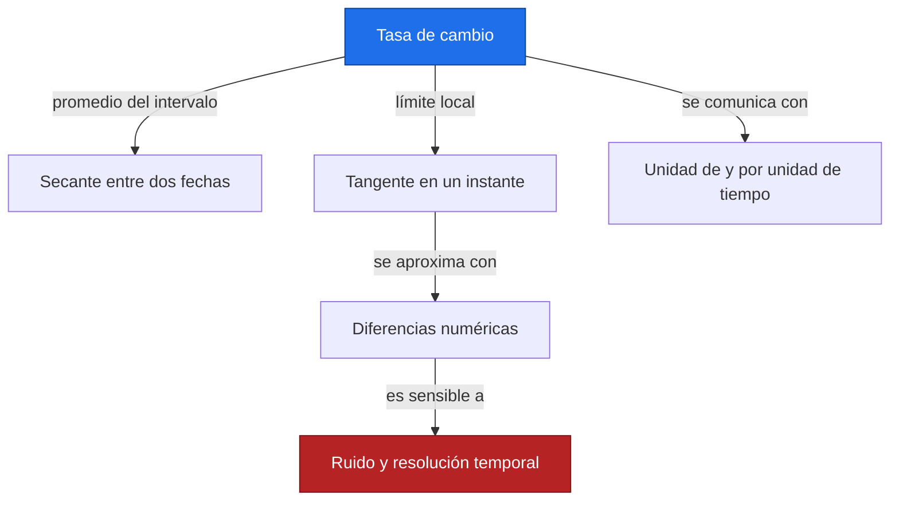
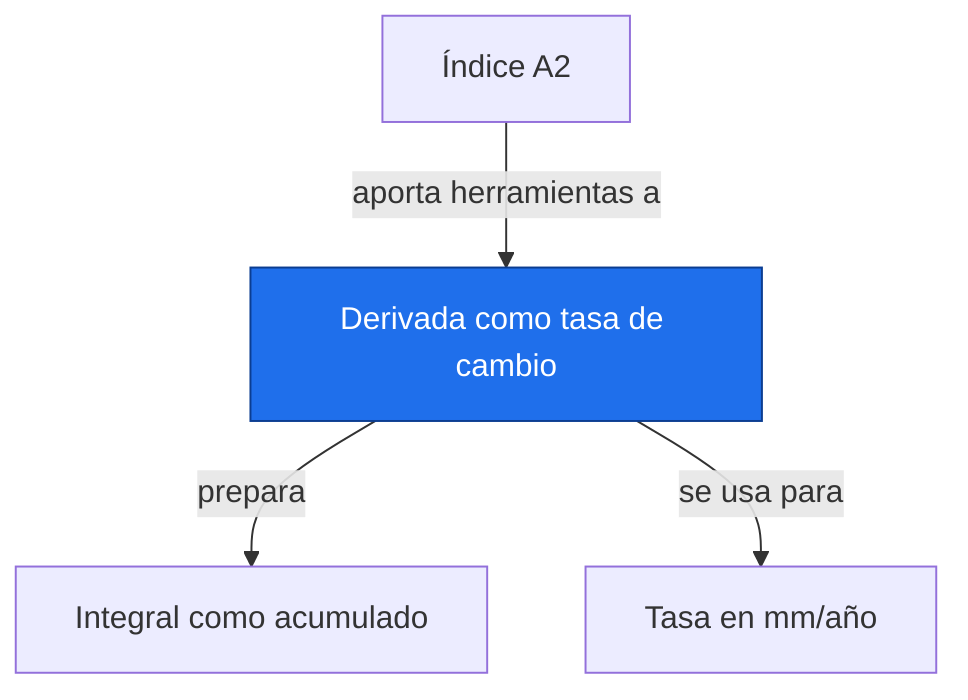

# Derivada como tasa de cambio

**Antes:** [[A2.0 Índice A2|Índice A2]] · **Después:** [[A2.2 Integral como acumulado|Integral como acumulado]]

> [!abstract] Idea clave
> La derivada describe una tasa instantánea; la pendiente media resume un intervalo completo.

> [!question] ¿Qué pregunta responde?
> ¿Está cambiando el ritmo de una serie o basta una sola tasa para describir todo el periodo?

> [!quote]- En 30 segundos (versión hablada)
> La pendiente entre dos fechas mide el cambio promedio. Si acercamos las fechas alrededor de un instante y la curva es suave, obtenemos la derivada. Un sensor registra puntos separados, así que su derivada numérica siempre es una aproximación sensible al ruido.

## Intuición visual

Una secante une dos puntos de la curva. Una tangente acompaña la curva cerca de un punto. En una recta coinciden sus pendientes; en una curva la tasa depende de dónde mires.



**Conclusión intuitiva:** La derivada describe una tasa instantánea; la pendiente media resume un intervalo completo.

## Definición y notación

> [!note] Definición
> $$
> m_{[t_1,t_2]}=\frac{h(t_2)-h(t_1)}{t_2-t_1},\qquad h^{\prime}(t)=\lim_{\Delta t\to0}\frac{h(t+\Delta t)-h(t)}{\Delta t}
> $$
>
> > [!info] En palabras
> > El cociente finito usa un intervalo no nulo. La derivada es su límite si existe y es el mismo al aproximarse desde ambos lados.

| Símbolo | Significa |
| --- | --- |
| t | Tiempo en años |
| h | Nivel ilustrativo en mm |
| Δt | Separación temporal |
| h′ | Tasa local en mm/año |

## Resultado principal

> [!important] Propiedad principal
> $$
> \frac{d}{dt}(a+bt)=b,\qquad \frac{d}{dt}(ct^2)=2ct
> $$
>
> > [!info] En palabras
> > La recta tiene una tasa constante; la cuadrática tiene una tasa que cambia linealmente con el tiempo. Los coeficientes llevan las unidades necesarias para que h sea un nivel.

> [!tip]- Demostración (intenta hacerla antes de abrir)
> $$
> \frac{c(t+\Delta t)^2-ct^2}{\Delta t}=2ct+c\Delta t\ \longrightarrow\ 2ct
> $$
>
> > [!info] En palabras
> > Expande el cuadrado y cancela el término constante. Al hacer pequeño el intervalo, desaparece el último término; lo restante es la pendiente local.

## Propiedades

La derivada de una constante es cero. La derivada de una suma es la suma de derivadas cuando existen. Una derivada positiva expresa aumento local, pero no garantiza una aceleración positiva.

Para datos con fechas irregulares pasa a np.gradient el vector de tiempos; el paso por defecto es una unidad de índice.

## Ejemplo resuelto

**Problema:** nivel ilustrativo h(t)=t² mm cuando t se expresa numéricamente en años; el coeficiente implícito es 1 mm/año².

| t en años | h en mm | Derivada exacta en mm/año |
| --- | --- | --- |
| 0 | 0 | 0 |
| 1 | 1 | 2 |
| 2 | 4 | 4 |
| 3 | 9 | 6 |
| 4 | 16 | 8 |

$$
m_{[1,3]}=\frac{9-1}{3-1}=4\ {\rm mm/año},\qquad h^{\prime}(2)=4\ {\rm mm/año}
$$

> [!info] En palabras
> La tasa media de 1 a 3 coincide aquí con la tasa en el punto medio por ser una cuadrática; no es una regla para cualquier función.

$$
h^{\prime}(1)=2\ {\rm mm/año},\qquad h^{\prime}(3)=6\ {\rm mm/año}
$$

> [!info] En palabras
> Dentro del mismo intervalo la tasa instantánea cambia, aunque la tasa media sea una sola cifra.

> [!success] Comprobación
> np.gradient con bordes de orden dos reproduce la derivada de esta cuadrática en todos los puntos. Con bordes de orden uno, los extremos usan diferencias de un solo lado y dan 1 y 7.

## Contraejemplo o caso límite

La función valor absoluto tiene una esquina en cero: allí sus pendientes laterales difieren y no existe derivada. Reducir el paso sobre mediciones ruidosas puede amplificar errores; derivar no es un método automático para encontrar tendencias climáticas.

## Verificación con Python

```python
import numpy as np
import sympy as sp
t = np.arange(5, dtype=float)
h = t**2  # Nivel ilustrativo, mm
u = sp.symbols("t", real=True)
print("derivada simbólica =", sp.diff(u**2, u))
print("gradient, borde 1 =", np.gradient(h, t).tolist())
print("gradient, borde 2 =", np.gradient(h, t, edge_order=2).tolist())
print(f"pendiente media 1 a 3 = {(h[3]-h[1])/(t[3]-t[1]):.2f}")
```

Salida esperada:

```text
derivada simbólica = 2*t
gradient, borde 1 = [1.0, 2.0, 4.0, 6.0, 7.0]
gradient, borde 2 = [0.0, 2.0, 4.0, 6.0, 8.0]
pendiente media 1 a 3 = 4.00
```

## Errores comunes

> [!warning] Error común
> ❌ Confundir cambio total con tasa → ✅ divide entre el tiempo y conserva mm/año.
>
> ❌ Usar un paso de uno cuando faltan años → ✅ utiliza fechas reales, ordenadas y sin duplicados.

## Aplicación en Space Apps

**Reto:** Earth System Trend Detective · **Pregunta:** ¿Está cambiando el ritmo de una serie o basta una sola tasa para describir todo el periodo?

Una pendiente ajustada resume el periodo; una derivada estimada muestra variaciones locales del ritmo. En datos NASA debes declarar cuál de las dos reportas y qué resolución temporal permite estimarla.


## Dependencias



Enlaces: [[A2.0 Índice A2|Índice A2]] → **Derivada como tasa de cambio** → [[A2.2 Integral como acumulado|Integral como acumulado]]

## Ejercicios

> [!question] Ejercicio 1
> Deriva h(t)=2+3t, con nivel en mm y tiempo en años.
>
> > [!success]- Solución
> > La derivada es 3 mm/año. El nivel inicial 2 mm desaparece al calcular cambios.

> [!question] Ejercicio 2
> Para h(t)=t², calcula la pendiente media entre 0 y 2 y la derivada en t=2.
>
> > [!success]- Solución
> > La media es 2 mm/año y la tasa instantánea final es 4 mm/año. La segunda es mayor porque la curva aumenta su ritmo.

## Flashcards

¿Qué representa una secante?::La tasa media entre dos puntos.
¿Qué requiere una derivada en un punto?::Que exista un único límite del cociente de diferencias.
¿Qué necesita np.gradient si los tiempos son irregulares?::El vector de coordenadas temporales reales.

## Autoevaluación

- [ ] Calculo 4 mm/año entre los años 1 y 3.
- [ ] Derivo la cuadrática mediante el cociente de diferencias.
- [ ] Explico la discrepancia en los bordes de gradient.
- [ ] Distingo ruido, tasa local y pendiente de todo el periodo.

## Fuentes

- Khan Academy, cálculo diferencial e integral: https://www.khanacademy.org
- 3Blue1Brown, serie Esencia del cálculo.
- NumPy, numpy.gradient: https://numpy.org/doc/stable/reference/generated/numpy.gradient.html
