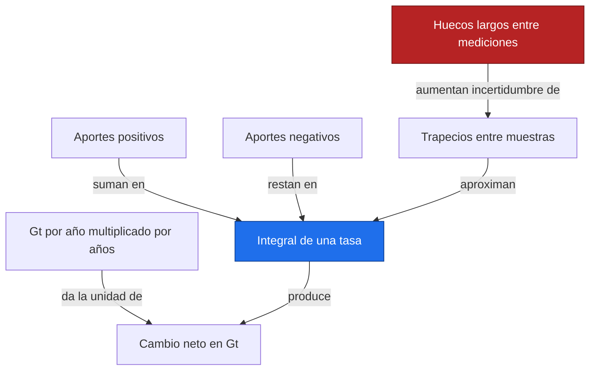
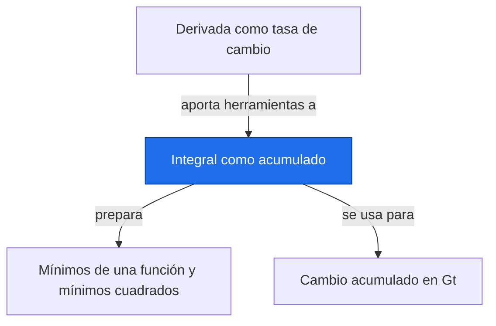

# Integral como acumulado

**Antes:** [[A2.1 Derivada como tasa de cambio|Derivada como tasa de cambio]] · **Después:** [[A2.3 Mínimos de una función y mínimos cuadrados|Mínimos de una función y mínimos cuadrados]]

> [!abstract] Idea clave
> Integrar una tasa en el tiempo permite obtener el cambio acumulado, con su signo y sus unidades.

> [!question] ¿Qué pregunta responde?
> ¿Cuánta masa se gana o pierde durante un periodo a partir de una tasa variable?

> [!quote]- En 30 segundos (versión hablada)
> Imagina un caudal medido a distintas horas. Multiplica cada tasa por la duración que representa y suma. Al hacer los intervalos más pequeños aparece la integral; con mediciones separadas, los trapecios aproximan la evolución entre puntos.

## Intuición visual

Bajo una curva de tasa, cada franja tiene altura de tasa y ancho de tiempo. Las franjas bajo cero representan pérdidas y restan al acumulado. El área geométrica sin signo y el cambio neto responden preguntas distintas.



**Conclusión intuitiva:** Integrar una tasa en el tiempo permite obtener el cambio acumulado, con su signo y sus unidades.

## Definición y notación

> [!note] Definición
> $$
> \Delta M=M(t_b)-M(t_a)=\int_{t_a}^{t_b}r(t)\,dt,\qquad r(t)=\frac{dM}{dt}
> $$
>
> > [!info] En palabras
> > La integral de la tasa de masa devuelve el cambio de masa durante el intervalo, no la masa absoluta inicial. Gt significa gigatoneladas.

| Símbolo | Significa |
| --- | --- |
| r | Tasa en Gt/año |
| M | Masa en Gt |
| tₐ, tᵦ | Límites del periodo, en años |
| ΔM | Cambio neto en Gt |

## Resultado principal

> [!important] Propiedad principal
> $$
> \int_{t_a}^{t_b}r(t)\,dt=F(t_b)-F(t_a)\quad\text{si }F^{\prime}=r
> $$
>
> > [!info] En palabras
> > El teorema fundamental conecta acumular y derivar: si conocemos una primitiva de una tasa continua, restamos sus valores en los extremos.

> [!tip]- Demostración (intenta hacerla antes de abrir)
> Piensa en el acumulado desde una fecha fija. Al añadir un intervalo muy pequeño, el acumulado crece aproximadamente a la tasa de ese instante por la duración añadida. Su derivada recupera la tasa, lo que justifica usar una primitiva.

## Propiedades

$$
\Delta M\approx\sum_{i=1}^{n-1}\frac{r_i+r_{i+1}}{2}(t_{i+1}-t_i)
$$

> [!info] En palabras
> Cada trapecio usa el promedio de dos tasas vecinas y el tiempo entre ellas. No exige intervalos iguales, pero interpreta una línea recta entre las muestras.

El método es exacto si la tasa es lineal en cada intervalo. Para curvas suaves suele mejorar al refinar las muestras; con huecos largos puede representar mal lo que ocurrió entre observaciones.

## Ejemplo resuelto

**Problema:** tasa de masa ilustrativa r(t)=−2t Gt/año para 0 a 3 años, con coeficiente −2 Gt/año².

| t en años | r en Gt/año |
| --- | --- |
| 0 | 0 |
| 1 | -2 |
| 2 | -4 |
| 3 | -6 |

$$
\Delta M=\frac{0-2}{2}\cdot1+\frac{-2-4}{2}\cdot1+\frac{-4-6}{2}\cdot1=-1-3-5=-9\ {\rm Gt}
$$

> [!info] En palabras
> Los tres trapecios representan pérdidas. Sumar sus contribuciones da una pérdida neta de nueve gigatoneladas.

$$
\int_0^3-2t\,dt=[-t^2]_0^3=-9\ {\rm Gt}
$$

> [!info] En palabras
> La primitiva confirma el cálculo de trapecios porque la tasa es lineal en todo el periodo.

> [!success] Comprobación
> La tasa va de 0 a −6 Gt/año y su promedio temporal es −3 Gt/año. Multiplicada por tres años da −9 Gt. No se ha supuesto una masa inicial.

## Contraejemplo o caso límite

Si la tasa cambia de signo, las ganancias y pérdidas se compensan. Para conocer el movimiento total sin signo habría que integrar su valor absoluto. Una serie de niveles de masa ya acumulados no debe tratarse otra vez como tasa.

## Verificación con Python

```python
import numpy as np
import sympy as sp
from scipy.integrate import trapezoid
t = np.array([0., 1., 2., 3.])
r = np.array([0., -2., -4., -6.])  # Ilustrativos, Gt/año
manual = np.sum((r[:-1]+r[1:])/2 * np.diff(t))
u = sp.symbols("t")
print(f"trapecios a mano = {manual:.2f} Gt")
print(f"SciPy = {trapezoid(r, x=t):.2f} Gt")
print(f"SymPy = {sp.integrate(-2*u, (u, 0, 3))} Gt")
```

Salida esperada:

```text
trapecios a mano = -9.00 Gt
SciPy = -9.00 Gt
SymPy = -9 Gt
```

## Errores comunes

> [!warning] Error común
> ❌ Integrar sobre números de fila cuando hay huecos → ✅ pasar los tiempos reales.
>
> ❌ Interpretar una integral negativa como área imposible → ✅ expresa pérdida neta. Usa scipy.integrate.trapezoid para evitar depender de np.trapz.

## Aplicación en Space Apps

**Reto:** Earth System Trend Detective · **Pregunta:** ¿Cuánta masa se gana o pierde durante un periodo a partir de una tasa variable?

Si un producto NASA entrega una tasa de pérdida de masa, integrarla permite informar una cantidad acumulada. Si entrega anomalías de masa, calcula primero qué operación corresponde. Lee la unidad del producto antes de decidir.


## Dependencias



Enlaces: [[A2.1 Derivada como tasa de cambio|Derivada como tasa de cambio]] → **Integral como acumulado** → [[A2.3 Mínimos de una función y mínimos cuadrados|Mínimos de una función y mínimos cuadrados]]

## Ejercicios

> [!question] Ejercicio 1
> Una tasa constante ilustrativa es −4 Gt/año durante 2.5 años. ¿Cuál es el cambio?
>
> > [!success]- Solución
> > El cambio es −10 Gt: pérdida neta de diez gigatoneladas.

> [!question] Ejercicio 2
> Integra por trapecios las tasas 2, 4 y 6 Gt/año en tiempos 0, 1 y 3 años.
>
> > [!success]- Solución
> > El primer intervalo aporta 3 Gt y el segundo 10 Gt. Total: 13 Gt; el segundo intervalo dura dos años.

## Flashcards

¿Qué unidad resulta al integrar Gt/año respecto a años?::Gt.
¿Cuándo es exacta la regla del trapecio?::Cuando la tasa es lineal entre los puntos muestreados.
¿Qué dato adicional hace falta para obtener masa absoluta?::La masa inicial o una referencia equivalente.

## Autoevaluación

- [ ] Obtengo −9 Gt con tres trapecios.
- [ ] Explico por qué el resultado tiene signo negativo.
- [ ] Integro una serie con separaciones temporales distintas.
- [ ] Distingo un cambio neto de una masa absoluta.

## Fuentes

- Khan Academy, cálculo diferencial e integral: https://www.khanacademy.org
- 3Blue1Brown, serie Esencia del cálculo.
- SciPy, scipy.integrate.trapezoid: https://docs.scipy.org/doc/scipy/reference/generated/scipy.integrate.trapezoid.html
