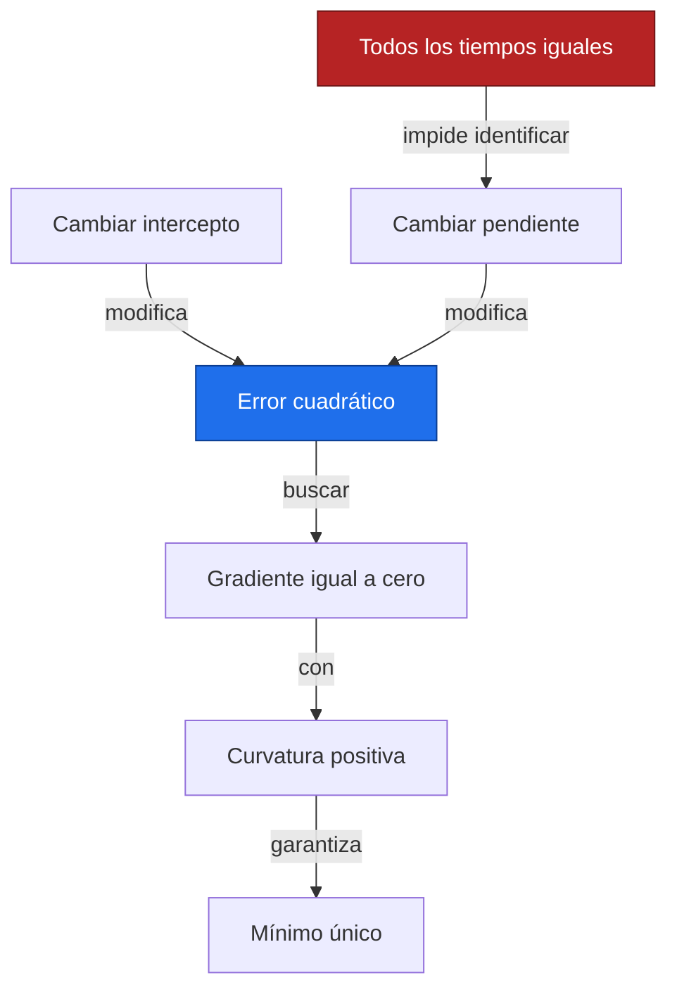
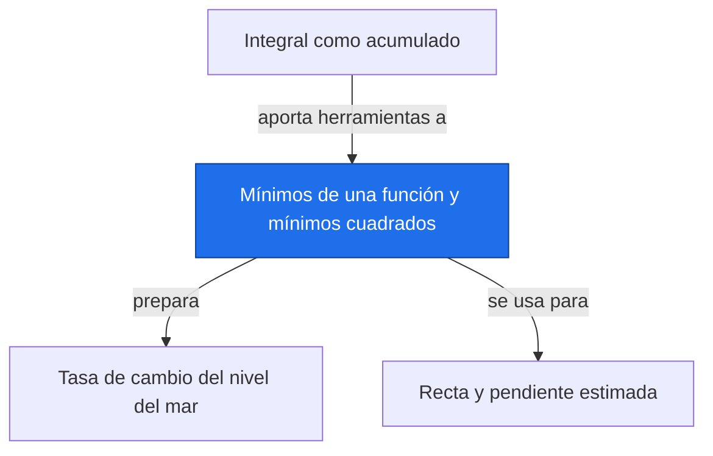

# Mínimos de una función y mínimos cuadrados

**Antes:** [[A2.2 Integral como acumulado|Integral como acumulado]] · **Después:** [[A2.4 Tasa de cambio del nivel del mar|Tasa de cambio del nivel del mar]]

> [!abstract] Idea clave
> La recta de mínimos cuadrados elige intercepto y pendiente para minimizar la suma de errores verticales al cuadrado.

> [!question] ¿Qué pregunta responde?
> ¿Por qué unos coeficientes concretos dan el menor error cuadrático para una serie?

> [!quote]- En 30 segundos (versión hablada)
> Cada recta deja distancias verticales respecto a los datos. Al elevarlas al cuadrado evitamos que errores positivos y negativos se cancelen y penalizamos más los grandes. Buscamos los coeficientes donde ninguna modificación pequeña reduzca el total.

## Intuición visual

Imagina un paisaje cuya altura es el error y cuyos ejes horizontales son intercepto y pendiente. Si los tiempos no son todos iguales, el paisaje es un cuenco con un único fondo.



**Conclusión intuitiva:** La recta de mínimos cuadrados elige intercepto y pendiente para minimizar la suma de errores verticales al cuadrado.

## Definición y notación

> [!note] Definición
> $$
> S(a,b)=\sum_{i=1}^{n}(y_i-a-bx_i)^2,\qquad e_i=y_i-a-bx_i
> $$
>
> > [!info] En palabras
> > S suma errores verticales al cuadrado para un conjunto fijo de datos. Si y está en mm, S se expresa en mm²; los coeficientes a y b son las variables de la optimización.

| Símbolo | Significa |
| --- | --- |
| a, b | Intercepto y pendiente a estimar |
| eᵢ | Residuo del punto i |
| S | Suma de cuadrados residual |
| x̄, ȳ | Medias de predictor y respuesta |

## Resultado principal

> [!important] Propiedad principal
> $$
> b=\frac{\sum_{i=1}^{n}(x_i-\bar{x})(y_i-\bar{y})}{\sum_{i=1}^{n}(x_i-\bar{x})^2},\qquad a=\bar{y}-b\bar{x}
> $$
>
> > [!info] En palabras
> > Si hay al menos dos valores distintos de x, el denominador es positivo y estos coeficientes definen el mínimo único del error cuadrático.

> [!tip]- Demostración (intenta hacerla antes de abrir)
> **1. Condiciones críticas.** Deriva respecto a cada coeficiente, manteniendo fijo el otro.
>
> $$
> \frac{\partial S}{\partial a}=-2\sum_i(y_i-a-bx_i)=0,\qquad \frac{\partial S}{\partial b}=-2\sum_i x_i(y_i-a-bx_i)=0
> $$
>
> > [!info] En palabras
> > En el fondo del cuenco, cambiar intercepto o pendiente no produce una variación de primer orden en el error.
>
> **2. Ecuaciones normales.** Reorganiza los términos.
>
> $$
> na+b\sum_i x_i=\sum_i y_i,\qquad a\sum_i x_i+b\sum_i x_i^2=\sum_i x_i y_i
> $$
>
> > [!info] En palabras
> > La primera ecuación fuerza que la recta pase por el punto de las medias. La segunda equilibra los residuos ponderados por x.
>
> **3. Elimina el intercepto.** De la primera ecuación despeja a y sustitúyelo en la segunda.
>
> $$
> a=\bar y-b\bar x,\qquad b\left(\sum_i x_i^2-n\bar x^2\right)=\sum_i x_i y_i-n\bar x\bar y
> $$
>
> > [!info] En palabras
> > Sustituir el intercepto deja una sola ecuación para la pendiente. Los términos entre paréntesis equivalen a la suma de desviaciones cuadradas.
>
> **4. Centra las sumas.**
>
> $$
> \sum_i(x_i-\bar x)^2=\sum_i x_i^2-n\bar x^2,\qquad \sum_i(x_i-\bar x)(y_i-\bar y)=\sum_i x_i y_i-n\bar x\bar y
> $$
>
> > [!info] En palabras
> > Expandir los productos y usar las definiciones de las medias lleva a la fórmula principal.
>
> **5. Confirma el mínimo.** La curvatura para cualquier cambio no nulo de coeficientes es positiva cuando x no es constante.
>
> $$
> 2\sum_i(\Delta a+\Delta b\,x_i)^2>0\quad\text{si }(\Delta a,\Delta b)\ne(0,0)
> $$
>
> > [!info] En palabras
> > La suma solo podría anularse si la misma recta fuera cero en todos los x. Con dos x distintos eso obliga a ambos cambios a ser cero, por lo que el cuenco es estrictamente convexo.

## Propiedades

$$
f^{\prime}(u_0)=0,\quad f^{\prime\prime}(u_0)>0\ \Longrightarrow\ u_0\text{ es un mínimo local}
$$

> [!info] En palabras
> Para una función suave de una variable, una segunda derivada positiva confirma el mínimo local. Si es negativa hay un máximo; si es cero, la prueba no decide.

Los cuadrados ofrecen derivadas suaves y ecuaciones resolubles; también dan mucha influencia a residuos extremos. Minimizar valores absolutos es otro criterio, válido y a menudo más resistente, pero no tiene estas mismas ecuaciones normales. La normalidad de errores no es necesaria para calcular el ajuste; la inferencia exige supuestos adicionales.

## Ejemplo resuelto

**Problema:** cinco puntos ilustrativos; x es tiempo en años e y es un nivel en mm.

| x | y | x − 3 | y − 4 | Producto centrado | Cuadrado de x − 3 |
| --- | --- | --- | --- | --- | --- |
| 1 | 2 | -2 | -2 | 4 | 4 |
| 2 | 4 | -1 | 0 | 0 | 1 |
| 3 | 5 | 0 | 1 | 0 | 0 |
| 4 | 4 | 1 | 0 | 0 | 1 |
| 5 | 5 | 2 | 1 | 2 | 4 |

$$
\bar x=3,\quad\bar y=4,\quad b=\frac{6}{10}=0.6\ {\rm mm/año},\quad a=4-0.6\cdot3=2.2\ {\rm mm}
$$

> [!info] En palabras
> Los productos centrados suman seis y los cuadrados centrados suman diez. Así se obtienen pendiente e intercepto.

$$
\hat y=(2.8,3.4,4.0,4.6,5.2),\qquad e=(-0.8,0.6,1.0,-0.6,-0.2),\qquad S=2.4\ {\rm mm}^2
$$

> [!info] En palabras
> Resta cada valor ajustado al observado y eleva los residuos al cuadrado. El total mínimo es 2.4 mm².

> [!success] Comprobación
> La recta pasa por el punto (3, 4). La recta horizontal de nivel 4 deja un error cuadrático de 6 mm², mayor que 2.4 mm².

## Contraejemplo o caso límite

Si todos los tiempos coinciden, no se identifica una pendiente única. Un punto crítico no siempre es un mínimo: la función −u² tiene derivada cero en el origen y allí presenta un máximo. Una buena solución algebraica no valida la forma lineal del fenómeno.

## Verificación con Python

```python
import numpy as np
x = np.array([1., 2., 3., 4., 5.])
y = np.array([2., 4., 5., 4., 5.])  # Ilustrativos, mm
dx, dy = x-x.mean(), y-y.mean()
b = np.sum(dx*dy)/np.sum(dx**2)
a = y.mean()-b*x.mean()
e = y-(a+b*x)
print(f"a = {a:.1f}; b = {b:.1f} mm/año")
print("polyfit [b, a] =", np.round(np.polyfit(x, y, 1), 6).tolist())
print("residuos =", np.round(e, 6).tolist())
print(f"S mínimo = {e@e:.1f} mm²")
print(f"S horizontal = {np.sum((y-y.mean())**2):.1f} mm²")
```

Salida esperada:

```text
a = 2.2; b = 0.6 mm/año
polyfit [b, a] = [0.6, 2.2]
residuos = [-0.8, 0.6, 1.0, -0.6, -0.2]
S mínimo = 2.4 mm²
S horizontal = 6.0 mm²
```

## Errores comunes

> [!warning] Error común
> ❌ Minimizar la suma de residuos sin cuadrados → ✅ los signos se cancelarían aunque el ajuste fuera malo.
>
> ❌ Concluir significancia a partir de S pequeño → ✅ tamaño de error e incertidumbre estadística son preguntas diferentes.

## Aplicación en Space Apps

**Reto:** Earth System Trend Detective · **Pregunta:** ¿Por qué unos coeficientes concretos dan el menor error cuadrático para una serie?

El ajuste describe una tasa de cambio media en una serie NASA. La formulación prepara [[A3.3 Mínimos cuadrados en forma matricial|Mínimos cuadrados en forma matricial]] y regresión e inferencia (bloque B, nota pendiente). Revisa residuos y sensibilidad al periodo antes de interpretar.


## Dependencias



Enlaces: [[A2.2 Integral como acumulado|Integral como acumulado]] → **Mínimos de una función y mínimos cuadrados** → [[A2.4 Tasa de cambio del nivel del mar|Tasa de cambio del nivel del mar]]

## Ejercicios

> [!question] Ejercicio 1
> Para f(u)=(u−2)²+1, localiza el mínimo y confirma la curvatura.
>
> > [!success]- Solución
> > La derivada es 2(u−2), que se anula en u=2. La segunda derivada es 2 y el mínimo vale 1.

> [!question] Ejercicio 2
> Ajusta a mano los puntos ilustrativos x=[0,1,2], y=[1,2,3].
>
> > [!success]- Solución
> > Las medias son 1 y 2. Numerador y denominador centrados valen 2; pendiente 1, intercepto 1 y error cuadrático 0.

## Flashcards

¿Qué minimiza mínimos cuadrados?::La suma de residuos verticales al cuadrado.
¿Cuándo existe pendiente única con intercepto?::Cuando el predictor tiene al menos dos valores distintos.
¿Normalidad es necesaria para calcular la recta?::No; los supuestos probabilísticos intervienen en la inferencia.

## Autoevaluación

- [ ] Deduzco las dos ecuaciones normales desde las derivadas.
- [ ] Obtengo a=2.2 y b=0.6 con la tabla.
- [ ] Justifico que el punto crítico sea mínimo único.
- [ ] Explico por qué un valor extremo puede dominar los cuadrados.

## Fuentes

- Khan Academy, cálculo diferencial e integral: https://www.khanacademy.org
- 3Blue1Brown, serie Esencia del cálculo.
- 3Blue1Brown, Esencia del álgebra lineal: interpretación geométrica de sistemas.
