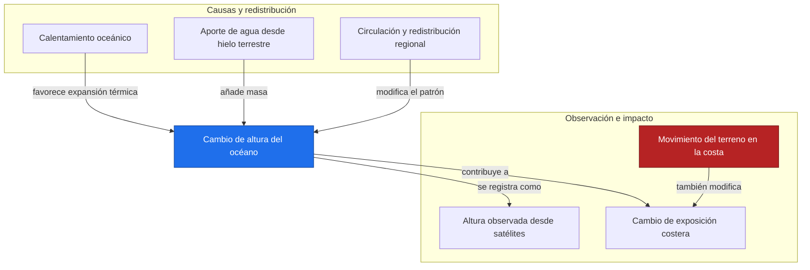
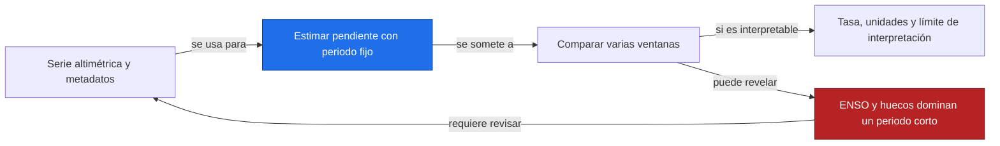
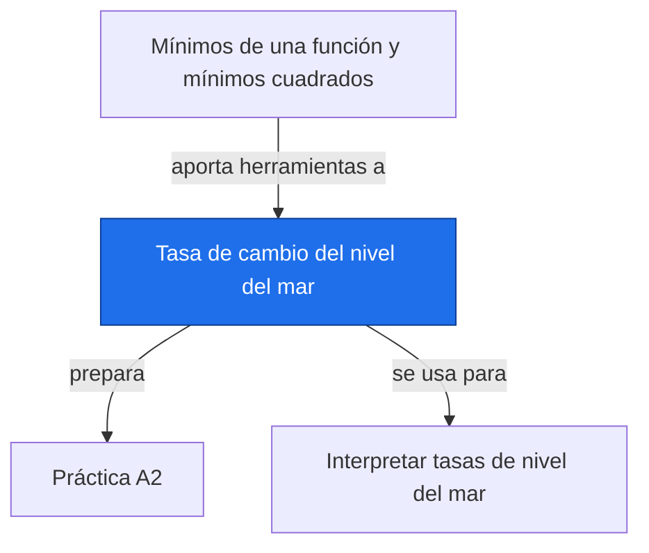

# Tasa de cambio del nivel del mar

**Antes:** [[A2.3 Mínimos de una función y mínimos cuadrados|Mínimos de una función y mínimos cuadrados]] · **Después:** [[A2.P Práctica A2|Práctica A2]]

> [!abstract] Idea clave
> Una tasa de +3 mm/año significa que el nivel crece tres milímetros por año en el modelo y periodo especificados.

> [!question] ¿Qué pregunta responde?
> ¿Qué mide una tasa del nivel del mar y por qué puede variar entre periodos y regiones?

> [!quote]- En 30 segundos (versión hablada)
> El nivel es una altura y la tasa indica qué tan rápido cambia. Una tasa positiva no exige que cada mes esté por encima del anterior: los ciclos y la variabilidad se superponen. Los satélites miden alturas; la tasa se estima comparando observaciones a lo largo del tiempo.

## Intuición

Piensa en una regla sobre la pared de un recipiente. La marca actual es el nivel; cuántos milímetros avanza por año es la tasa. En el océano, temperatura, intercambio de masa y circulación hacen que esa subida no sea uniforme.

**Todos los valores numéricos del ejemplo son ilustrativos.** +3 mm/año se usa para aprender unidades; no se presenta como estimación actual del nivel global.

## Sistema: causas, proceso y efectos



## Descripción cuantitativa

$$
v(t)=\frac{dh}{dt},\qquad a_h(t)=\frac{d^2h}{dt^2}=\frac{dv}{dt}
$$

> [!info] En palabras
> La primera derivada es velocidad de cambio del nivel, en mm/año; la segunda es cambio de esa velocidad, en mm/año². No es la aceleración del movimiento de una ola individual.

| Símbolo | Significa | Unidades |
| --- | --- | --- |
| h | Nivel respecto a una referencia | mm |
| t | Tiempo desde un origen | año |
| v | Tasa de cambio del nivel | mm/año |
| aₕ | Cambio de la tasa | mm/año² |

$$
h(t)=h_0+vt\quad\text{si v es constante}
$$

> [!info] En palabras
> Una tasa constante produce una recta. Cambiar la referencia vertical modifica el nivel inicial, sin modificar la tasa.

## Escalas

| Escala | Valor típico | Comentario |
| --- | --- | --- |
| Espacial | Punto, región o promedio oceánico | La tasa local puede diferir del promedio global |
| Temporal | Estaciones, años y décadas | Ventanas cortas pueden resaltar variabilidad |
| Magnitud del ejemplo | 3 mm/año, ilustrativa | No representa una cifra observada actual |

El nivel relativo en una costa incorpora movimiento del terreno; la altura altimétrica usa una referencia geocéntrica. Es necesario saber qué cantidad contiene el producto.

## Ejemplo numérico

**Situación:** dos modelos ilustrativos de nivel en mm, con tiempo en años desde una fecha elegida.

$$
h_1(t)=10+3t,\qquad h_2(t)=10+3t+0.2t^2
$$

> [!info] En palabras
> Ambos empiezan en 10 mm y con tasa inicial 3 mm/año; el segundo añade curvatura. Sus coeficientes llevan mm, mm/año y mm/año² según el término.

$$
h_1(4)=22,\quad h_2(4)=25.2\ {\rm mm},\qquad h^{\prime}_1=3,\quad h^{\prime}_2(t)=3+0.4t\ {\rm mm/año}
$$

> [!info] En palabras
> A los cuatro años el segundo nivel está más alto porque su tasa ha crecido. La tasa final del segundo es 4.6 mm/año.

$$
\Delta h_1=12,\quad\Delta h_2=15.2\ {\rm mm},\qquad \bar v_2=\frac{15.2}{4}=3.8\ {\rm mm/año},\quad h^{\prime\prime}_2=0.4\ {\rm mm/año}^2
$$

> [!info] En palabras
> El cambio total, la tasa media, la tasa final y la aceleración son cantidades diferentes; cada una responde una pregunta.

> [!success] ¿Tiene sentido?
> Las unidades y la acumulación son coherentes: el modelo que acelera gana más altura. No se compara su magnitud con observaciones reales porque los coeficientes fueron elegidos para enseñar.

## Cálculo en Python

```python
import numpy as np
import matplotlib.pyplot as plt
t = np.linspace(0, 4, 41)
h1 = 10 + 3*t  # Modelos ilustrativos, mm
h2 = 10 + 3*t + 0.2*t**2
print(f"nivel final constante = {h1[-1]:.1f} mm")
print(f"nivel final variable = {h2[-1]:.1f} mm")
print(f"tasa media variable = {(h2[-1]-h2[0])/4:.1f} mm/año")
print(f"tasa final variable = {3+0.4*4:.1f} mm/año")
plt.plot(t, h1, label="Tasa constante")
plt.plot(t, h2, label="Tasa creciente")
plt.xlabel("Tiempo desde el origen (años)")
plt.ylabel("Nivel ilustrativo (mm)")
plt.title("Dos modelos ilustrativos del nivel")
plt.legend()
plt.grid(True)
plt.show()
```

Salida esperada:

```text
nivel final constante = 22.0 mm
nivel final variable = 25.2 mm
tasa media variable = 3.8 mm/año
tasa final variable = 4.6 mm/año
```

## Cómo se observa desde el espacio

Un altímetro de radar estima la distancia a la superficie a partir del recorrido de la señal. Combinada con la órbita y las correcciones geofísicas, permite obtener altura del mar y construir series. El satélite no entrega directamente una derivada climática.

| Variable | Misión o producto | Qué detecta |
| --- | --- | --- |
| Altura superficial del océano | TOPEX/Poseidon y serie Jason | Altimetría de radar de la superficie marina |
| Anomalía media global | Serie multimisiones de NASA | Cambios de altura agregados sobre el océano |

Referencias de observación: [NASA, TOPEX/Poseidon](https://sealevel.nasa.gov/missions/topex-poseidon) y [NASA, serie global](https://sealevel.nasa.gov/vital-signs/global-mean-sea-level/).

## Incertidumbre y factores de confusión

> [!warning] Cuidado
> ENSO puede superponer variabilidad a una tendencia de largo plazo. Elegir un inicio o un final con un episodio intenso puede modificar la pendiente del intervalo. Comparar ventanas de duración semejante ayuda a evaluar sensibilidad.

ENSO redistribuye calor y agua y deja señales en el nivel del mar. [NASA, ENSO y nivel del mar](https://sealevel.nasa.gov/faq/10/how-does-el-nino-fit-into-the-sea-level-rise-picture/).

- [ ] Compruebo variabilidad natural y ciclo estacional.
- [ ] Distingo altura geocéntrica y nivel costero relativo.
- [ ] Reviso referencias y correcciones entre misiones.
- [ ] Comparo la tasa al variar inicio y final sin escoger solo el resultado deseado.

## Impacto y relevancia

Una tasa ayuda a comparar periodos y regiones; un cambio acumulado ayuda a comunicar cuánto ha variado el nivel. Los impactos costeros también dependen de mareas, oleaje, terreno y exposición. La pendiente aislada no representa todo el riesgo.

## Aplicación en Space Apps

**Reto:** Earth System Trend Detective · **Pregunta:** ¿cómo cambia la pendiente al modificar la ventana de análisis?



## Conexiones



Enlaces: [[A2.3 Mínimos de una función y mínimos cuadrados|Mínimos de una función y mínimos cuadrados]] → **Tasa de cambio del nivel del mar** → [[A2.P Práctica A2|Práctica A2]]

## Flashcards

¿Qué significa +3 mm/año en este ejemplo?::Una tasa ilustrativa de aumento de tres milímetros por año.
¿Qué unidad tiene la segunda derivada del nivel?::mm/año² si el tiempo se mide en años.
¿Por qué ENSO afecta pendientes cortas?::Su variabilidad se superpone al cambio de largo plazo y puede dominar los extremos del periodo.

## Autoevaluación

- [ ] Explico 3 mm/año sin confundirlo con 3 mm totales.
- [ ] Obtengo los niveles finales 22 y 25.2 mm.
- [ ] Distingo tasa media 3.8 y tasa final 4.6 mm/año.
- [ ] Describo qué observa un altímetro y qué se estima después.

## Fuentes

- NASA, Sea Level Change Portal: fuentes oficiales enlazadas en observación e incertidumbre.
- Khan Academy, derivadas y unidades.
- Temario y habilidad para Detective.pdf, A2.
