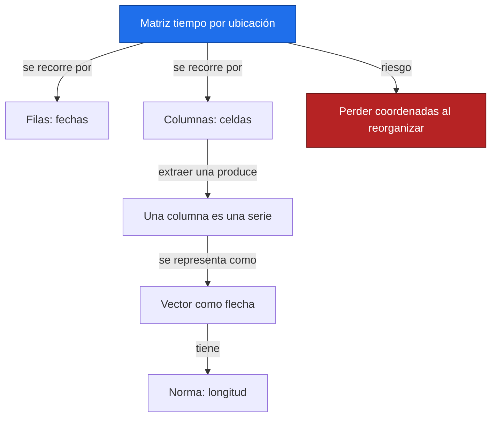
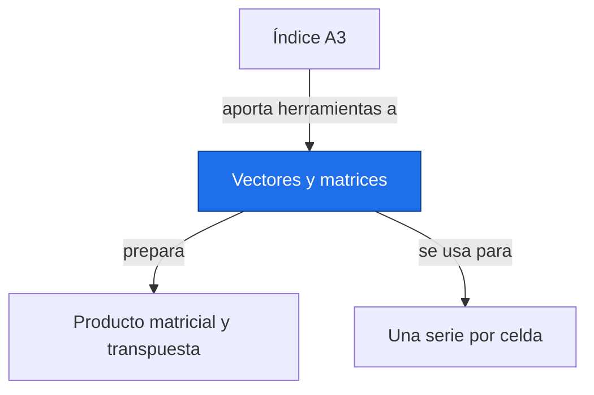

# Vectores y matrices

**Antes:** [[A3.0 Índice A3|Índice A3]] · **Después:** [[A3.2 Producto matricial y transpuesta|Producto matricial y transpuesta]]

> [!abstract] Idea clave
> Vectores y matrices organizan números con un orden y unas dimensiones que forman parte de su significado.

> [!question] ¿Qué pregunta responde?
> ¿Cómo representar una serie y una malla de series sin confundir tiempo con ubicación?

> [!quote]- En 30 segundos (versión hablada)
> Un vector guarda una lista ordenada. Una matriz organiza listas en filas y columnas. Si las filas son fechas y las columnas ubicaciones, cada columna es una serie. Conservar esa convención es tan importante como conservar los valores.

## Intuición visual

Piensa en una hoja de cálculo: cada fila es una fecha compartida y cada columna una celda geográfica. Un vector puede verse también como una flecha; su longitud resume el tamaño conjunto de sus componentes.



**Conclusión intuitiva:** Vectores y matrices organizan números con un orden y unas dimensiones que forman parte de su significado.

## Definición y notación

> [!note] Definición
> $$
> v\in\mathbb R^n,\quad Y\in\mathbb R^{m\times p},\qquad u^\mathsf T v=\sum_{i=1}^{n}u_i v_i,\qquad \lVert v\rVert_2=\sqrt{\sum_{i=1}^{n}v_i^2}
> $$
>
> > [!info] En palabras
> > Un vector tiene n componentes; una matriz tiene m filas y p columnas. El producto punto multiplica componentes correspondientes y suma; la norma euclídea mide la longitud.

| Símbolo | Significa |
| --- | --- |
| m | Número de tiempos |
| p | Número de ubicaciones |
| Yᵢⱼ | Valor en tiempo i y ubicación j |
| shape | Tupla de dimensiones en NumPy |

## Resultado principal

> [!important] Propiedad principal
> $$
> v^\mathsf Tv=\lVert v\rVert_2^2\geq0,\qquad \lVert v\rVert_2=0\Longleftrightarrow v=0
> $$
>
> > [!info] En palabras
> > La norma al cuadrado suma cuadrados, por eso nunca es negativa y solo vale cero para el vector nulo.

> [!tip]- Demostración (intenta hacerla antes de abrir)
> Cada componente al cuadrado es no negativa. La suma puede ser cero solamente si todas son cero. Tomar la raíz produce una longitud con las mismas unidades que las componentes, si comparten unidad.

## Propiedades

Un vector fila tiene forma 1×n y uno columna n×1. Un arreglo de NumPy con shape (n,) tiene un solo eje: transponerlo no crea un vector columna; usa reshape o añade un eje.

No combines sin escalar magnitudes incompatibles, como °C y mm, al calcular una norma para comparar observaciones. El tamaño de la norma también crece con el número de componentes.

## Ejemplo resuelto

**Problema:** vectores ilustrativos u=(1,2), v=(3,4), adimensionales, y una malla ilustrativa de tres tiempos y dos ubicaciones.

$$
u^\mathsf Tv=1\cdot3+2\cdot4=11,\qquad \lVert v\rVert_2=\sqrt{3^2+4^2}=5
$$

> [!info] En palabras
> El producto punto compara componentes emparejadas; la norma de v es cinco por la suma de sus cuadrados.

| Tiempo | Ubicación oeste, °C | Ubicación este, °C |
| --- | --- | --- |
| 0 | 1 | 10 |
| 1 | 2 | 20 |
| 2 | 3 | 30 |

La matriz tiene shape (3,2). La media temporal de cada columna es 2 y 20 °C; la media espacial simple de cada fila es 5.5, 11 y 16.5 °C. Esos promedios responden preguntas distintas.

> [!success] Comprobación
> Hay seis números, organizados como tres filas por dos columnas. La serie del oeste es 1, 2, 3, no la primera fila 1, 10.

## Contraejemplo o caso límite

Una matriz de valores no contiene por sí sola latitudes, longitudes o unidades. Al aplanar una malla debes conservar la correspondencia de cada columna con su celda. Los faltantes pueden invalidar normas o medias si no se tratan.

## Verificación con Python

```python
import numpy as np
u, v = np.array([1, 2]), np.array([3, 4])
Y = np.array([[1., 10.], [2., 20.], [3., 30.]])  # Ilustrativos, °C
print(f"producto punto = {u@v}; norma = {np.linalg.norm(v):.1f}")
print("shape de Y =", Y.shape)
print("serie oeste =", Y[:, 0].tolist())
print("medias temporales =", Y.mean(axis=0).tolist())
print("medias espaciales simples =", Y.mean(axis=1).tolist())
print("vector, fila, columna =", v.shape, v[None, :].shape, v[:, None].shape)
```

Salida esperada:

```text
producto punto = 11; norma = 5.0
shape de Y = (3, 2)
serie oeste = [1.0, 2.0, 3.0]
medias temporales = [2.0, 20.0]
medias espaciales simples = [5.5, 11.0, 16.5]
vector, fila, columna = (2,) (1, 2) (2, 1)
```

## Errores comunes

> [!warning] Error común
> ❌ Suponer que v.T convierte siempre una lista en columna → ✅ un arreglo de un eje conserva su forma al transponer.
>
> ❌ Promediar ubicaciones como si todas tuvieran igual área → ✅ revisar la geometría y los pesos espaciales.

## Aplicación en Space Apps

**Reto:** Earth System Trend Detective · **Pregunta:** ¿Cómo representar una serie y una malla de series sin confundir tiempo con ubicación?

Una malla NASA puede organizarse como tiempo × ubicación para estimar una pendiente por columna. [[D.0 Introducción al bloque D|Introducción al bloque D]] explica por qué un promedio espacial necesita información de área.


## Dependencias



Enlaces: [[A3.0 Índice A3|Índice A3]] → **Vectores y matrices** → [[A3.2 Producto matricial y transpuesta|Producto matricial y transpuesta]]

## Ejercicios

> [!question] Ejercicio 1
> ¿Qué forma tiene una matriz con doce meses y cuatro ubicaciones? ¿Qué forma tiene una columna si se conserva el eje de ubicación?
>
> > [!success]- Solución
> > La matriz tiene forma (12,4); una columna conservando ambos ejes tiene forma (12,1).

> [!question] Ejercicio 2
> Calcula el producto punto de (1,−1) con (2,2) y la norma de (−3,4).
>
> > [!success]- Solución
> > El producto punto es 0; los vectores son ortogonales. La norma es 5: el signo de la primera componente no cambia su cuadrado.

## Flashcards

¿Qué significa shape (m,p) en esta convención?::m tiempos y p ubicaciones.
¿Qué devuelve el producto punto de dos vectores compatibles?::Un escalar.
¿Qué pierde una matriz numérica si no guardo metadatos?::La interpretación de sus ejes, unidades y coordenadas.

## Autoevaluación

- [ ] Identifico filas y columnas de la tabla sin mirar el texto.
- [ ] Obtengo producto punto 11 y norma 5.
- [ ] Construyo versiones fila y columna de un vector.
- [ ] Explico por qué una media espacial simple puede ser inadecuada.

## Fuentes

- 3Blue1Brown, serie Esencia del álgebra lineal.
- Jake VanderPlas, Python Data Science Handbook, capítulo sobre NumPy.
