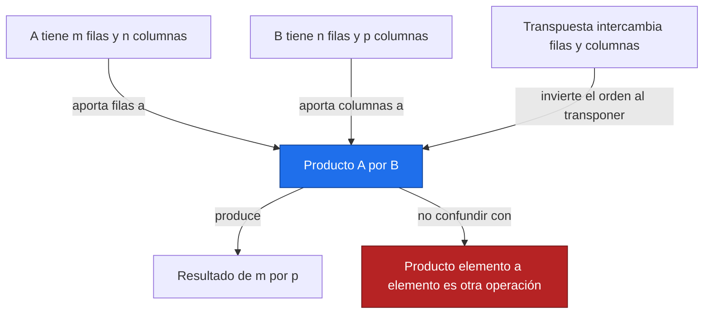
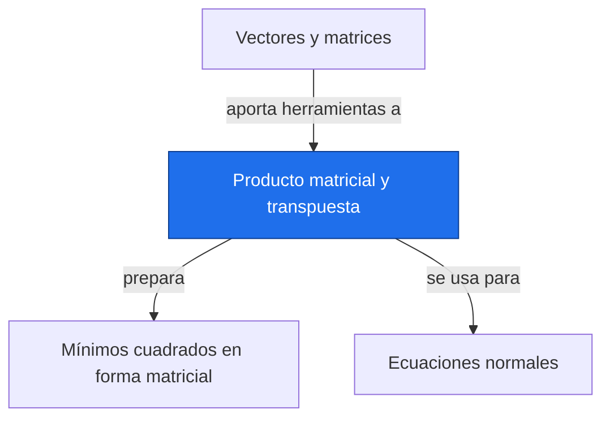

# Producto matricial y transpuesta

**Antes:** [[A3.1 Vectores y matrices|Vectores y matrices]] · **Después:** [[A3.3 Mínimos cuadrados en forma matricial|Mínimos cuadrados en forma matricial]]

> [!abstract] Idea clave
> El producto matricial combina filas con columnas; la transpuesta intercambia esos papeles.

> [!question] ¿Qué pregunta responde?
> ¿Qué operaciones de matrices tienen dimensiones compatibles y qué representan sus resultados?

> [!quote]- En 30 segundos (versión hablada)
> Para cada entrada del producto, tomas una fila de la primera matriz y una columna de la segunda, multiplicas sus componentes y sumas. El orden importa porque cambiarlo cambia qué se combina, e incluso puede volver imposible la operación.

## Intuición visual

Dibuja las dimensiones al lado de las matrices antes de calcular. Las dimensiones interiores deben coincidir; las exteriores determinan la forma del resultado.



**Conclusión intuitiva:** El producto matricial combina filas con columnas; la transpuesta intercambia esos papeles.

## Definición y notación

> [!note] Definición
> $$
> A\in\mathbb R^{m\times n},\ B\in\mathbb R^{n\times p},\qquad (AB)_{ij}=\sum_{k=1}^{n}A_{ik}B_{kj},\qquad (A^\mathsf T)_{ij}=A_{ji}
> $$
>
> > [!info] En palabras
> > Cada entrada del producto es un producto punto. La transpuesta mueve una entrada de fila i y columna j a fila j y columna i.

| Símbolo | Significa |
| --- | --- |
| m,n,p | Dimensiones de filas y columnas |
| k | Índice interno que se suma |
| Aᵀ | Transpuesta de A |
| @ | Operador de producto matricial en NumPy |

## Resultado principal

> [!important] Propiedad principal
> $$
> (AB)^\mathsf T=B^\mathsf TA^\mathsf T,\qquad (X^\mathsf TX)^\mathsf T=X^\mathsf TX
> $$
>
> > [!info] En palabras
> > Al transponer un producto se invierte el orden. Aplicada a X transpuesta por X, esta regla muestra que el resultado es simétrico.

> [!tip]- Demostración (intenta hacerla antes de abrir)
> $$
> [(AB)^\mathsf T]_{ij}=(AB)_{ji}=\sum_k A_{jk}B_{ki}=\sum_k(B^\mathsf T)_{ik}(A^\mathsf T)_{kj}
> $$
>
> > [!info] En palabras
> > La misma suma describe la entrada i,j del producto de las transpuestas en orden inverso. La igualdad se cumple entrada por entrada.

## Propiedades

La multiplicación matricial es asociativa y distributiva cuando las dimensiones lo permiten. Generalmente no es conmutativa. Una matriz identidad conserva el factor compatible.

El producto XᵀX reúne productos punto entre columnas de X. Es simétrico, pero ser simétrico no garantiza que sea invertible.

## Ejemplo resuelto

**Problema:** matrices ilustrativas adimensionales de tamaño 2×2.

$$
A=\begin{pmatrix}1&2\\0&1\end{pmatrix},\quad B=\begin{pmatrix}2&0\\3&1\end{pmatrix},\quad AB=\begin{pmatrix}8&2\\3&1\end{pmatrix},\quad BA=\begin{pmatrix}2&4\\3&7\end{pmatrix}
$$

> [!info] En palabras
> La entrada superior izquierda de AB es 1·2+2·3=8. En BA, la misma posición es 2·1+0·0=2; el orden cambia el resultado.

$$
A^\mathsf TA=\begin{pmatrix}1&2\\2&5\end{pmatrix}
$$

> [!info] En palabras
> Las entradas fuera de la diagonal coinciden porque intercambiar el orden de los factores de un producto punto no cambia su suma.

> [!success] Comprobación
> Ambos productos 2×2 existen, pero son distintos. El producto elemento a elemento de A y B tendría filas [2,0] y [0,1], que tampoco coinciden con AB.

## Contraejemplo o caso límite

Si A es 2×3 y B es 2×2, AB no está definido porque 3 y 2 no coinciden. BA sí tiene forma 2×3. Una operación puede existir en un orden y no en el otro.

## Verificación con Python

```python
import numpy as np
A = np.array([[1, 2], [0, 1]])
B = np.array([[2, 0], [3, 1]])
print("AB =", (A@B).tolist())
print("BA =", (B@A).tolist())
print("A transpuesta por A =", (A.T@A).tolist())
print("elemento a elemento =", (A*B).tolist())
print("regla de transpuesta =", np.array_equal((A@B).T, B.T@A.T))
```

Salida esperada:

```text
AB = [[8, 2], [3, 1]]
BA = [[2, 4], [3, 7]]
A transpuesta por A = [[1, 2], [2, 5]]
elemento a elemento = [[2, 0], [0, 1]]
regla de transpuesta = True
```

## Errores comunes

> [!warning] Error común
> ❌ Usar * para un producto de matrices NumPy → ✅ usa @; * actúa elemento a elemento y puede expandir dimensiones.
>
> ❌ Transponer un producto sin invertir sus factores → ✅ verifica la regla con dimensiones antes de multiplicar.

## Aplicación en Space Apps

**Reto:** Earth System Trend Detective · **Pregunta:** ¿Qué operaciones de matrices tienen dimensiones compatibles y qué representan sus resultados?

Si X tiene columnas de intercepto y tiempo, Xβ produce una predicción por fecha. XᵀX y Xᵀy resumen los productos necesarios para resolver mínimos cuadrados en [[A3.3 Mínimos cuadrados en forma matricial|Mínimos cuadrados en forma matricial]].


## Dependencias



Enlaces: [[A3.1 Vectores y matrices|Vectores y matrices]] → **Producto matricial y transpuesta** → [[A3.3 Mínimos cuadrados en forma matricial|Mínimos cuadrados en forma matricial]]

## Ejercicios

> [!question] Ejercicio 1
> A tiene forma (3,2) y B forma (2,4). ¿Qué formas tienen AB y su transpuesta?
>
> > [!success]- Solución
> > AB tiene forma (3,4) y su transpuesta (4,3). BA no existe porque sus dimensiones internas serían 4 y 3.

> [!question] Ejercicio 2
> Para X con filas [1,0], [1,1], [1,2], calcula XᵀX.
>
> > [!success]- Solución
> > El resultado tiene filas [3,3] y [3,5]: suma de unos, suma de tiempos y suma de tiempos al cuadrado.

## Flashcards

¿Qué dimensiones deben coincidir en AB?::Las columnas de A y las filas de B.
¿Cómo se transpone un producto?::Se transponen los factores y se invierte su orden.
¿XᵀX siempre es invertible?::No; sus columnas de origen pueden ser dependientes.

## Autoevaluación

- [ ] Calculo las cuatro entradas de AB.
- [ ] Explico por qué AB y BA difieren.
- [ ] Compruebo la forma de XᵀX antes de calcularlo.
- [ ] Distingo @ de * con un ejemplo numérico.

## Fuentes

- 3Blue1Brown, serie Esencia del álgebra lineal.
- Jake VanderPlas, Python Data Science Handbook, capítulo sobre NumPy.
