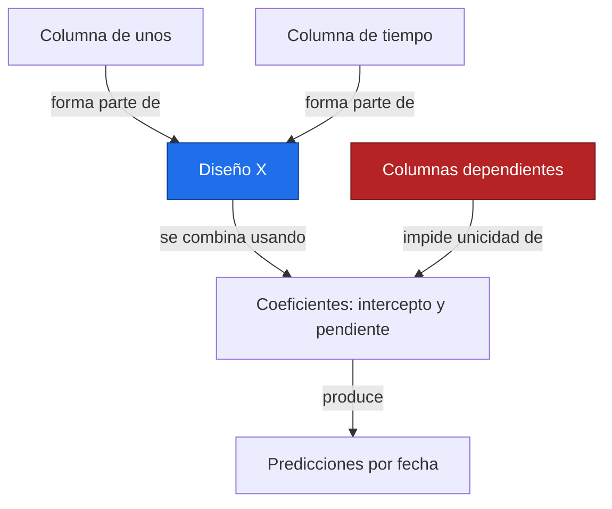
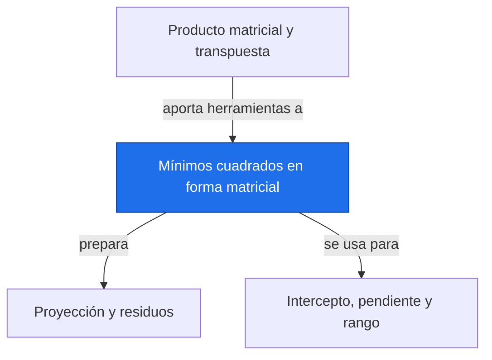

# Mínimos cuadrados en forma matricial

**Antes:** [[A3.2 Producto matricial y transpuesta|Producto matricial y transpuesta]] · **Después:** [[A3.4 Proyección y residuos|Proyección y residuos]]

> [!abstract] Idea clave
> Mínimos cuadrados matriciales expresa todo el ajuste de una recta como un solo problema de vectores y matrices.

> [!question] ¿Qué pregunta responde?
> ¿Cómo construir la matriz de diseño y recuperar la pendiente y el intercepto de una serie?

> [!quote]- En 30 segundos (versión hablada)
> La primera columna del diseño contiene unos y la segunda tiempos. Los coeficientes indican cuánto aporta cada columna a la respuesta. Elegimos sus valores para acercar el vector de predicciones al vector de observaciones.

## Intuición visual

Cada posible combinación de columnas de X produce un vector ajustado. Buscamos la combinación que deja el residuo más corto. Con dos columnas independientes, los coeficientes quedan determinados de forma única.



**Conclusión intuitiva:** Mínimos cuadrados matriciales expresa todo el ajuste de una recta como un solo problema de vectores y matrices.

## Definición y notación

> [!note] Definición
> $$
> y=X\beta+\varepsilon,\quad X=\begin{pmatrix}1&t_1\\ \vdots&\vdots\\1&t_n\end{pmatrix},\quad \beta=\begin{pmatrix}a\\b\end{pmatrix},\quad \hat\beta=\underset{\beta}{\operatorname{argmin}}\ \lVert y-X\beta\rVert_2^2
> $$
>
> > [!info] En palabras
> > El modelo representa una parte lineal y un error desconocido. El ajuste busca coeficientes a partir de datos observados; los residuos posteriores no son los errores teóricos conocidos.

| Símbolo | Significa |
| --- | --- |
| X | Diseño n×2 |
| β | Vector de dos coeficientes |
| y | Respuesta con n entradas |
| ε | Error teórico |
| β̂ | Coeficientes estimados |

## Resultado principal

> [!important] Propiedad principal
> $$
> X^\mathsf TX\hat\beta=X^\mathsf Ty,\qquad \hat\beta=(X^\mathsf TX)^{-1}X^\mathsf Ty\quad\text{si X tiene rango columna completo}
> $$
>
> > [!info] En palabras
> > Las ecuaciones normales exigen que el residuo sea ortogonal a todas las columnas del diseño. La inversa escrita expresa la solución única cuando las columnas son independientes.

> [!tip]- Demostración (intenta hacerla antes de abrir)
> $$
> S(\beta)=y^\mathsf Ty-2\beta^\mathsf TX^\mathsf Ty+\beta^\mathsf TX^\mathsf TX\beta,\qquad \nabla S=-2X^\mathsf Ty+2X^\mathsf TX\beta
> $$
>
> > [!info] En palabras
> > Expande la norma al cuadrado y deriva respecto a los coeficientes. Igualar el gradiente a cero produce las ecuaciones normales. La curvatura es positiva si las columnas son independientes.

## Propiedades

En la práctica, usa np.linalg.lstsq(X,y,rcond=None). Si ya tienes un sistema pequeño bien condicionado, np.linalg.solve(X.T@X, X.T@y) evita la inversa explícita, aunque formar XᵀX empeora el condicionamiento numérico.

Centrar el tiempo cerca del periodo observado suele mejorar la escala del diseño. Si todos los tiempos son iguales o una columna repite otra, falta rango y los coeficientes dejan de ser únicos. lstsq devuelve entonces una solución de norma mínima; eso no identifica una pendiente física.

## Ejemplo resuelto

**Problema:** reproduce los cinco puntos ilustrativos de [[A2.3 Mínimos de una función y mínimos cuadrados|Mínimos de una función y mínimos cuadrados]]: tiempos [1,2,3,4,5] años y niveles [2,4,5,4,5] mm.

$$
X^\mathsf TX=\begin{pmatrix}5&15\\15&55\end{pmatrix},\qquad X^\mathsf Ty=\begin{pmatrix}20\\66\end{pmatrix},\qquad \det(X^\mathsf TX)=50
$$

> [!info] En palabras
> La primera entrada cuenta observaciones, la segunda suma tiempos y la última suma sus cuadrados. El determinante no nulo permite resolver de forma única.

$$
5a+15b=20,\quad15a+55b=66\ \Longrightarrow\ 10b=6\ \Longrightarrow\ \hat\beta=\begin{pmatrix}2.2\\0.6\end{pmatrix}
$$

> [!info] En palabras
> Restar tres veces la primera ecuación a la segunda elimina el intercepto. La pendiente es 0.6 mm/año y el intercepto 2.2 mm.

La primera predicción es 2.8 mm y la última 5.2 mm. El error cuadrático residual sigue siendo 2.4 mm², exactamente como en la deducción escalar.

> [!success] Comprobación
> El diseño tiene forma (5,2), el sistema normal (2,2) y el resultado dos coeficientes. La coincidencia con A2.3 conecta ambos lenguajes.

## Contraejemplo o caso límite

Un diseño sin intercepto ajusta una recta forzada a pasar por cero; es otro modelo. Tener suficientes filas no garantiza independencia entre columnas. La normalidad no es un requisito algebraico del algoritmo.

## Verificación con Python

```python
import numpy as np
t = np.array([1., 2., 3., 4., 5.])
y = np.array([2., 4., 5., 4., 5.])  # Ilustrativos, mm
X = np.column_stack([np.ones_like(t), t])
beta, sse, rango, valores = np.linalg.lstsq(X, y, rcond=None)
normal = np.linalg.solve(X.T@X, X.T@y)
print("XTX =", (X.T@X).tolist())
print("XTy =", (X.T@y).tolist())
print("beta [a, b] =", np.round(beta, 6).tolist())
print("solve coincide =", np.allclose(beta, normal))
print(f"rango = {rango}; SSE = {np.sum((y-X@beta)**2):.1f}")
```

Salida esperada:

```text
XTX = [[5.0, 15.0], [15.0, 55.0]]
XTy = [20.0, 66.0]
beta [a, b] = [2.2, 0.6]
solve coincide = True
rango = 2; SSE = 2.4
```

## Errores comunes

> [!warning] Error común
> ❌ Calcular inv(XᵀX) como receta universal → ✅ usa lstsq y comprueba rango y escala.
>
> ❌ Leer beta como [pendiente, intercepto] → ✅ con X=[1,t], el orden es [intercepto, pendiente].

## Aplicación en Space Apps

**Reto:** Earth System Trend Detective · **Pregunta:** ¿Cómo construir la matriz de diseño y recuperar la pendiente y el intercepto de una serie?

La misma matriz de tiempos puede ajustar muchas columnas de una malla NASA cuando comparten fechas y máscara válida. Si cada celda tiene huecos diferentes, hay que adaptar el diseño y registrar cuántos datos entraron en cada ajuste.


## Dependencias



Enlaces: [[A3.2 Producto matricial y transpuesta|Producto matricial y transpuesta]] → **Mínimos cuadrados en forma matricial** → [[A3.4 Proyección y residuos|Proyección y residuos]]

## Ejercicios

> [!question] Ejercicio 1
> Para tiempos [0,1,2] y respuesta [1,3,5], construye X y calcula beta.
>
> > [!success]- Solución
> > Las filas de X son [1,0], [1,1] y [1,2]. Intercepto 1, pendiente 2 y error cuadrático cero.

> [!question] Ejercicio 2
> ¿Qué ocurre si X contiene dos columnas idénticas de unos y la respuesta es constante en 4?
>
> > [!success]- Solución
> > X tiene rango 1. Cualquier par de coeficientes que sume 4 produce el mismo ajuste; la solución de norma mínima es [2,2].

## Flashcards

¿Qué contiene X=[1,t]?::Una columna de unos y otra de tiempos.
¿Cuándo es invertible XᵀX?::Cuando X tiene columnas linealmente independientes.
¿Qué función de NumPy se prefiere para ajustar?::np.linalg.lstsq con rcond explícito.

## Autoevaluación

- [ ] Construyo X con forma (5,2).
- [ ] Reproduzco el sistema normal a mano.
- [ ] Obtengo beta=[2.2,0.6] con lstsq.
- [ ] Diagnostico un diseño con columnas repetidas.

## Fuentes

- 3Blue1Brown, serie Esencia del álgebra lineal.
- Jake VanderPlas, Python Data Science Handbook, capítulo sobre NumPy.
- NumPy, numpy.linalg.lstsq: https://numpy.org/doc/stable/reference/generated/numpy.linalg.lstsq.html
