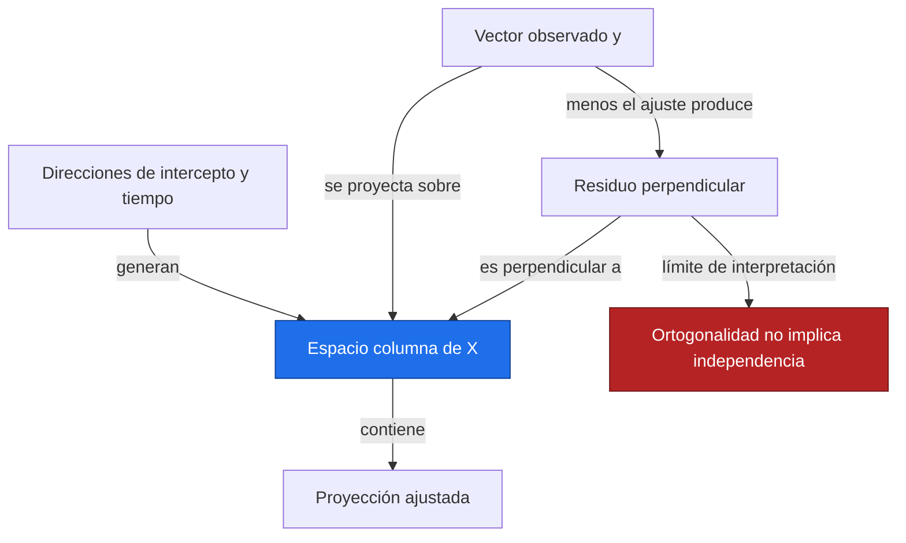
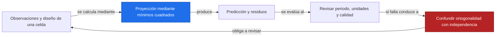
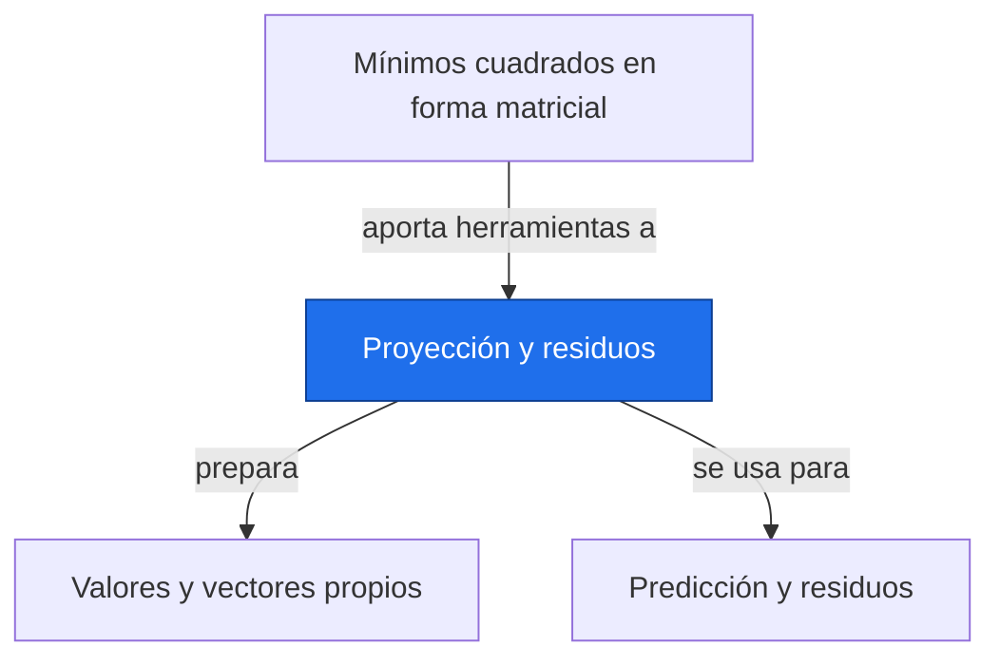

# Proyección y residuos

**Antes:** [[A3.3 Mínimos cuadrados en forma matricial|Mínimos cuadrados en forma matricial]] · **Después:** [[A3.5 Valores y vectores propios|Valores y vectores propios]]

> [!abstract] Idea clave
> El ajuste es una proyección de las observaciones sobre el espacio de predicciones; los residuos quedan perpendiculares a ese espacio.

> [!question] ¿Qué pregunta responde?
> ¿Qué significa geométricamente que los residuos no permitan mejorar la recta?

> [!quote]- En 30 segundos (versión hablada)
> El diseño permite formar un conjunto de predicciones. La proyección encuentra el punto de ese conjunto más cercano a los datos. El segmento que falta, el residuo, es perpendicular a todas las direcciones que el modelo puede representar.

## Intuición visual

Piensa en una flecha en tres dimensiones y su sombra perpendicular sobre un plano. En una regresión con cinco observaciones trabajamos en cinco dimensiones; el dibujo del plano es una analogía de esa geometría, no un mapa geográfico.



**Conclusión intuitiva:** El ajuste es una proyección de las observaciones sobre el espacio de predicciones; los residuos quedan perpendiculares a ese espacio.

## Definición y notación

> [!note] Definición
> $$
> \hat y=X\hat\beta=Hy,\qquad H=X(X^\mathsf TX)^{-1}X^\mathsf T,\qquad e=y-\hat y
> $$
>
> > [!info] En palabras
> > H proyecta los datos sobre las combinaciones de columnas del diseño, suponiendo rango columna completo. El residuo es lo observado menos lo predicho.

| Símbolo | Significa |
| --- | --- |
| H | Matriz de proyección n×n |
| ŷ | Vector de valores ajustados |
| e | Vector residual |
| Col(X) | Espacio de combinaciones de columnas de X |

## Resultado principal

> [!important] Propiedad principal
> $$
> X^\mathsf Te=0,\qquad \sum_{i=1}^{n}e_i=0\quad\text{si X incluye una columna de unos}
> $$
>
> > [!info] En palabras
> > Los residuos tienen producto punto cero con cada columna del diseño. En particular, con intercepto, su suma es cero salvo redondeo numérico.

> [!tip]- Demostración (intenta hacerla antes de abrir)
> $$
> X^\mathsf Te=X^\mathsf T(y-X\hat\beta)=X^\mathsf Ty-X^\mathsf TX\hat\beta=0
> $$
>
> > [!info] En palabras
> > La última igualdad usa las ecuaciones normales. Al elegir la columna de unos, el producto punto se convierte en la suma de residuos.

## Propiedades

$$
H^\mathsf T=H,\qquad H^2=H,\qquad \lVert y\rVert_2^2=\lVert\hat y\rVert_2^2+\lVert e\rVert_2^2
$$

> [!info] En palabras
> La proyección es simétrica e idempotente: proyectar de nuevo no cambia el ajuste. La descomposición ortogonal cumple el teorema de Pitágoras.

R² (bloque B, nota pendiente) compara variación residual con variación de los datos bajo condiciones concretas; aquí se menciona como siguiente aplicación y no como prueba de causalidad.

## Ejemplo resuelto

**Problema:** mismos cinco puntos ilustrativos que A2.3 y A3.3, con tiempos en años y niveles en mm.

| t | y | ŷ | e |
| --- | --- | --- | --- |
| 1 | 2 | 2.8 | −0.8 |
| 2 | 4 | 3.4 | 0.6 |
| 3 | 5 | 4.0 | 1.0 |
| 4 | 4 | 4.6 | −0.6 |
| 5 | 5 | 5.2 | −0.2 |

$$
\sum e_i=-0.8+0.6+1-0.6-0.2=0,\quad \sum t_i e_i=-0.8+1.2+3-2.4-1=0
$$

> [!info] En palabras
> La primera suma comprueba ortogonalidad con la columna constante; la segunda, con la columna de tiempos.

$$
\lVert e\rVert_2^2=2.4,\quad\lVert\hat y\rVert_2^2=83.6,\quad\lVert y\rVert_2^2=86=83.6+2.4
$$

> [!info] En palabras
> Las tres sumas de cuadrados tienen unidad mm². La igualdad de Pitágoras es otra comprobación del ajuste.

> [!success] Comprobación
> Los residuos individuales no son cero, pero no queda una dirección lineal disponible en el diseño que reduzca su norma. Un residuo de 1 mm en el tercer punto no contradice el mínimo global.

## Contraejemplo o caso límite

Sin intercepto no tiene por qué anularse la suma residual. En mínimos cuadrados ponderados cambia la condición de ortogonalidad a una que incorpora pesos. Residuos ortogonales al tiempo aún pueden mostrar ciclos, autocorrelación o varianza cambiante.

## Verificación con Python

```python
import numpy as np
t = np.array([1., 2., 3., 4., 5.])
y = np.array([2., 4., 5., 4., 5.])  # Ilustrativos, mm
X = np.column_stack([np.ones_like(t), t])
beta = np.linalg.lstsq(X, y, rcond=None)[0]
ajuste = X@beta
e = y-ajuste
H = X@np.linalg.solve(X.T@X, X.T)
print("residuos =", np.round(e, 6).tolist())
print("XTe aproximadamente cero =", np.allclose(X.T@e, 0, atol=1e-12))
print("H simétrica e idempotente =", np.allclose(H, H.T) and np.allclose(H@H, H))
print(f"Pitágoras: {y@y:.1f} = {ajuste@ajuste:.1f} + {e@e:.1f}")
```

Salida esperada:

```text
residuos = [-0.8, 0.6, 1.0, -0.6, -0.2]
XTe aproximadamente cero = True
H simétrica e idempotente = True
Pitágoras: 86.0 = 83.6 + 2.4
```

## Errores comunes

> [!warning] Error común
> ❌ Leer residuos con suma cero como ausencia de errores → ✅ es una propiedad del ajuste con intercepto, incluso cuando el modelo describe mal los datos.
>
> ❌ Crear H para una serie enorme → ✅ calcula X@beta sin almacenar una matriz n×n.

## Aplicación en Space Apps

**Reto:** Earth System Trend Detective · **Pregunta:** ¿Qué significa geométricamente que los residuos no permitan mejorar la recta?

La inspección residual ayuda a descubrir ciclos o cambios de comportamiento en series NASA. La igualdad Xᵀe≈0 verifica el cálculo, pero no la independencia temporal necesaria para ciertas pruebas.



## Dependencias



Enlaces: [[A3.3 Mínimos cuadrados en forma matricial|Mínimos cuadrados en forma matricial]] → **Proyección y residuos** → [[A3.5 Valores y vectores propios|Valores y vectores propios]]

## Ejercicios

> [!question] Ejercicio 1
> Ajusta solo un intercepto a y=[1,2,6]. Calcula ajuste y residuos.
>
> > [!success]- Solución
> > El ajuste es la media 3 en las tres posiciones. Residuos [−2,−1,3], suma cero y suma de cuadrados 14.

> [!question] Ejercicio 2
> Ajusta sin intercepto y=b·t a t=[1,2], y=[1,1]. ¿Suman cero los residuos?
>
> > [!success]- Solución
> > La pendiente es 3/5=0.6. Los residuos son [0.4,−0.2], cuya suma es 0.2. Su producto punto con t sí es cero.

## Flashcards

¿Qué representa H?::La proyección ortogonal sobre el espacio columna del diseño.
¿Cuándo la suma de residuos es cero?::En mínimos cuadrados ordinarios con intercepto.
¿Ortogonalidad al tiempo implica independencia temporal?::No; pueden persistir patrones de dependencia en los residuos.

## Autoevaluación

- [ ] Obtengo los cinco residuos de la tabla.
- [ ] Compruebo ambas componentes de Xᵀe.
- [ ] Explico qué significa proyectar dos veces.
- [ ] Doy un ejemplo sin intercepto cuya suma residual no sea cero.

## Fuentes

- 3Blue1Brown, serie Esencia del álgebra lineal.
- Jake VanderPlas, Python Data Science Handbook, capítulo sobre NumPy.
