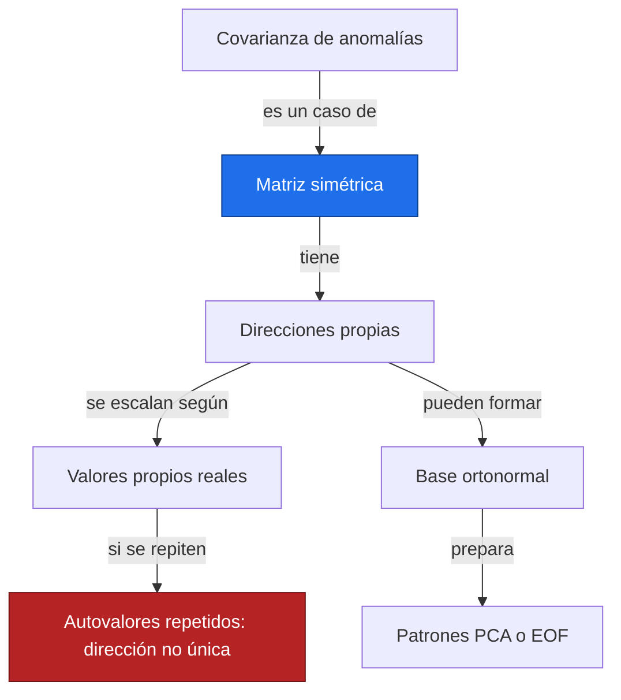
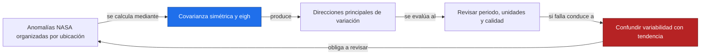
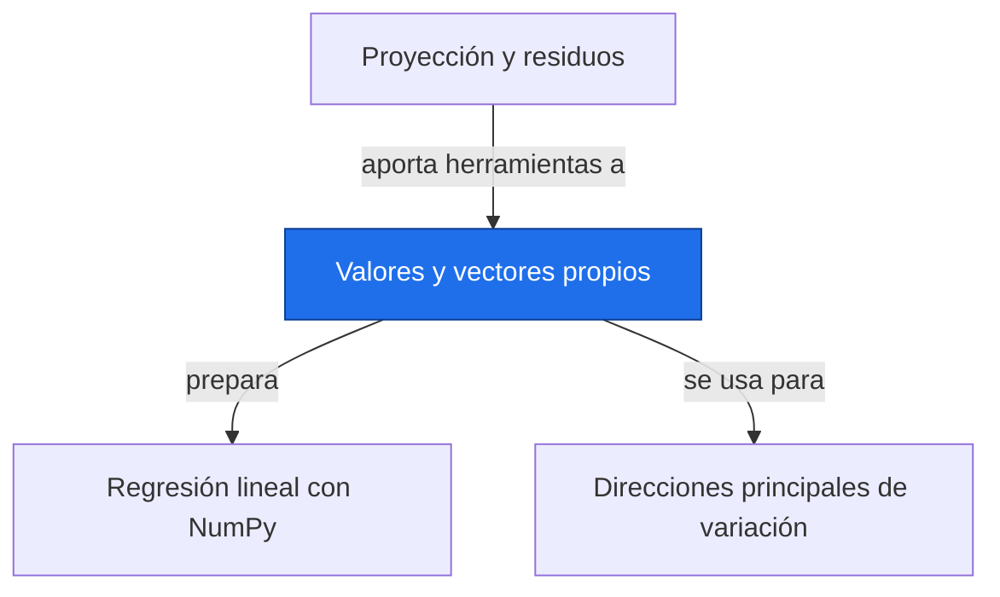

# Valores y vectores propios

**Antes:** [[A3.4 Proyección y residuos|Proyección y residuos]] · **Después:** [[A3.6 Regresión lineal con NumPy|Regresión lineal con NumPy]]

> [!abstract] Idea clave
> Un vector propio señala una dirección que una transformación conserva; su valor propio indica el factor de escala.

> [!question] ¿Qué pregunta responde?
> ¿Qué direcciones principales resume una matriz simétrica y cómo preparan el análisis de patrones espaciales?

> [!quote]- En 30 segundos (versión hablada)
> Una matriz suele girar y estirar flechas. Algunas direcciones especiales solo cambian de longitud o de sentido. En una matriz de covarianza, esas direcciones describen combinaciones de variables y sus valores propios indican cuánta variabilidad llevan.

## Intuición visual

Transforma una nube de puntos con una matriz. Las flechas sobre las direcciones propias permanecen sobre su línea original. En matrices simétricas podemos elegir ejes propios perpendiculares.



**Conclusión intuitiva:** Un vector propio señala una dirección que una transformación conserva; su valor propio indica el factor de escala.

## Definición y notación

> [!note] Definición
> $$
> Av=\lambda v,\qquad v\ne0,\qquad \det(A-\lambda I)=0
> $$
>
> > [!info] En palabras
> > Un vector propio no nulo conserva su dirección bajo A, aunque un valor propio negativo invierte su sentido. Las raíces del polinomio característico son los valores propios.

| Símbolo | Significa |
| --- | --- |
| A | Matriz cuadrada |
| v | Vector propio no nulo |
| λ | Valor propio |
| I | Matriz identidad |
| det | Determinante |

## Resultado principal

> [!important] Propiedad principal
> Una matriz real simétrica tiene valores propios reales y admite una base de vectores propios ortonormales. Para valores propios distintos, los vectores propios son ortogonales; dentro de un subespacio repetido se puede elegir una base ortonormal.

> [!tip]- Demostración (intenta hacerla antes de abrir)
> $$
> Av=\lambda v,\quad Aw=\mu w,\quad A^\mathsf T=A\ \Longrightarrow\ \lambda v^\mathsf Tw=v^\mathsf TAw=\mu v^\mathsf Tw
> $$
>
> > [!info] En palabras
> > La simetría permite mover la matriz de un lado al otro del producto punto. Si los valores propios son distintos, el producto punto de sus vectores debe ser cero. Esta prueba explica la ortogonalidad; la existencia de la base completa es el teorema espectral.

## Propiedades

Multiplicar un vector propio por una constante no nula conserva su condición; su signo no es único. Normalizar permite comparar direcciones.

Una matriz de covarianza válida es simétrica y semidefinida positiva: sus valores propios son no negativos, salvo pequeños errores numéricos. Un valor propio cero expresa una dirección sin variación.

## Ejemplo resuelto

**Problema:** matriz simétrica ilustrativa que también puede representar una covarianza en unidades cuadradas.

$$
A=\begin{pmatrix}2&1\\1&2\end{pmatrix},\qquad \det(A-\lambda I)=(2-\lambda)^2-1=(\lambda-1)(\lambda-3)
$$

> [!info] En palabras
> La ecuación característica da valores propios 1 y 3. El determinante 2×2 se obtiene multiplicando la diagonal principal y restando el producto de la otra diagonal.

$$
\lambda_1=1,\quad v_1=\frac{1}{\sqrt2}\begin{pmatrix}1\\-1\end{pmatrix},\qquad \lambda_2=3,\quad v_2=\frac{1}{\sqrt2}\begin{pmatrix}1\\1\end{pmatrix}
$$

> [!info] En palabras
> La dirección de contraste entre dos componentes tiene escala uno; la dirección donde ambas cambian juntas tiene escala tres. Ambos vectores tienen norma uno y producto punto cero.

Si A es una covarianza, la suma de los valores propios es 4 y la dirección principal contiene 3/4, es decir 75 % de la varianza total. Es una interpretación ilustrativa, no un resultado sobre un campo NASA.

> [!success] Comprobación
> A por (1,1) da (3,3), y A por (1,−1) da (1,−1). np.linalg.eigh devuelve valores ascendentes y puede invertir el signo de cualquier vector sin cambiar su validez.

## Contraejemplo o caso límite

Para matrices reales no simétricas pueden aparecer valores propios complejos y vectores no ortogonales. Con valores repetidos no hay una dirección principal única dentro del subespacio. En PCA/EOF de mallas, centrar anomalías y ponderar por área es parte del problema.

## Verificación con Python

```python
import numpy as np
A = np.array([[2., 1.], [1., 2.]])
w, V = np.linalg.eigh(A)
print("valores propios =", w.tolist())
print("Av = lambda v =", np.allclose(A@V, V*w))
print("vectores ortonormales =", np.allclose(V.T@V, np.eye(2)))
print(f"fracción principal = {w[-1]/w.sum():.2%}")
v = np.array([1., 1.])/np.sqrt(2)
print("dirección principal coincide salvo signo =", np.isclose(abs(V[:, -1]@v), 1))
```

Salida esperada:

```text
valores propios = [1.0, 3.0]
Av = lambda v = True
vectores ortonormales = True
fracción principal = 75.00%
dirección principal coincide salvo signo = True
```

## Errores comunes

> [!warning] Error común
> ❌ Rechazar un vector porque tiene signo contrario al calculado a mano → ✅ ambos representan la misma dirección.
>
> ❌ Usar eigh en cualquier matriz → ✅ comprueba que sea simétrica real o hermítica; aquí trabajamos solo con matrices reales simétricas.

## Aplicación en Space Apps

**Reto:** Earth System Trend Detective · **Pregunta:** ¿Qué direcciones principales resume una matriz simétrica y cómo preparan el análisis de patrones espaciales?

La covarianza entre ubicaciones resume cómo varían juntas sus anomalías. Sus direcciones propias preparan PCA/EOF (bloque E, nota pendiente). Un patrón de variabilidad dominante no es automáticamente una tendencia ni una causa física.



## Dependencias



Enlaces: [[A3.4 Proyección y residuos|Proyección y residuos]] → **Valores y vectores propios** → [[A3.6 Regresión lineal con NumPy|Regresión lineal con NumPy]]

## Ejercicios

> [!question] Ejercicio 1
> Para la matriz diagonal con diagonal [2,5], identifica valores y vectores propios unitarios.
>
> > [!success]- Solución
> > Los valores son 2 y 5; los vectores canónicos [1,0] y [0,1] ya tienen norma uno.

> [!question] Ejercicio 2
> Para la matriz identidad 2×2, ¿cuál es el valor propio y qué ocurre con las direcciones?
>
> > [!success]- Solución
> > El valor propio 1 tiene multiplicidad dos. Todo vector no nulo es propio; se puede elegir cualquier base ortonormal.

## Flashcards

¿Puede el vector propio ser cero?::No; se excluye porque no identifica una dirección.
¿Qué garantiza una matriz real simétrica?::Valores propios reales y una base propia ortonormal.
¿Qué función de NumPy se usa en este caso?::np.linalg.eigh.

## Autoevaluación

- [ ] Expando el determinante y encuentro 1 y 3.
- [ ] Verifico los dos vectores multiplicando a mano.
- [ ] Explico la ambigüedad de signo.
- [ ] Interpreto el 75 % solo bajo la lectura de A como covarianza.

## Fuentes

- 3Blue1Brown, serie Esencia del álgebra lineal.
- Jake VanderPlas, Python Data Science Handbook, capítulo sobre NumPy.
