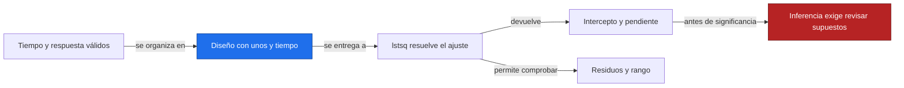
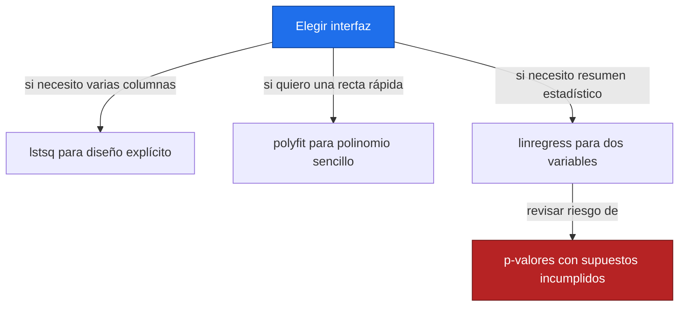
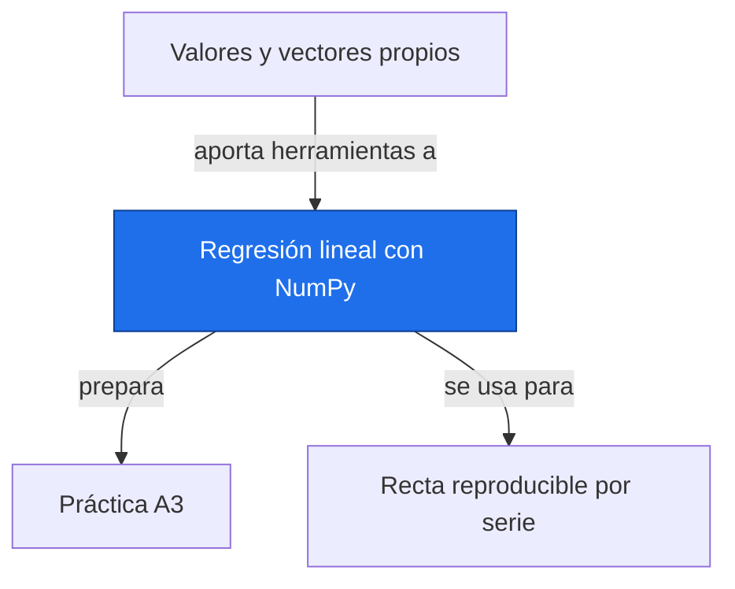

# Regresión lineal con NumPy

**Antes:** [[A3.5 Valores y vectores propios|Valores y vectores propios]] · **Después:** [[A3.P Práctica A3|Práctica A3]]

> [!abstract] Qué hace
> Construye un diseño con intercepto y tiempo, ajusta una recta y comprueba coeficientes y residuos con tres interfaces de Python.

> [!question] ¿Cuándo lo necesito?
> Al estimar una pendiente por serie NASA y dejar claro su periodo, unidad y límite de interpretación.

## Modelo mental



La matriz de diseño fija el orden de los coeficientes. Con columnas [1,t] el primero es intercepto y el segundo pendiente. El ajuste devuelve números; su significado depende de la unidad de t.

## Instalación e importación

Se requieren NumPy, SciPy y Matplotlib. Si faltan, usa python -m pip install numpy scipy matplotlib dentro de un entorno virtual temporal activado. Los bloques no escriben archivos ni requieren datos externos.

```python
import numpy as np
from scipy.stats import linregress
import matplotlib.pyplot as plt
```

Este bloque no imprime salida; deja disponibles las importaciones o el resultado indicado.

## Sintaxis mínima

```python
import numpy as np
t = np.array([0., 1., 2.])
y = np.array([1., 3., 5.])  # Ilustrativos
X = np.column_stack([np.ones_like(t), t])
beta, sumas_residuales, rango, singulares = np.linalg.lstsq(X, y, rcond=None)
print("beta [a, b] =", np.round(beta, 6).tolist())
print(f"forma de X = {X.shape}; rango = {rango}")
```

Salida esperada:

```text
beta [a, b] = [1.0, 2.0]
forma de X = (3, 2); rango = 2
```

sumas_residuales contiene sumas de cuadrados, no el vector de errores. Puede estar vacío si falta rango o no hay más filas que columnas. Calcula siempre y−X@beta para inspeccionar residuos.

## Ejemplo mínimo

**Datos simulados de forma determinista:** cinco niveles [2,4,5,4,5] mm en 2020–2024. Equivalen a una recta base de intercepto 2.8 mm y pendiente 0.6 mm/año más perturbaciones [−0.8,0.6,1,−0.6,−0.2] mm. No son mediciones ni una simulación aleatoria de un proceso climático.

Son los valores de A2.3 y A3.3 con el origen temporal desplazado: ahora los tiempos son 0–4 años en lugar de 1–5.

$$
\bar t=2,\quad \bar y=4,\quad b=\frac{6}{10}=0.6\ {\rm mm/año},\quad a=4-0.6\cdot2=2.8\ {\rm mm},\quad b_{\rm década}=6\ {\rm mm/década}
$$

> [!info] En palabras
> El cambio del origen modifica el intercepto respecto a A3.3, pero conserva la pendiente y todos los residuos.

```python
import numpy as np
from scipy.stats import linregress
anios = np.arange(2020, 2025, dtype=float)
t = anios-anios[0]
y = np.array([2., 4., 5., 4., 5.])  # Simulados, mm
X = np.column_stack([np.ones_like(t), t])
beta = np.linalg.lstsq(X, y, rcond=None)[0]
b_poly, a_poly = np.polyfit(t, y, 1)
r = linregress(t, y)
print(f"lstsq: a={beta[0]:.1f} mm, b={beta[1]:.1f} mm/año")
print(f"polyfit: a={a_poly:.1f}, b={b_poly:.1f}")
print(f"linregress: a={r.intercept:.1f}, b={r.slope:.1f}")
print(f"pendiente por década = {10*beta[1]:.1f} mm/década")
```

Salida esperada:

```text
lstsq: a=2.8 mm, b=0.6 mm/año
polyfit: a=2.8, b=0.6
linregress: a=2.8, b=0.6
pendiente por década = 6.0 mm/década
```

## Parámetros clave

| Parámetro | Qué hace | Valor por defecto |
| --- | --- | --- |
| rcond en lstsq | Umbral relativo para detectar rango numérico | None en la llamada utilizada |
| y en lstsq | Una serie o varias columnas de respuesta | Obligatorio |
| deg en polyfit | Grado del polinomio | Obligatorio; 1 para recta |
| alternative en linregress | Alternativa de su prueba de pendiente | two-sided |

Aquí se comparan solo los coeficientes. linregress también devuelve estadísticos inferenciales; no se interpretan antes de estudiar sus supuestos en el bloque B (nota pendiente).

## Patrones útiles

**Patrón 1 — Dibujar datos y recta.** Cada bloque repite los datos para poder ejecutarse solo.

```python
import numpy as np
import matplotlib.pyplot as plt
anios = np.arange(2020, 2025)
t = anios-anios[0]
y = np.array([2., 4., 5., 4., 5.])  # Simulados, mm
X = np.column_stack([np.ones_like(t), t])
beta = np.linalg.lstsq(X, y, rcond=None)[0]
plt.scatter(anios, y, label="Datos simulados")
plt.plot(anios, X@beta, label="Ajuste: 6 mm/década")
plt.xlabel("Año")
plt.ylabel("Nivel simulado (mm)")
plt.title("Serie simulada 2020–2024")
plt.legend()
plt.grid(True)
plt.show()
```

Este bloque no imprime salida; deja disponibles las importaciones o el resultado indicado.

**Patrón 2 — Comprobar residuos y rango.** La ortogonalidad comprueba la solución algebraica; no prueba independencia.

```python
import numpy as np
t = np.arange(5, dtype=float)
y = np.array([2., 4., 5., 4., 5.])  # Simulados, mm
X = np.column_stack([np.ones_like(t), t])
beta, _, rango, _ = np.linalg.lstsq(X, y, rcond=None)
e = y-X@beta
print("residuos =", np.round(e, 6).tolist())
print(f"SSE = {e@e:.1f} mm²; rango = {rango}")
print("ortogonalidad =", np.allclose(X.T@e, 0, atol=1e-12))
assert rango == 2
```

Salida esperada:

```text
residuos = [-0.8, 0.6, 1.0, -0.6, -0.2]
SSE = 2.4 mm²; rango = 2
ortogonalidad = True
```

## Trampas y gotchas

> [!warning] Error común
> ❌ Pasar fechas sin convertir a una unidad de tiempo → ✅ define años transcurridos, con fracciones si hace falta.
>
> ❌ Eliminar faltantes de y sin aplicar la misma máscara a t → ✅ filtra pares completos y conserva los intervalos reales.

```python
import numpy as np
t = np.array([0., 1., 2., 4.])
y = np.array([1., np.nan, 5., 9.])  # Simulados
validos = np.isfinite(t) & np.isfinite(y)
t, y = t[validos], y[validos]
X = np.column_stack([np.ones_like(t), t])
beta, _, rango, _ = np.linalg.lstsq(X, y, rcond=None)
assert rango == 2
print("tiempos conservados =", t.tolist())
print("beta =", np.round(beta, 6).tolist())
```

Salida esperada:

```text
tiempos conservados = [0.0, 2.0, 4.0]
beta = [1.0, 2.0]
```

- [ ] Reviso el orden de coeficientes de cada interfaz.
- [ ] Centro el tiempo para evitar un origen lejano sin utilidad.
- [ ] Compruebo rango y número de puntos válidos.
- [ ] Distingo residuos, suma de cuadrados e incertidumbre.

## ¿Esto o aquello?



Rendimiento: muchas series con las mismas fechas pueden resolverse juntas pasando una matriz de respuestas. Cuando las máscaras varían por celda hay que ajustar con sus fechas válidas o agrupar máscaras compatibles. No construyas la matriz de proyección H para obtener predicciones.

## Uso en Space Apps

**Reto:** Earth System Trend Detective · **Tarea:** calcular tendencias de dos celdas simuladas con fechas completas y compartidas.

```python
import numpy as np
t = np.arange(5, dtype=float)
Y = np.column_stack([2+0.3*t, 5-0.2*t])  # Malla simulada, mm
X = np.column_stack([np.ones_like(t), t])
beta = np.linalg.lstsq(X, Y, rcond=None)[0]
print("interceptos =", np.round(beta[0], 6).tolist())
print("pendientes mm/década =", np.round(10*beta[1], 6).tolist())
```

Salida esperada:

```text
interceptos = [2.0, 5.0]
pendientes mm/década = [3.0, -2.0]
```

El resultado representa dos tendencias ilustrativas, +3 y −2 mm/década. Para un mapa real también necesitas coordenadas, cobertura, periodo e incertidumbre. Las pruebas temporales del bloque C y las pruebas múltiples de D5 están pendientes.

## Conexiones



Enlaces: [[A3.5 Valores y vectores propios|Valores y vectores propios]] → **Regresión lineal con NumPy** → [[A3.P Práctica A3|Práctica A3]]

## Flashcards

¿En qué orden devuelve coeficientes lstsq para X=[1,t]?::Intercepto y luego pendiente.
¿Qué devuelve polyfit de grado uno?::Pendiente y luego intercepto.
¿Qué comprueba Xᵀe≈0?::La ortogonalidad algebraica del residuo respecto al diseño.
¿Cómo expresar en mm/década una tasa en mm/año?::Multiplicando por diez.

## Autoevaluación

- [ ] Construyo X sin copiar el ejemplo.
- [ ] Obtengo a=2.8 y b=0.6 con las tres interfaces.
- [ ] Conservo tiempos [0,2,4] después de filtrar faltantes.
- [ ] Reproduzco SSE=2.4 y la ortogonalidad residual.
- [ ] Dibujo datos, recta, unidades y periodo con etiqueta de simulación.

## Fuentes

- [NumPy, numpy.linalg.lstsq](https://numpy.org/doc/stable/reference/generated/numpy.linalg.lstsq.html).
- NumPy, documentación de polyfit y column_stack: https://numpy.org
- SciPy, documentación de scipy.stats.linregress: https://docs.scipy.org
- Jake VanderPlas, Python Data Science Handbook.
