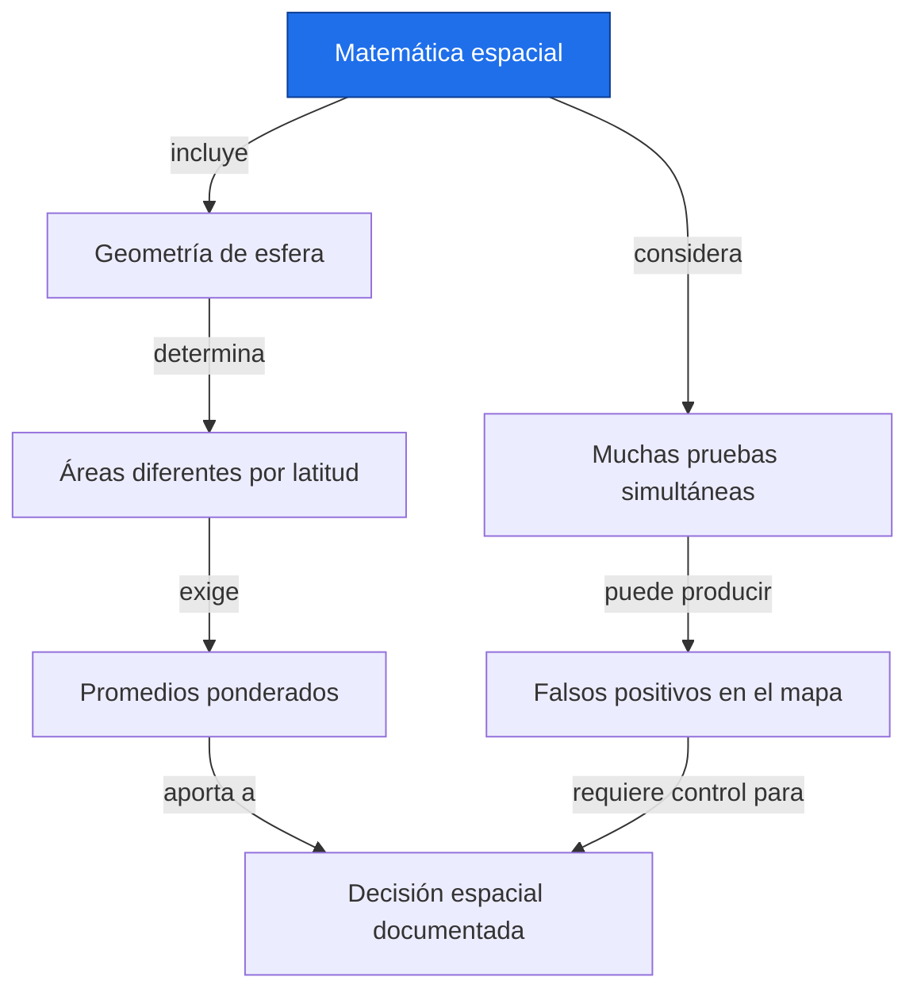
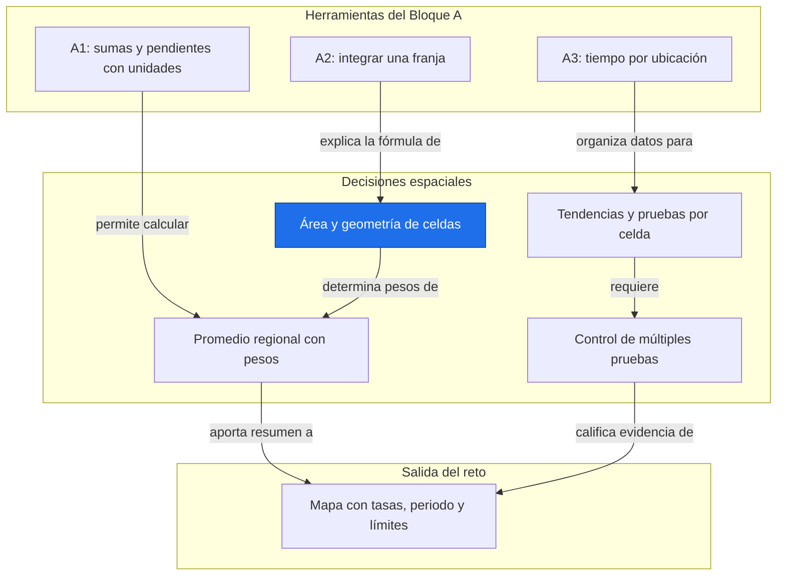
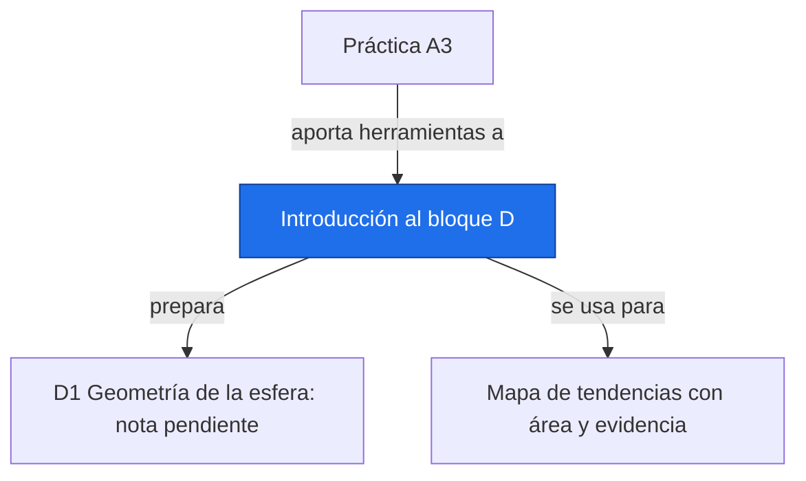

# Introducción al bloque D

**Antes:** [[A3.P Práctica A3|Práctica A3]] · **Después:** D1 Geometría de la esfera (nota pendiente)

> [!abstract] Idea clave
> Para interpretar un mapa de tendencias hay que respetar la geometría de la Tierra, el área de las celdas y la cantidad de pruebas realizadas.

> [!question] ¿Qué problema resuelve o qué pregunta responde?
> ¿Cómo convertir muchas series locales en una conclusión espacial que represente la región estudiada?

> [!quote]- En 30 segundos (versión hablada para el pitch)
> Un mapa contiene muchas series, pero sus celdas no siempre representan la misma superficie. Antes de promediar debemos ponderarlas. Y antes de colorear tendencias significativas debemos considerar que probar muchas celdas produce hallazgos por azar.

## Intuición

Imagina envolver un globo con una cuadrícula de latitud y longitud. Los meridianos se acercan cerca de los polos, por lo que una celda de un grado por un grado cubre menos superficie allí. Dar a cada celda el mismo voto sobrepondera las zonas con más celdas por unidad de área y puede sesgar el promedio regional.



**Conclusión intuitiva:** contar celdas no equivale a medir superficie ni a contar evidencias independientes.

## Definición

> [!note] Definición
> Las matemáticas espaciales describen posiciones, superficies, relaciones entre lugares y operaciones estadísticas sobre un dominio geográfico. Aquí usamos una Tierra esférica idealizada y mallas como aproximación inicial.

Partes o componentes:

| Subtema | Prioridad | Objetivo |
| --- | --- | --- |
| D1 Geometría de la esfera (nota pendiente) | E | Usar latitud, longitud, radianes, áreas y distancias; reconocer haversine. |
| D2 Promedios ponderados por área (nota pendiente) | E | Representar la región con pesos de superficie y máscaras válidas. |
| D3 Mallas y proyecciones (nota pendiente) | E | Interpretar resolución, CRS, coordenadas, faltantes y remuestreo. |
| D4 Estadística espacial (nota pendiente) | R | Reconocer autocorrelación espacial e índice de Moran. |
| D5 Pruebas múltiples en mapas (nota pendiente) | E | Reconocer Bonferroni, FDR y significancia de campo. |

E significa esencial y R recomendado. Este archivo presenta el mapa del bloque; D1–D5 todavía no tienen notas en este encargo.

## Cómo funciona

1. Identifica qué representa cada celda, su sistema de coordenadas y sus límites.
2. Conserva la relación tiempo × ubicación y define una máscara de datos válidos.
3. Calcula tasas y sus unidades para un periodo comparable.
4. Pondera por área cuando resumas una región.
5. Evalúa dependencia espacial y multiplicidad antes de interpretar un mapa de significancia.

### Prerrequisito que falta en A: trigonometría

El Bloque A no incluye un curso de trigonometría. D1 necesita radianes, seno y coseno; este repaso cubre lo mínimo para leer el ejemplo.

$$
\theta_{\rm rad}=\theta_{\rm grados}\frac{\pi}{180},\qquad \theta_{\rm grados}=\theta_{\rm rad}\frac{180}{\pi}
$$

> [!info] En palabras
> Una vuelta completa son 360 grados o 2π radianes. NumPy calcula seno y coseno a partir de radianes.

En un círculo de radio uno, el punto que forma un ángulo desde el eje horizontal tiene coordenada horizontal coseno y vertical seno. En la esfera, el coseno de la latitud describe cómo se reduce el radio del paralelo; el seno aparece al integrar las franjas.

$$
60^\circ=\frac{\pi}{3}\ {\rm rad},\qquad \cos(\pi/3)=0.5,\qquad \sin(\pi/3)=\frac{\sqrt3}{2}\approx0.866025
$$

> [!info] En palabras
> A sesenta grados la coordenada horizontal del círculo unitario es un medio. Por eso el paralelo tiene la mitad del radio del ecuador en el modelo esférico.

```python
import numpy as np
angulo = np.deg2rad(60.)
print(f"60 grados = {angulo:.6f} radianes")
print(f"coseno = {np.cos(angulo):.6f}; seno = {np.sin(angulo):.6f}")
print(f"regreso a grados = {np.rad2deg(angulo):.1f}")
```

Salida esperada:

```text
60 grados = 1.047198 radianes
coseno = 0.500000; seno = 0.866025
regreso a grados = 60.0
```

### Área y pesos

$$
A=R^2\Delta\lambda\,(\sin\varphi_2-\sin\varphi_1)
$$

> [!info] En palabras
> R es el radio de la esfera; la amplitud longitudinal Δλ y las latitudes límite se expresan en radianes. El área está en la unidad de R al cuadrado. Ordena los límites de sur a norte y usa una amplitud longitudinal positiva.

$$
w_i\propto\cos\varphi_i,\qquad \bar x_A=\frac{\sum_i w_i x_i}{\sum_i w_i}
$$

> [!info] En palabras
> En una malla regular de iguales pasos angulares se pueden usar pesos proporcionales al coseno de la latitud central. La media ponderada divide la suma de aportes por la suma de pesos válidos.

Para celdas centradas de igual ancho en latitud y longitud sobre una esfera, el factor común se cancela y los pesos de coseno son proporcionales al área exacta. En mallas irregulares, curvilíneas o parcialmente cubiertas, usa áreas y fracciones de cobertura reales.

## Ejemplo

> [!example] Celdas de un grado por un grado
> **Situación:** esfera idealizada con radio elegido R=6371 km, celdas centradas en 0°, 60° y 80°; cada una abarca ±0.5° de latitud.
>
> **Qué ocurre:** sus anchos angulares coinciden, pero sus áreas disminuyen hacia los polos.
>
> **Resultado:** el cociente respecto al ecuador coincide con el coseno de la latitud central bajo estas condiciones.

$$
A(\varphi)=R^2\frac{\pi}{180}\left[\sin\left(\varphi+\frac{\pi}{360}\right)-\sin\left(\varphi-\frac{\pi}{360}\right)\right],\qquad \frac{A(\varphi)}{A(0)}=\cos\varphi
$$

> [!info] En palabras
> La identidad de diferencia de senos cancela el mismo ancho latitudinal al dividir. Por eso la comparación no es solo una aproximación numérica en esta malla idealizada.

```python
import numpy as np
R = 6371.0  # km: radio elegido del modelo esférico
lat = np.array([0., 60., 80.])
sur, norte = np.deg2rad(lat-0.5), np.deg2rad(lat+0.5)
area = R**2*np.deg2rad(1.)*(np.sin(norte)-np.sin(sur))
cociente = area/area[0]
for p, a, q, c in zip(lat, area, cociente, np.cos(np.deg2rad(lat))):
    print(f"lat={p:4.0f}° área={a:.6f} km² razón={q:.6f} cos={c:.6f}")
assert np.allclose(cociente, np.cos(np.deg2rad(lat)))
```

Salida esperada:

```text
lat=   0° área=12364.154779 km² razón=1.000000 cos=1.000000
lat=  60° área=6182.077390 km² razón=0.500000 cos=0.500000
lat=  80° área=2147.012946 km² razón=0.173648 cos=0.173648
```

Un segundo ejemplo ilustrativo toma dos celdas de estas dimensiones, a 0° y 60°, con valores 0 y 10. Su media simple es 5; con pesos 1 y 0.5, la media regional es 10/3≈3.333333. Son dos celdas, no una estimación del promedio global.

```python
import numpy as np
x = np.array([0., 10.])  # Valores ilustrativos, misma unidad
w = np.cos(np.deg2rad([0., 60.]))
print(f"media simple = {x.mean():.6f}")
print(f"media ponderada = {np.average(x, weights=w):.6f}")
```

Salida esperada:

```text
media simple = 5.000000
media ponderada = 3.333333
```

### Adelanto de pruebas múltiples

Con 1000 pruebas válidas, todas bajo hipótesis nula, y nivel nominal 0.05, se esperan 50 rechazos falsos en promedio. La cantidad de una realización concreta varía; no implica que el 5 % de los hallazgos sea falso. La dependencia modifica cómo se agrupan en el mapa, y la validez de cada prueba sigue siendo necesaria.

FDR busca controlar la proporción esperada de falsos descubrimientos entre los rechazos, con convenciones y supuestos específicos. Benjamini–Hochberg, Bonferroni y significancia de campo se estudiarán en D5 (nota pendiente); aquí no se implementan ni se usa un mapa para declarar significancia.

## Errores y límites

> [!warning] Error común
> ❌ Aplicar coseno a grados sin convertir → ✅ convertir a radianes antes de llamar np.cos.
>
> ❌ Usar el mismo peso para todas las celdas latitud/longitud → ✅ comprobar área y cobertura válida.
>
> ❌ Interpretar cada punto significativo como evidencia independiente → ✅ evaluar multiplicidad y dependencia espacial.

La fórmula esférica no sustituye áreas de un elipsoide, límites irregulares ni fracciones tierra–océano. Una proyección de mapa puede distorsionar superficies: medir píxeles de una imagen no recupera automáticamente áreas físicas.

En D3 se revisarán las convenciones de longitud 0–360 y −180–180, el cruce de la línea de fecha, CRS y proyecciones como plate carrée, Robinson o polar. El remuestreo por promedio, vecino más cercano o interpolación bilineal responde a objetivos distintos y puede alterar extremos. Son adelantos, no instrucciones para reproyectar todavía.

## Aplicación en Space Apps

**Reto:** Earth System Trend Detective · **Pregunta:** ¿qué regiones cambian y cuánto territorio representan?



Enlaces: [[A1.1 Notación de sumatoria y productos|Notación de sumatoria y productos]] · [[A1.2 Función lineal, pendiente e intercepto|Función lineal, pendiente e intercepto]] · [[A2.2 Integral como acumulado|Integral como acumulado]] · [[A3.1 Vectores y matrices|Vectores y matrices]]

El Bloque A permite calcular tasas; para afirmar significancia también se requieren inferencia (bloque B, nota pendiente) y métodos temporales (bloque C, nota pendiente).

## Conexiones



Enlaces: [[A3.P Práctica A3|Práctica A3]] → **Introducción al bloque D**. Repaso: [[A.0 Índice del bloque A|Índice del bloque A]]. Siguiente: D1 Geometría de la esfera (nota pendiente).

**Ruta posterior:** D1 Geometría de la esfera (nota pendiente) → D2 Promedios ponderados por área (nota pendiente) → D3 Mallas y proyecciones (nota pendiente) → D4 Estadística espacial (nota pendiente) → D5 Pruebas múltiples en mapas (nota pendiente).

## Flashcards

¿Por qué una celda de 1° × 1° es menor cerca de los polos?::Porque los meridianos convergen y se reduce el ancho del paralelo.
¿Qué unidad angular esperan seno y coseno de NumPy?::Radianes.
¿Cuándo sirven pesos de coseno de latitud?::En una malla regular de pasos angulares iguales sobre una esfera, con cobertura tratada de forma coherente.
¿Qué controla FDR?::La proporción esperada de falsos descubrimientos entre los rechazos, bajo los supuestos del procedimiento.

## Autoevaluación

- [ ] Convierto 60° a π/3 radianes y regreso.
- [ ] Explico por qué la celda centrada en 60° tiene la mitad del área ecuatorial en el modelo.
- [ ] Reproduzco las tres áreas y sus cocientes.
- [ ] Obtengo 3.333333 para las dos celdas ilustrativas.
- [ ] Distingo número esperado de falsos positivos y proporción falsa entre hallazgos.
- [ ] Identifico el repaso de trigonometría que necesito antes de D1.

## Fuentes

- Temario y habilidad para Detective.pdf, Bloque D.
- Khan Academy, trigonometría y círculo unitario.
- NumPy, documentación de deg2rad, rad2deg, sin, cos y average.
- Wilks, Statistical Methods in the Atmospheric Sciences, temas de análisis espacial y multiplicidad. Referencia de estudio; no se atribuyen cifras observadas.
