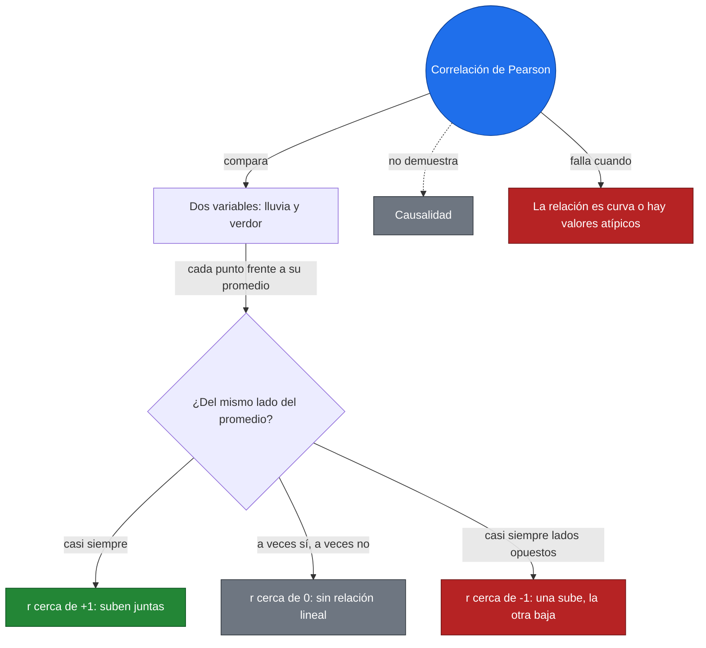
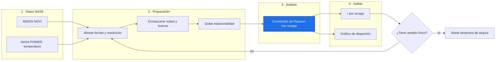
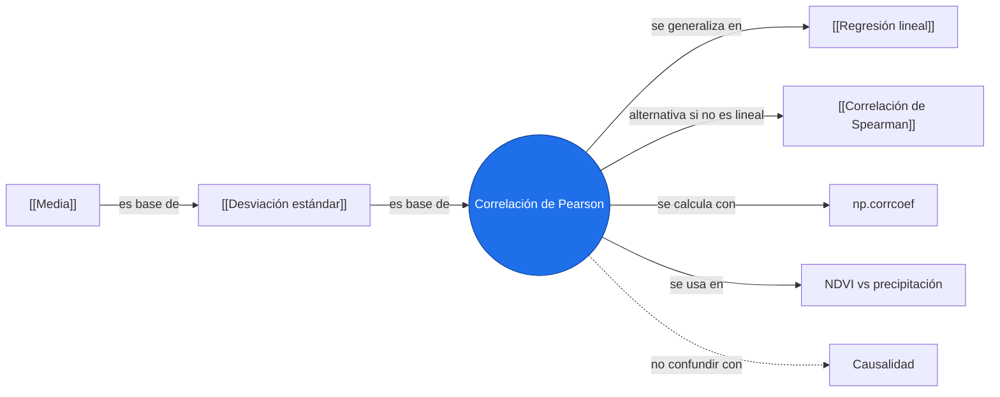

# Correlación de Pearson

> [!abstract] Idea clave
> Mide qué tan bien dos variables siguen una **línea recta** juntas, con un número entre −1 y 1.

> [!question] ¿Qué pregunta responde?
> ¿Cuando una variable sube, la otra tiende a subir (o bajar) de forma lineal?

> [!quote]- En 30 segundos (versión hablada para el pitch)
> Miramos si dos series se mueven juntas. Un valor cerca de 1 dice que suben a la vez, cerca de −1 que una sube cuando la otra baja, y cerca de 0 que no hay relación lineal. No dice que una cause la otra.

## Intuición

Piensa en lluvia mensual y verdor de la vegetación. Si en los meses lluviosos la vegetación está más verde y en los secos menos, las dos variables "caminan juntas".



**Conclusión intuitiva:** compara, punto por punto, si ambas variables están del mismo lado de su promedio.

## Fórmula

$$
r = \frac{\sum_{i=1}^{n}(x_i-\bar{x})(y_i-\bar{y})}{\sqrt{\sum_{i=1}^{n}(x_i-\bar{x})^2}\;\sqrt{\sum_{i=1}^{n}(y_i-\bar{y})^2}}
$$

| Símbolo | Significa |
|:-:|---|
| $x_i, y_i$ | valores de cada variable en la observación $i$ |
| $\bar{x}, \bar{y}$ | promedios de $x$ y de $y$ |
| $n$ | número de observaciones |
| $r$ | coeficiente de correlación, $-1 \le r \le 1$ |

> [!info] En palabras
> El numerador suma qué tanto se mueven juntas las desviaciones respecto al promedio (positivo si coinciden en signo). El denominador las escala por la variación propia de cada variable, para que el resultado no dependa de las unidades.

## Ejemplo a mano

Datos ilustrativos: $x$ = precipitación (cm), $y$ = índice de verdor relativo.

| $i$ | $x$ | $y$ | $x-\bar{x}$ | $y-\bar{y}$ | producto |
|:-:|:-:|:-:|:-:|:-:|:-:|
| 1 | 1 | 2 | −2 | −2 | 4 |
| 2 | 2 | 4 | −1 | 0 | 0 |
| 3 | 3 | 5 | 0 | 1 | 0 |
| 4 | 4 | 4 | 1 | 0 | 0 |
| 5 | 5 | 5 | 2 | 1 | 2 |

1. Promedios: $\bar{x}=3$, $\bar{y}=4$
2. Numerador: $4+0+0+0+2 = 6$
3. Denominador: $\sqrt{10}\,\sqrt{6}=\sqrt{60}\approx 7.746$

$$
\boxed{r = \frac{6}{7.746} \approx 0.7746}
$$

## Código

```python
import numpy as np
import matplotlib.pyplot as plt

x = np.array([1, 2, 3, 4, 5])
y = np.array([2, 4, 5, 4, 5])

r = np.corrcoef(x, y)[0, 1]
print(f"r = {r:.4f}")

m, b = np.polyfit(x, y, 1)
plt.scatter(x, y)
plt.plot(x, m * x + b, "r--")
plt.title(f"Correlación de Pearson, r = {r:.2f}")
plt.xlabel("Precipitación (cm)"); plt.ylabel("Verdor relativo")
plt.show()
```

Salida esperada: `r = 0.7746` (coincide con el ejemplo a mano).

- `np.corrcoef(x, y)` → devuelve una matriz 2×2; `[0, 1]` es la correlación entre $x$ e $y$.
- `np.polyfit(x, y, 1)` → recta de ajuste, solo para visualizar.

## Interpretación

> [!success] Qué significa el resultado
> $r\approx 0.77$: relación lineal **positiva y fuerte**. Más lluvia tiende a asociarse con más verdor. Además, $r^2\approx 0.60$: la recta explica cerca del 60 % de la variación de $y$.

## Trampas y límites

> [!warning] Error común
> ❌ "Correlación alta significa que $x$ causa $y$" → ✅ Solo indica que se mueven juntas; puede haber una tercera variable o coincidencia.

No permite afirmar que: la relación sea causal, que sea lineal si $r$ es bajo (una curva puede dar $r\approx 0$), ni que sea confiable con pocos datos o con valores atípicos.

Revisa en datos de la Tierra:

- [ ] Estacionalidad (dos series con ciclo anual correlacionan solo por el ciclo)
- [ ] Autocorrelación temporal (los puntos no son independientes)
- [ ] Datos faltantes, nubes, huecos
- [ ] Resolución espacial y temporal
- [ ] Unidades y escala

## Aplicación en Space Apps

**Reto:** Climate Action / Air Quality & Biophysical Monitoring · **Pregunta:** ¿cómo detectar y anticipar anomalías críticas en índices de vegetación antes de que se agrave una sequía?

| Producto | Variable | Unidades | Cobertura | Resolución | Enlace |
|---|---|---|---|---|---|
| NASA MODIS (MOD13Q1) | NDVI | Adimensional | Global | 250 m / 16 días | [LP DAAC MODIS](https://lpdaac.usgs.gov/products/mod13q1v061/) |
| NASA POWER | Temp. superficie ($T_{2M}$) | °C | Global | 0.5° × 0.5° / Diaria | [NASA POWER API](https://power.larc.nasa.gov/) |
| Sentinel-5P / TROPOMI | Columna de NO₂ | mol/m² | Global | 5.5 × 3.5 km / Diaria | [Earthdata Search](https://search.earthdata.nasa.gov/) |



## Conexiones



Pearson mide la fuerza de la relación lineal; la regresión usa esa relación para predecir.

## Flashcards

¿Qué mide la correlación de Pearson?::La fuerza y dirección de la relación lineal entre dos variables, entre −1 y 1.
¿Correlación implica causalidad?::No; puede haber una tercera variable o coincidencia.
¿Qué indica $r^2$?::La fracción de la variación de $y$ explicada por la recta de ajuste.

## Autoevaluación

- [ ] Lo explico sin mirar la nota
- [ ] Sé qué significa cada símbolo
- [ ] Lo resuelvo a mano y en Python con el mismo resultado
- [ ] Sé interpretar el resultado y una limitación
- [ ] Sé cómo aplicarlo a un dato NASA

## Fuentes

- Documentación de NumPy: `numpy.corrcoef`
