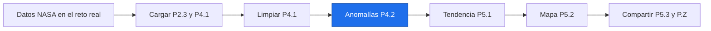

# Bloque P — Python desde cero

Para compañeros que nunca han programado y necesitan seguir código científico del Detective. En cinco días practicarás cargar → limpiar → anomalías → tendencia → mapa → compartir. La teoría estadística y espacial sigue en otros bloques.

Ruta: concepto → Prueba tú → ejercicios en notebook → cierre. El notebook contiene los mismos ejercicios que la nota: se resuelven una vez. Todas las cifras y figuras son **simuladas**. El nombre del reto y el contexto NASA Space Apps 2026 proceden del encargo; no se presentan como convocatoria oficial verificada.

## Plan de cinco días

| Día | Subbloque | ◆ Núcleo 240 min | ➕ Ampliación 240 min |
|---|---|---|---|
| 1 | [[P1.0 Índice P1|Índice P1]] | 30 entorno y diagnóstico + 75 conceptos + 125 ejercicios + 10 cierre | 150 ejercicios + 45 lectura + 45 refuerzo |
| 2 | [[P2.0 Índice P2|Índice P2]] | 15 repaso + 75 conceptos + 140 ejercicios + 10 cierre | 150 ejercicios + 45 lectura + 45 refuerzo |
| 3 | [[P3.0 Índice P3|Índice P3]] | 15 repaso + 75 conceptos + 140 ejercicios + 10 cierre | 150 ejercicios + 45 lectura + 45 refuerzo |
| 4 | [[P4.0 Índice P4|Índice P4]] | 15 repaso + 75 conceptos + 140 ejercicios + 10 cierre | 150 ejercicios + 45 lectura + 45 refuerzo |
| 5 | [[P5.0 Índice P5|Índice P5]] | 15 repaso + 75 conceptos + 45 ejercicios + 95 proyecto + 10 cierre | 60 ejercicios + 120 proyecto + 60 repaso |

Cada concepto: 15 min lectura/ejemplos + 10 Prueba tú. La lectura del libro núcleo se integra en esos 15 min. Día 1: 15 min entorno y 15 diagnóstico. Desde Día 2: 15 min flashcards del día anterior.

Los tiempos son estimaciones para principiantes, no una garantía individual. Al agotarse una sesión usa pistas y soluciones; lleva repeticiones adicionales a ampliación. Conserva el cierre y el proyecto.

| Disponibilidad | Calendario |
|---|---|
| 4 h diarias | Lunes P1, martes P2, miércoles P3, jueves P4, viernes P5 con P.Z; solo núcleo |
| 8 h diarias | Cada día P1–P5: núcleo y ampliación; el quinto incluye ambos niveles del proyecto |
| Fin de semana doble | Jueves P1 4 h, viernes P2 4 h, sábado P3 4 h + P4 4 h, domingo P5 con P.Z 4 h + ampliación 4 h |

Un fin de semana puede doblar dedicación: núcleo + ampliación, o dos días de núcleo. Sigue P1 → P2 → P3 → P4 → P5 → P.Z. **No saltes el proyecto del Día 5.**

## Leyenda y estudio

- ◆ Núcleo; ➕ ampliación.
- ⭐ básico 5 min; ⭐⭐ intermedio 10–12 min; ⭐⭐⭐ avanzado 20 min. Retos Tierra 15–25 min, con su tiempo explícito.
- Tipos: Predice la salida; Corrige el error; Completa el código; Escribe desde cero; Reto Tierra con P.D.
- La distribución por cantidad ronda 40 % básico, 45 % intermedio y el resto avanzado. P5 tiene cinco ejercicios: 40/40/20.
- Atasco: al doble del tiempo abre la pista; al triple abre la solución, ciérrala y repite.
- Repasa flashcards `pregunta::respuesta` sin mirar primero; pueden usarse sin complemento.

Fuera del bloque: generadores con yield, decoradores, clases complejas, pytest avanzado, dask, Parquet y Docker.

## Mapa del Detective


Enlaces: [[P2.3 Archivos, errores y módulos|Archivos, errores y módulos]] · [[P4.1 Series y DataFrames|Series y DataFrames]] · [[P4.2 Fechas, remuestreo y anomalías|Fechas, remuestreo y anomalías]] · [[P5.1 SciPy, llamar y leer resultados|SciPy, llamar y leer resultados]] · [[P5.2 xarray y NetCDF|xarray y NetCDF]] · [[P5.3 Depuración, Git y código reproducible|Depuración, Git y código reproducible]] · [[P.Z Proyecto integrador|Proyecto integrador]].

## Tres rutas de ejecución · elige una

**Colab, sin instalar en tu computadora.** Abre Colab desde la bibliografía, inicia sesión si se solicita, elige Archivo → Subir notebook y selecciona el ipynb del día. Shift+Enter ejecuta una celda. Ejecuta la celda %pip antes de necesitar bibliotecas; se instala en la sesión remota. Descarga el notebook para conservar trabajo; los archivos de la sesión son temporales. [Colab oficial](https://research.google.com/colaboratory/faq.html).

**Local con VS Code o Jupyter.** Python 3.13 reproduce la versión principal comprobada. Abre terminal en P Python desde cero, crea un entorno y usa su intérprete. VS Code: Python: Select Interpreter → .venv; para notebooks selecciona ese kernel. [VS Code oficial](https://code.visualstudio.com/docs/python/environments).

```powershell
python -m venv .venv
.venv\Scripts\python.exe -m pip install -r requirements.txt
.venv\Scripts\python.exe -m pip install notebook
.venv\Scripts\python.exe -m notebook
```

En macOS/Linux sustituye el intérprete por `.venv/bin/python`. También puedes guardar `practica.py` y ejecutarlo con el intérprete del entorno. Notebook mezcla texto y celdas; un archivo .py contiene instrucciones. [venv](https://docs.python.org/3.13/tutorial/venv.html) y [Jupyter](https://jupyter.org/install).

**conda.** Si ya está instalado, crea un entorno independiente y después instala los requisitos dentro. Son comandos de terminal, no Python. [conda oficial](https://docs.conda.io/projects/conda/en/latest/user-guide/tasks/manage-environments.html).

```bash
conda create -n detective-p python=3.13 pip
conda activate detective-p
python -m pip install -r requirements.txt
python -m pip install notebook
python -m notebook
```

La preparación instaló paquetes solo en un entorno virtual temporal. Estas instrucciones son para futuras sesiones. No ejecutes comandos de terminal en una celda Python salvo la celda %pip suministrada.

## Diagnóstico · 10 preguntas · 15 min

Predice sin ejecutar. Si nunca has programado, marca «no sé». Evalúa conocimientos previos; por eso muestra sintaxis aún no enseñada. No consultes soluciones antes de puntuar.

### 1. Predice la salida

```python
print(9//2,9%2)
```

### 2. Predice la salida

```python
print(float('2.5')*2)
```

### 3. Predice la salida

```python
x=3
print(x>0 and x<5)
```

### 4. Predice la salida

```python
s=0
for i in range(4):
    s+=i
print(s)
```

### 5. Predice la salida

```python
def f(x):
    return x*10
print(f(0.02))
```

### 6. Predice la salida

```python
a=[1,2,3]
print(a[-1],a[:2])
```

### 7. Predice la salida

```python
a=[1,2]
b=a
b[0]=9
print(a)
```

### 8. Predice la salida

```python
d={'Costa':14,'Sierra':12}
print(d['Costa'])
```

### 9. Predice la salida

```python
print([x*2 for x in [1,2,3]])
```

### 10. Predice la salida

```python
try:
    float('')
except ValueError:
    print('faltante')
```

> [!success]- Respuestas · un punto por respuesta completamente correcta
> 1. `4 1`
> 2. `5.0`
> 3. `True`
> 4. `6`
> 5. `0.2`
> 6. `3 [1, 2]`
> 7. `[9, 2]`
> 8. `14`
> 9. `[2, 4, 6]`
> 10. `faltante`

**8–10 puntos:** puedes saltar P1 y P2 y empezar en P3. Dedica las 8 h de núcleo ahorradas a ejercicios de ampliación P3 150 min, P4 150 min y P5 con proyecto ampliado 180 min. Las lecturas y refuerzos adicionales siguen opcionales. Consulta cualquier concepto que hayas fallado antes de usarlo.

**0–7 puntos:** sigue P1–P5. La puntuación mide familiaridad con código, no capacidad científica.

## Seguimiento en Obsidian

El panel requiere Dataview; los índices funcionan sin ese complemento.

```dataview
TABLE dia, nivel, tiempo_estimado, estado
FROM "P Python desde cero"
WHERE bloque = "P" AND tipo = "python"
SORT dia ASC, orden ASC
```

Comienza: [[P1.0 Índice P1|Índice P1]] · [[P.B Bibliografía y plan de lectura|Bibliografía y plan de lectura]] · [[P.D Datos sintéticos de práctica|Datos sintéticos de práctica]] · [[P.Z Proyecto integrador|Proyecto integrador]].
