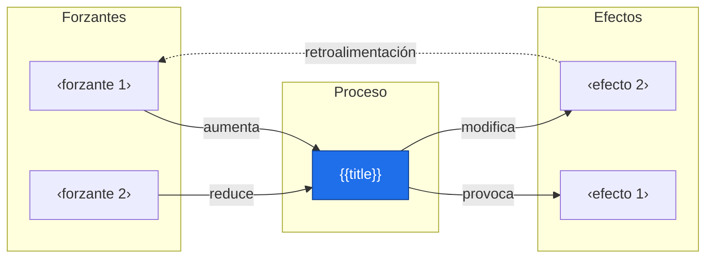
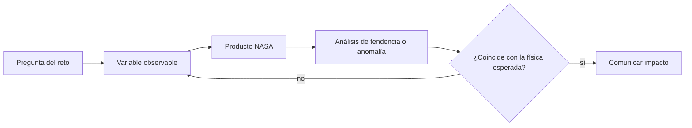
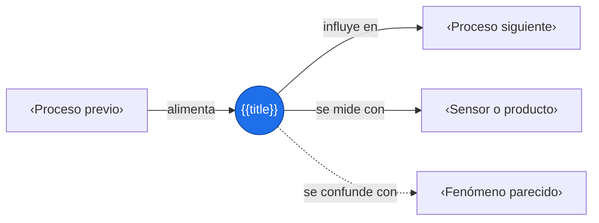

# {{title}}

> [!abstract] Idea clave
> ‹Qué es el fenómeno o proceso, en una frase.›

> [!question] ¿Qué pregunta responde?
> ‹¿Por qué ocurre, cómo cambia, qué provoca?›

> [!quote]- En 30 segundos (versión hablada)
> ‹Explicación oral para cualquier público.›

## Intuición

‹Analogía cotidiana del proceso.›

## Sistema: causas, proceso y efectos



## Descripción cuantitativa

$$
\text{‹ecuación o ley›}
$$

| Símbolo | Significa | Unidades |
|:-:|---|:-:|
| $‹a›$ | ‹…› | ‹…› |
| $‹b›$ | ‹…› | ‹…› |

> [!info] En palabras
> ‹Qué relación física expresa y qué pasa si una variable cambia.›

## Escalas

| Escala | Valor típico | Comentario |
|---|---|---|
| Espacial | ‹m, km, global› | ‹…› |
| Temporal | ‹horas, estaciones, décadas› | ‹…› |
| Magnitud | ‹orden de magnitud› | ‹…› |

## Ejemplo numérico

**Situación:** ‹caso concreto con números›

$$
\begin{aligned}
\text{‹cantidad›} &= \text{‹sustitución con unidades›} \\
&= \text{‹resultado con unidades›}
\end{aligned}
$$

> [!success] ¿Tiene sentido?
> ‹Compara el orden de magnitud con valores reales.›

## Cálculo en Python

```python
import numpy as np
import matplotlib.pyplot as plt

t = np.linspace(0, 10, 200)      # ‹unidad›
y = ...                          # ecuación del proceso
plt.plot(t, y)
plt.xlabel("‹variable› (‹unidad›)"); plt.ylabel("‹variable› (‹unidad›)")
plt.title("‹título›"); plt.grid(True); plt.show()
```

## Cómo se observa desde el espacio

| Variable | Misión o producto | Qué detecta |
|---|---|---|
| ‹…› | ‹…› | ‹…› |
| ‹…› | ‹…› | ‹…› |

## Incertidumbre y factores de confusión

> [!warning] Cuidado
> ‹Otro proceso que produce la misma señal, ciclo natural que se confunde con tendencia, límite de la medición.›

- [ ] Variabilidad natural vs tendencia
- [ ] Ciclo estacional o anual
- [ ] Efectos locales vs globales
- [ ] Sesgos del instrumento

## Impacto y relevancia

‹Por qué importa: clima, agua, agricultura, salud, riesgos.›

## Aplicación en Space Apps

**Reto:** ‹nombre› · **Pregunta:** ¿‹…›?



## Conexiones



Enlaces: [[‹Proceso previo›]] → **{{title}}** → [[‹Proceso siguiente›]]

## Flashcards

¿Qué es {{title}}?::‹respuesta›
¿Qué lo provoca?::‹respuesta›
¿Cómo se mide desde el espacio?::‹respuesta›

## Autoevaluación

- [ ] Explico el proceso sin mirar la nota
- [ ] Nombro causas, efectos y una retroalimentación
- [ ] Manejo unidades y órdenes de magnitud
- [ ] Sé qué producto NASA lo observa
- [ ] Distingo tendencia de variabilidad natural

## Fuentes

- ‹enlace o referencia›
