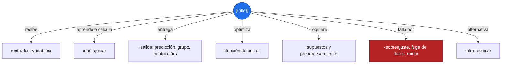
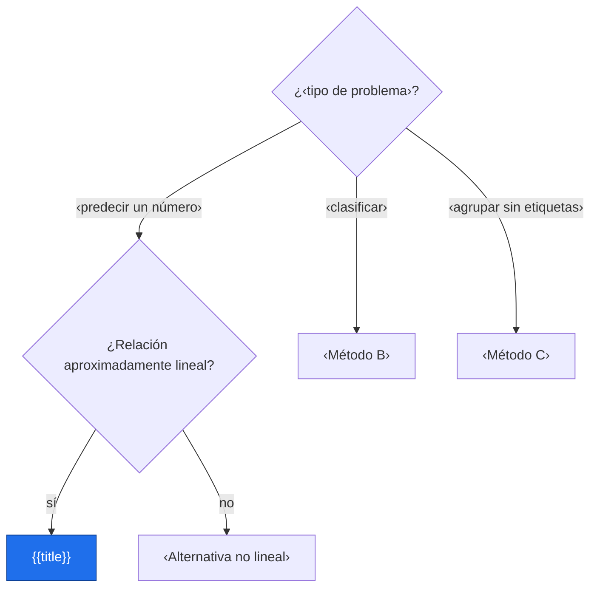
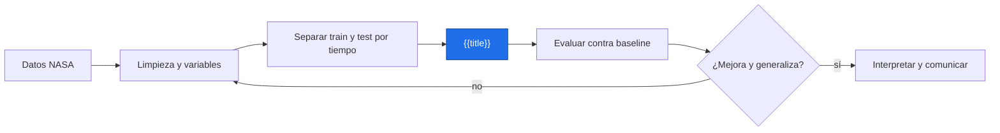
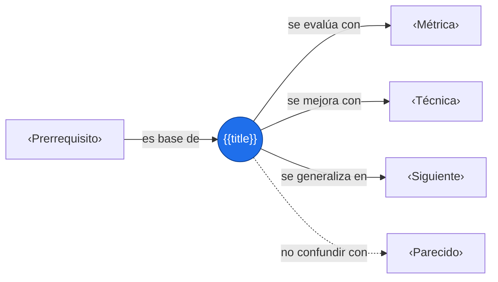

# {{title}}

> [!abstract] Idea clave
> ‹Qué hace la técnica, en una frase.›

> [!question] ¿Qué problema resuelve?
> ‹¿Predecir, clasificar, agrupar, detectar anomalías, reducir dimensión…?›

> [!quote]- En 30 segundos (versión hablada para el pitch)
> ‹Explicación oral para un jurado no técnico.›

## Intuición

‹Analogía sin matemáticas.›



**Conclusión intuitiva:** ‹…›

## Cuándo usarlo



No conviene cuando: ‹…›

## Cómo funciona

1. ‹Paso del algoritmo 1›
2. ‹Paso del algoritmo 2›
3. ‹Paso del algoritmo 3›

$$
\text{‹función de costo o regla de predicción›}
$$

> [!info] En palabras
> ‹Qué intenta minimizar o maximizar y cómo se actualiza.›

## Datos y preprocesamiento

| Requisito | Por qué importa | Cómo lo hago |
|---|---|---|
| ‹escalado› | ‹…› | ‹…› |
| ‹valores faltantes› | ‹…› | ‹…› |
| ‹variables categóricas› | ‹…› | ‹…› |

## Hiperparámetros clave

| Parámetro | Qué controla | Si lo subo |
|---|---|---|
| ‹…› | ‹…› | ‹…› |
| ‹…› | ‹…› | ‹…› |

## Implementación mínima

```python
import numpy as np
import pandas as pd
from sklearn.pipeline import make_pipeline
from sklearn.preprocessing import StandardScaler
from sklearn.metrics import mean_absolute_error   # cambia según el problema

df = pd.read_csv("datos.csv")                     # ‹fuente›
X = df[["‹feature_1›", "‹feature_2›"]]
y = df["‹objetivo›"]

# Series temporales: separa por tiempo, nunca al azar
corte = int(len(df) * 0.8)
X_tr, X_te = X.iloc[:corte], X.iloc[corte:]
y_tr, y_te = y.iloc[:corte], y.iloc[corte:]

modelo = make_pipeline(StandardScaler(), ‹Modelo›())   # el escalado se ajusta solo con train
modelo.fit(X_tr, y_tr)
pred = modelo.predict(X_te)

base = np.full(len(y_te), y_tr.mean())                 # baseline: predecir el promedio
print("Error modelo  :", mean_absolute_error(y_te, pred))
print("Error baseline:", mean_absolute_error(y_te, base))
```

- `make_pipeline` → encadena preprocesamiento y modelo para evitar fuga de datos.
- `‹línea clave›` → ‹qué hace›

## Evaluación

| Métrica | Qué mide | Cuándo usarla |
|---|---|---|
| ‹MAE / RMSE / R² / F1…› | ‹…› | ‹…› |

- [ ] Comparé contra un baseline simple
- [ ] Separé train y test antes de cualquier ajuste
- [ ] Usé validación cruzada (por bloques de tiempo si hay series)
- [ ] Miré los errores en una gráfica, no solo una métrica

## Interpretación

> [!success] Qué significa el resultado
> ‹La métrica en palabras, comparada con el baseline, y qué variables pesan más.›

## Fallos comunes

> [!warning] Error común
> ❌ ‹error› → ✅ ‹corrección›

- [ ] Fuga de datos (información del futuro o del test en el entrenamiento)
- [ ] Sobreajuste (excelente en train, mediocre en test)
- [ ] Correlación espacial o temporal ignorada al separar datos
- [ ] Desbalance de clases o extrapolación fuera del rango observado

## Aplicación en Space Apps

**Reto:** ‹nombre› · **Pregunta:** ¿‹…›?



## Comparación con alternativas

| Criterio | {{title}} | ‹Alternativa A› | ‹Alternativa B› |
|---|---|---|---|
| Interpretabilidad | ‹…› | ‹…› | ‹…› |
| Datos que necesita | ‹…› | ‹…› | ‹…› |
| Costo de cómputo | ‹…› | ‹…› | ‹…› |

## Conexiones



Enlaces: [[‹Prerrequisito›]] → **{{title}}** → [[‹Siguiente›]]

## Flashcards

¿Qué problema resuelve {{title}}?::‹respuesta›
¿Qué se minimiza o maximiza en {{title}}?::‹respuesta›
¿Cuál es el riesgo principal de {{title}}?::‹respuesta›

## Autoevaluación

- [ ] Explico la técnica sin mirar la nota
- [ ] Sé cuándo usarla y cuándo no
- [ ] La implemento con un pipeline y un baseline
- [ ] Evalúo sin fuga de datos
- [ ] Interpreto el resultado en palabras
- [ ] Sé aplicarla a un dato NASA

## Fuentes

- ‹documentación, curso o paper›
