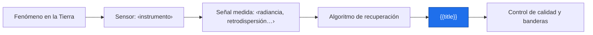
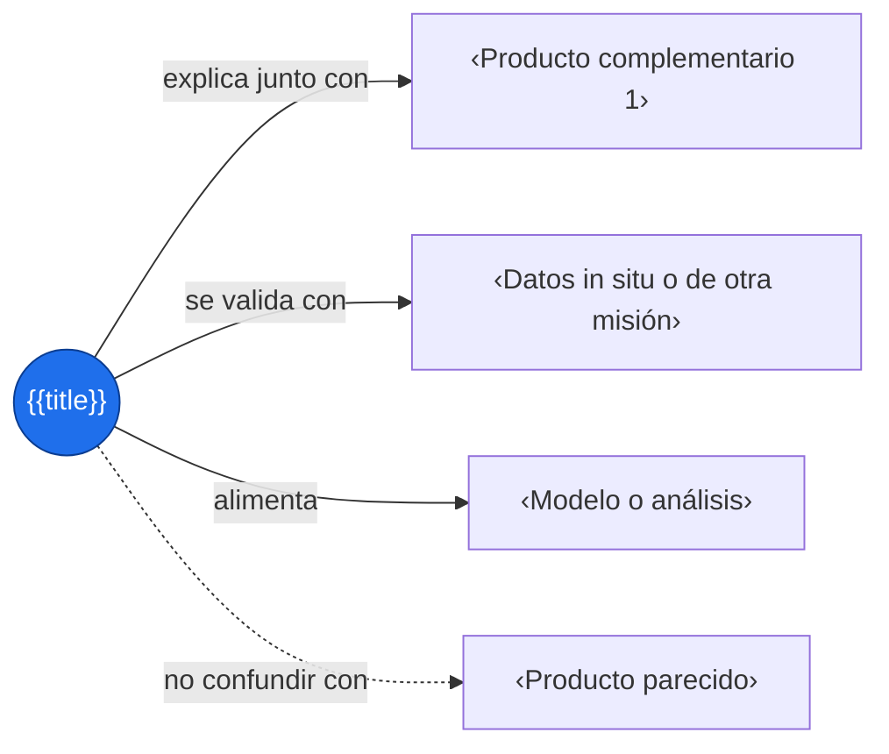

# {{title}}

> [!abstract] Qué es
> ‹Qué mide este producto, en una frase.›

> [!question] ¿Para qué pregunta me sirve?
> ‹¿…?›

## Ficha técnica

| Campo | Dato |
|---|---|
| Producto / versión | ‹…› |
| Misión / instrumento | ‹…› |
| Variable | ‹…› |
| Unidades | ‹…› |
| Cobertura espacial | ‹…› |
| Cobertura temporal | ‹…› |
| Resolución espacial | ‹…› |
| Resolución temporal | ‹…› |
| Nivel de procesamiento | ‹L1, L2, L3, L4› |
| Formato | ‹NetCDF, HDF, GeoTIFF, CSV› |
| Latencia | ‹tiempo real, días, meses› |
| Licencia y cómo citar | ‹…› |
| Enlace oficial | ‹…› |

- [ ] Verifiqué esta ficha en la documentación oficial (fecha: ‹…›)

## Qué mide y cómo

‹Principio físico en pocas líneas: qué radiación o señal detecta y cómo se convierte en la variable.›



## Cómo obtenerlo

| Vía | Cuándo usarla | Enlace |
|---|---|---|
| ‹Earthdata Search› | ‹descargar archivos›  | ‹…› |
| ‹API› | ‹automatizar en el proyecto› | ‹…› |
| ‹Visor web› | ‹explorar rápido› | ‹…› |

```python
import requests

url = "‹URL de la API›"
params = {"‹parametro›": "‹valor›"}
r = requests.get(url, params=params, timeout=60)
r.raise_for_status()
datos = r.json()
```

## Cargar y explorar

```python
import xarray as xr

ds = xr.open_dataset("‹archivo.nc›")
print(ds)                          # variables, dimensiones y atributos
var = ds["‹variable›"]
print(var.attrs)                   # unidades y nombre largo
print(var.encoding)                # scale_factor y _FillValue, si xarray los aplicó
var.isel(time=0).plot()
```

## Calidad y limitaciones

> [!warning] Cuidado
> ‹Sesgo, incertidumbre o condición donde el dato no es confiable.›

- [ ] Banderas de calidad (QA) revisadas
- [ ] Valores de relleno (_FillValue) y factor de escala aplicados una sola vez
- [ ] Nubes, aerosoles o huecos tratados
- [ ] Unidades y sistema de coordenadas confirmados
- [ ] Cambios de versión o de sensor a lo largo del tiempo

## Preprocesamiento necesario

1. ‹Filtrar por calidad›
2. ‹Reproyectar o remuestrear›
3. ‹Agregar en el tiempo›
4. ‹Quitar estacionalidad›

## Uso en el reto

**Reto:** ‹nombre› · **Pregunta:** ¿‹…›?

## Combinar con



| Producto | Variable | Por qué combinarlo | Enlace |
|---|---|---|---|
| ‹…› | ‹…› | ‹…› | ‹…› |

## Cita

```text
‹Formato de cita indicado por el proveedor›
```

## Autoevaluación

- [ ] Sé qué mide realmente y qué no
- [ ] Conozco su resolución y su cobertura
- [ ] Sé cargarlo y graficarlo
- [ ] Conozco su principal limitación
- [ ] Sé con qué otro dato combinarlo

## Fuentes

- ‹documentación oficial, guía del usuario, ATBD›
