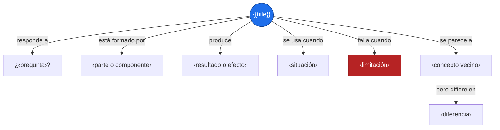
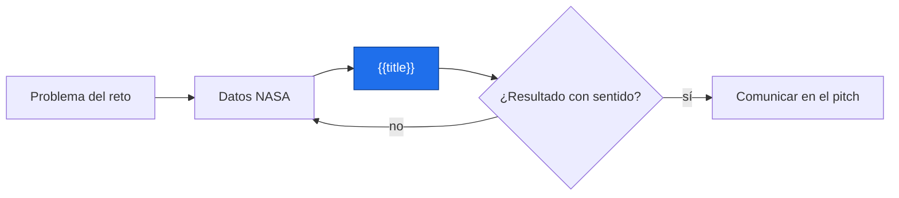
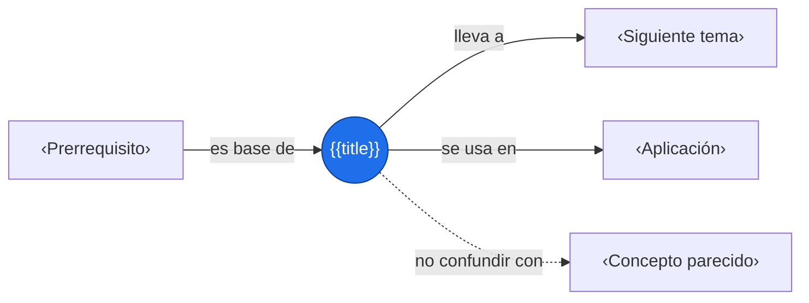

# {{title}}

> [!abstract] Idea clave
> ‹Una sola frase, sin jerga.›

> [!question] ¿Qué problema resuelve o qué pregunta responde?
> ‹¿…?›

> [!quote]- En 30 segundos (versión hablada para el pitch)
> ‹Cómo lo explicarías en voz alta a alguien que no conoce el tema.›

## Intuición

‹Analogía o situación cotidiana. Sin fórmulas ni tecnicismos todavía.›



**Conclusión intuitiva:** ‹…›

## Definición

> [!note] Definición
> ‹Definición precisa en una o dos frases.›

Partes o componentes:

- **‹parte 1›**: ‹qué es y qué hace›
- **‹parte 2›**: ‹…›
- **‹parte 3›**: ‹…›

## Cómo funciona

1. ‹Paso 1›
2. ‹Paso 2›
3. ‹Paso 3›

## Ejemplo

> [!example] ‹Nombre del ejemplo›
> **Situación:** ‹…›
> **Qué ocurre:** ‹…›
> **Resultado:** ‹…›

## Errores y límites

> [!warning] Error común
> ❌ ‹idea incorrecta› → ✅ ‹idea correcta›

No aplica cuando: ‹…›

## Aplicación en Space Apps

**Reto:** ‹nombre› · **Pregunta:** ¿‹…›?



## Conexiones



Enlaces: [[‹Prerrequisito›]] → **{{title}}** → [[‹Siguiente tema›]]

## Flashcards

¿Qué es {{title}}?::‹respuesta›
¿Cuándo se usa {{title}}?::‹respuesta›
¿Cuál es un error común con {{title}}?::‹respuesta›

## Autoevaluación

- [ ] Lo explico sin mirar la nota
- [ ] Doy un ejemplo propio
- [ ] Reconozco un error común y un límite
- [ ] Sé cómo aplicarlo en un reto

## Fuentes

- ‹enlace o referencia›

---

## Módulos opcionales (copia solo si aportan)

> [!note]- Fórmula
> $$
> \text{‹fórmula›}
> $$
> | Símbolo | Significa |
> |:-:|---|
> | $‹a›$ | ‹…› |

> [!example]- Código
> ```python
> # ‹ejemplo mínimo›
> ```

> [!example]- Tabla comparativa
> | Criterio | ‹A› | ‹B› |
> |---|---|---|
> | ‹criterio 1› | ‹…› | ‹…› |
> | ‹criterio 2› | ‹…› | ‹…› |

> [!tip]- Mapa mental de repaso
> ```mermaid
> mindmap
>   root((‹Concepto›))
>     Qué es
>       ‹definición›
>     Cómo funciona
>       ‹paso›
>     Cuándo usarlo
>       ‹caso›
>     Cuándo NO
>       ‹límite›
> ```
