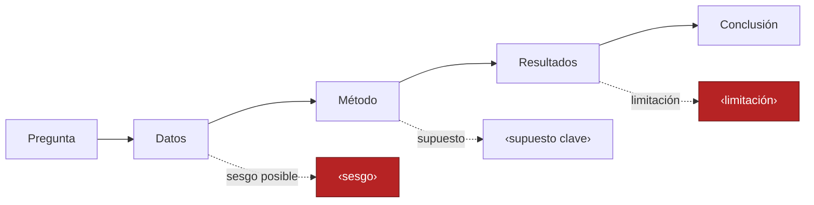
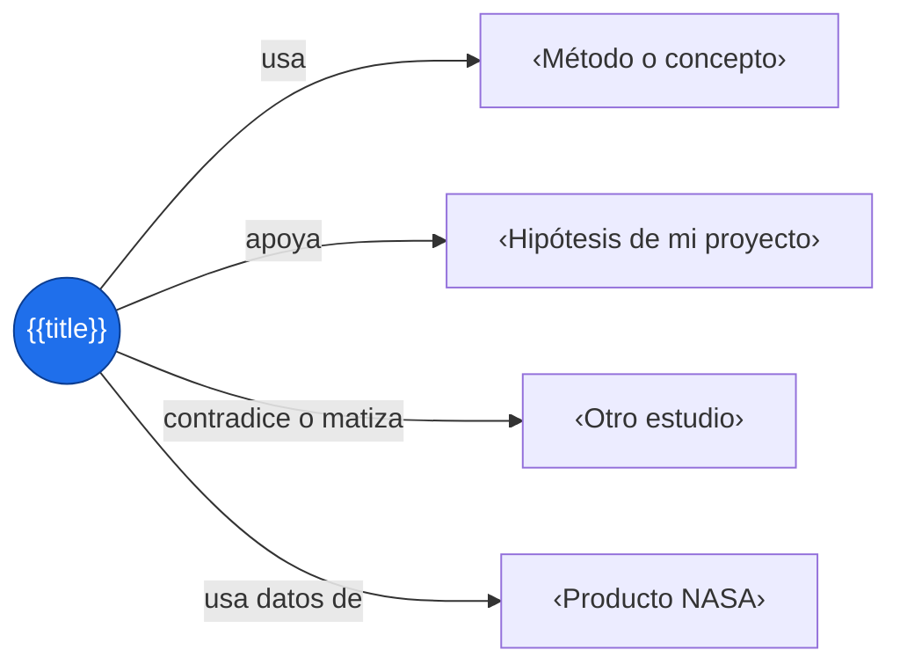

# {{title}}

> [!abstract] En una frase
> ‹Qué hicieron y qué encontraron.›

| Campo | Dato |
|---|---|
| Autores | ‹…› |
| Año y fuente | ‹…› |
| DOI o enlace | ‹…› |
| Tipo | ‹artículo, informe, documentación, tesis› |
| Datos NASA usados | ‹…› |

## Pregunta e hipótesis

> [!question] Pregunta de investigación
> ‹¿…?›

**Hipótesis:** ‹…›

## Estructura del estudio



## Método

‹Qué técnica usaron y por qué.›

## Datos

| Variable | Fuente | Periodo | Resolución |
|---|---|---|---|
| ‹…› | ‹…› | ‹…› | ‹…› |

## Resultados clave

1. ‹Resultado con cifra›
2. ‹Resultado con cifra›
3. ‹Resultado con cifra›

## Evaluación crítica

> [!success] Fortalezas
> ‹…›

> [!warning] Debilidades y supuestos
> ‹…›

> [!question] Preguntas que me quedan
> ‹…›

## Qué puedo reutilizar

- [ ] ‹Método o técnica›
- [ ] ‹Dato o producto›
- [ ] ‹Figura o idea de visualización›
- [ ] ‹Referencia para citar›

## Citas útiles

Solo fragmentos cortos, con página:

- «‹fragmento breve›» (p. ‹…›)

## Conexiones



Enlaces: [[‹Concepto relacionado›]] · [[‹Otro paper›]]

## Cita

```text
‹Formato APA u otro›
```

## Autoevaluación

- [ ] Explico la pregunta y el método en 30 segundos
- [ ] Sé qué datos usaron y de dónde salen
- [ ] Puedo nombrar una limitación seria
- [ ] Sé qué parte usaría en mi proyecto
- [ ] Verifiqué que la fuente es confiable y citable
