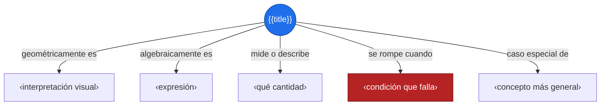
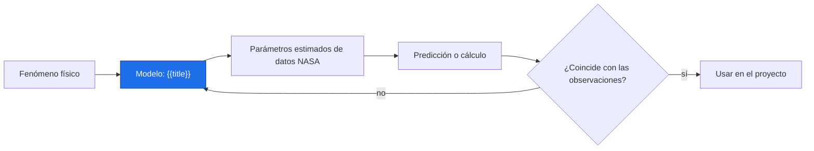
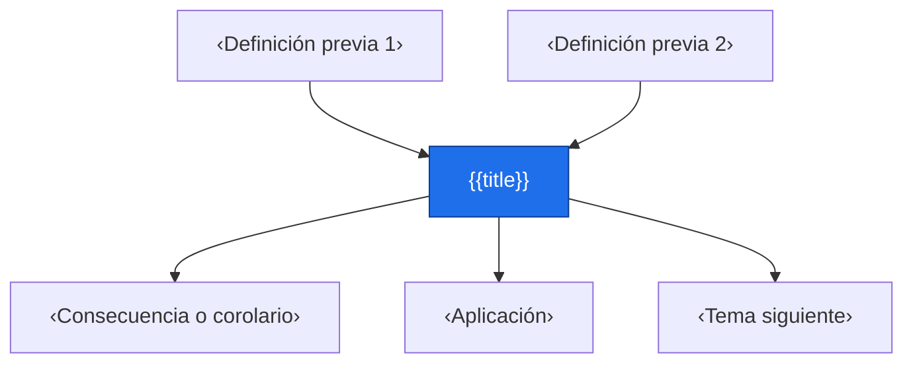

# {{title}}

> [!abstract] Idea clave
> ‹Qué dice o qué permite hacer, en una frase.›

> [!question] ¿Qué pregunta responde?
> ‹¿…?›

> [!quote]- En 30 segundos (versión hablada)
> ‹Explicación oral, sin símbolos.›

## Intuición visual

‹Qué dibujarías: una gráfica, una flecha, un área, una transformación.›



**Conclusión intuitiva:** ‹…›

## Definición y notación

> [!note] Definición
> Sea $‹objeto›$. Se dice que $‹propiedad›$ si
> $$
> \text{‹condición formal›}
> $$

| Símbolo | Significa |
|:-:|---|
| $‹a›$ | ‹…› |
| $‹b›$ | ‹…› |

> [!info] En palabras
> ‹Traduce la definición: qué exige, qué permite y por qué se define así.›

## Resultado principal

> [!important] Teorema
> Si $‹hipótesis›$, entonces $‹conclusión›$.

> [!tip]- Demostración (intenta hacerla antes de abrir)
> $$
> \begin{aligned}
> \text{‹inicio›} &= \text{‹paso 1›} \\
> &= \text{‹paso 2›} \\
> &= \text{‹conclusión›}
> \end{aligned}
> $$
> **Idea de la prueba:** ‹la clave en una frase›

## Propiedades

- $\text{‹propiedad 1›}$
- $\text{‹propiedad 2›}$
- $\text{‹propiedad 3›}$

## Ejemplo resuelto

**Problema:** ‹enunciado›

$$
\begin{aligned}
\text{‹expresión›} &= \text{‹paso 1›} \\
&= \text{‹paso 2›}
\end{aligned}
$$

$$
\boxed{\text{‹resultado›}}
$$

> [!success] Comprobación
> ‹Cómo verificas que el resultado tiene sentido: unidades, caso simple, gráfica.›

## Contraejemplo o caso límite

‹Situación donde la propiedad falla o donde el resultado es extremo.›

## Verificación con Python

```python
import sympy as sp
import numpy as np
import matplotlib.pyplot as plt

x = sp.symbols("x")
expr = ...                                  # expresión del ejemplo
print(sp.simplify(expr))                    # verificación simbólica

f = sp.lambdify(x, expr, "numpy")
xs = np.linspace(-5, 5, 400)
plt.plot(xs, f(xs)); plt.grid(True)
plt.title("‹título›"); plt.show()
```

Salida esperada: `‹valor o expresión›` (debe coincidir con el ejemplo resuelto).

## Errores comunes

> [!warning] Error común
> ❌ ‹error de procedimiento o de concepto› → ✅ ‹forma correcta›

## Aplicación en Space Apps

**Reto:** ‹nombre› · **Pregunta:** ¿‹…›?

‹Qué cantidad del sistema terrestre modela o calcula este concepto.›



## Dependencias



Enlaces: [[‹Definición previa›]] → **{{title}}** → [[‹Tema siguiente›]]

## Ejercicios

> [!question] Ejercicio 1
> ‹enunciado›
> > [!success]- Solución
> > ‹solución›

> [!question] Ejercicio 2
> ‹enunciado›
> > [!success]- Solución
> > ‹solución›

## Flashcards

¿Cómo se define {{title}}?::‹respuesta›
¿Qué dice el teorema principal?::‹respuesta›
¿Cuándo falla {{title}}?::‹respuesta›

## Autoevaluación

- [ ] Enuncio la definición sin mirar
- [ ] Sé qué significa cada símbolo
- [ ] Intenté la demostración por mi cuenta
- [ ] Resuelvo un ejemplo a mano y lo verifico en Python
- [ ] Conozco un contraejemplo
- [ ] Sé dónde aparece en ciencias de la Tierra

## Fuentes

- ‹libro, curso o enlace›
