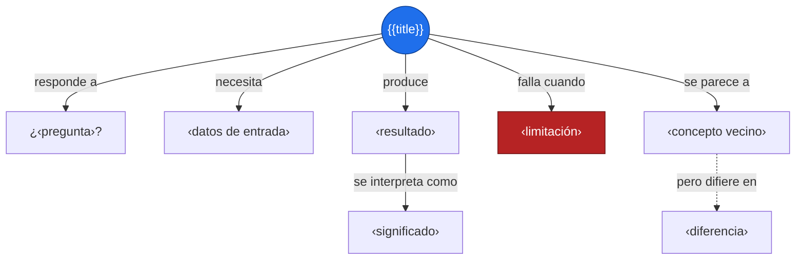
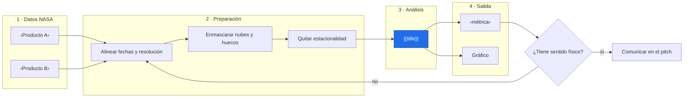
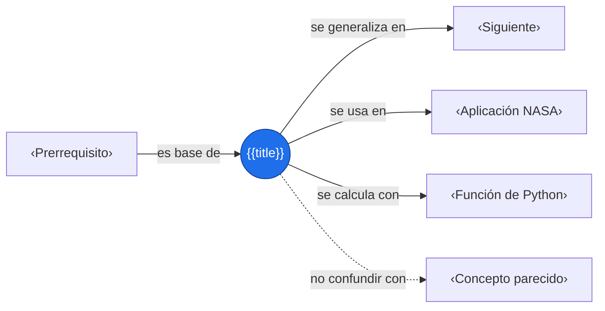

# {{title}}

> [!abstract] Idea clave
> ‹Una sola frase, sin jerga.›

> [!question] ¿Qué pregunta responde?
> ‹¿…?›

> [!quote]- En 30 segundos (versión hablada para el pitch)
> ‹Cómo lo explicarías en voz alta a alguien que no sabe estadística.›

## Intuición

‹Situación simple: dados, monedas, sensor, temperatura, lluvia… sin fórmulas todavía.›



**Conclusión intuitiva:** ‹…›

## Fórmula

$$
\text{‹fórmula›}
$$

| Símbolo | Significa |
|:-:|---|
| $‹a›$ | ‹…› |
| $‹b›$ | ‹…› |

> [!info] En palabras
> ‹Traduce la fórmula: qué operación hace primero, qué hace después y por qué.›

## Supuestos

| Supuesto | Por qué importa | Cómo lo compruebo |
|---|---|---|
| ‹independencia› | ‹…› | ‹…› |
| ‹normalidad, linealidad, etc.› | ‹…› | ‹…› |

## Ejemplo a mano

Datos (los mismos se usan en el código):

| Dato | Valor |
|---|---:|
| ‹…› | ‹…› |
| ‹…› | ‹…› |

1. Primero: $\text{‹paso 1›}$
2. Después: $\text{‹paso 2›}$
3. Resultado:

$$
\boxed{\text{‹resultado›}}
$$

## Código

```python
import numpy as np
import matplotlib.pyplot as plt

datos = np.array([...])          # mismos datos del ejemplo a mano

resultado = ...                  # cálculo
print(f"resultado = {resultado:.4f}")

plt.plot(datos, "o-")            # siempre grafica: un número solo engaña
plt.title("‹título›")
plt.xlabel("‹x›"); plt.ylabel("‹y›")
plt.show()
```

Salida esperada: `‹valor›` (debe coincidir con el ejemplo a mano).

- `‹línea clave›` → ‹qué hace›

## Interpretación

> [!success] Qué significa el resultado
> ‹El número en palabras y dentro del contexto del problema.›

## Trampas y límites

> [!warning] Error común
> ❌ ‹interpretación incorrecta› → ✅ ‹interpretación correcta›

No permite afirmar que: ‹…›

Revisa en datos de la Tierra:

- [ ] Estacionalidad (¿la tendencia es solo el ciclo anual?)
- [ ] Autocorrelación temporal (los puntos no son independientes)
- [ ] Datos faltantes, nubes, huecos
- [ ] Resolución espacial y temporal
- [ ] Unidades y escala

## Aplicación en Space Apps

**Reto:** ‹nombre› · **Pregunta:** ¿‹…›?

| Producto | Variable | Unidades | Cobertura | Resolución | Enlace |
|---|---|---|---|---|---|
| ‹…› | ‹…› | ‹…› | ‹…› | ‹…› | ‹…› |
| ‹…› | ‹…› | ‹…› | ‹…› | ‹…› | ‹…› |



## Conexiones



Enlaces: [[‹Prerrequisito›]] → **{{title}}** → [[‹Siguiente›]]

## Flashcards

¿Qué mide {{title}}?::‹respuesta›
¿Qué supuestos necesita {{title}}?::‹respuesta›
Fórmula de {{title}}::$\text{‹fórmula›}$

## Autoevaluación

- [ ] Lo explico sin mirar la nota
- [ ] Sé qué significa cada símbolo
- [ ] Lo resuelvo a mano y en Python con el mismo resultado
- [ ] Sé interpretar el resultado y una limitación
- [ ] Sé qué supuestos exige
- [ ] Sé cómo aplicarlo a un dato NASA

## Fuentes

- ‹enlace o referencia›

---

## Módulos opcionales (copia solo si aportan)

> [!example]- Casos o comportamiento visual
> **Caso 1 — ‹nombre›:** ‹descripción› → $\text{‹resultado›}$
> **Caso 2 — ‹nombre›:** ‹descripción› → $\text{‹resultado›}$

> [!note]- Derivación
> $$
> \text{‹paso a paso›}
> $$

> [!tip]- ¿Qué método uso?
> ```mermaid
> flowchart TD
>     S{"¿‹pregunta 1›?"}
>     S -- "sí" --> M1["‹Método A›"]
>     S -- "no" --> T{"¿‹pregunta 2›?"}
>     T -- "sí" --> M2["‹Método B›"]
>     T -- "no" --> M3["‹Método C›"]
> ```
