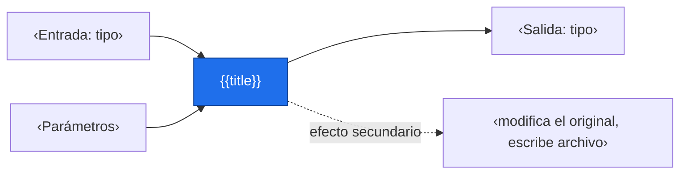
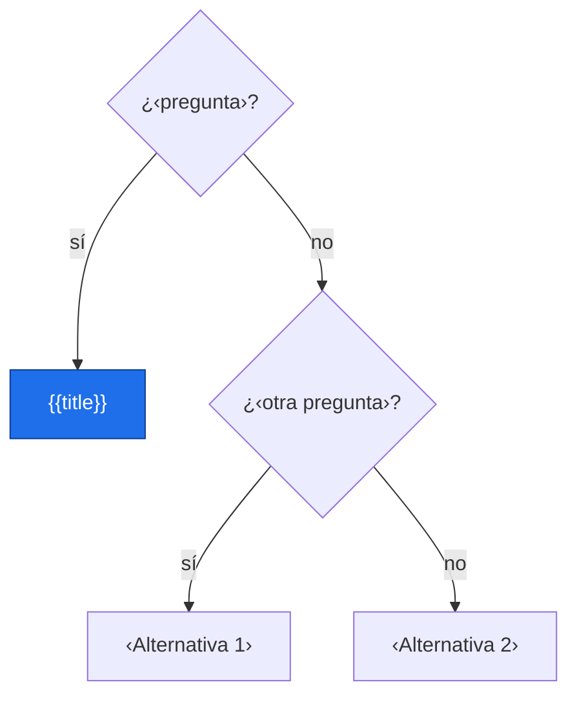
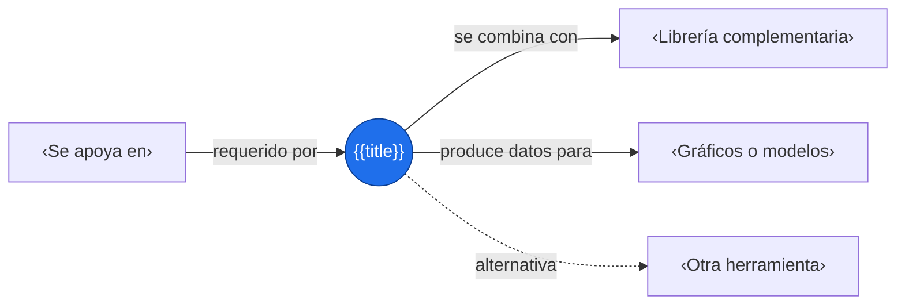

# {{title}}

> [!abstract] Qué hace
> ‹Qué resuelve, en una frase.›

> [!question] ¿Cuándo lo necesito?
> ‹Situación típica en la que lo usarías.›

## Modelo mental



‹Cómo pensar en esta herramienta: qué recibe, qué devuelve y qué cambia.›

## Instalación e importación

```bash
pip install ‹paquete›
```

```python
import ‹paquete› as ‹alias›
```

## Sintaxis mínima

```python
resultado = ‹alias›.‹funcion›(‹argumento›, ‹parametro›=‹valor›)
```

## Ejemplo mínimo

```python
import numpy as np

datos = np.array([...])
resultado = ...
print(resultado)
```

Salida esperada:

```text
‹salida›
```

## Parámetros clave

| Parámetro | Qué hace | Valor por defecto |
|---|---|---|
| `‹param 1›` | ‹…› | ‹…› |
| `‹param 2›` | ‹…› | ‹…› |
| `‹param 3›` | ‹…› | ‹…› |

## Patrones útiles

**Patrón 1 — ‹nombre›**

```python
‹código›
```

**Patrón 2 — ‹nombre›**

```python
‹código›
```

## Trampas y gotchas

> [!warning] Error común
> Mensaje típico: `‹error›`

```python
# ❌ Incorrecto
‹código problemático›

# ✅ Correcto
‹código correcto›
```

- [ ] ¿Modifica el objeto original o devuelve una copia?
- [ ] ¿Qué tipo y forma (shape) devuelve?
- [ ] ¿Cómo trata los NaN?
- [ ] ¿Hay diferencia entre versiones?

## ¿Esto o aquello?



Rendimiento: ‹cuándo es lento y qué usar en su lugar›.

## Uso en Space Apps

**Reto:** ‹nombre› · **Tarea:** ‹cargar, limpiar, graficar, descargar datos…›

```python
# Snippet reutilizable para el proyecto
‹código›
```

## Conexiones



Enlaces: [[‹Concepto previo›]] → **{{title}}** → [[‹Siguiente›]]

## Flashcards

¿Para qué sirve {{title}}?::‹respuesta›
¿Qué devuelve {{title}}?::‹respuesta›
¿Cuál es el error típico con {{title}}?::‹respuesta›

## Autoevaluación

- [ ] Lo escribo de memoria en un ejemplo mínimo
- [ ] Sé qué devuelve y si modifica el original
- [ ] Reconozco su error más común
- [ ] Sé cuándo usar una alternativa
- [ ] Lo usé con datos reales

## Fuentes

- ‹documentación oficial›
